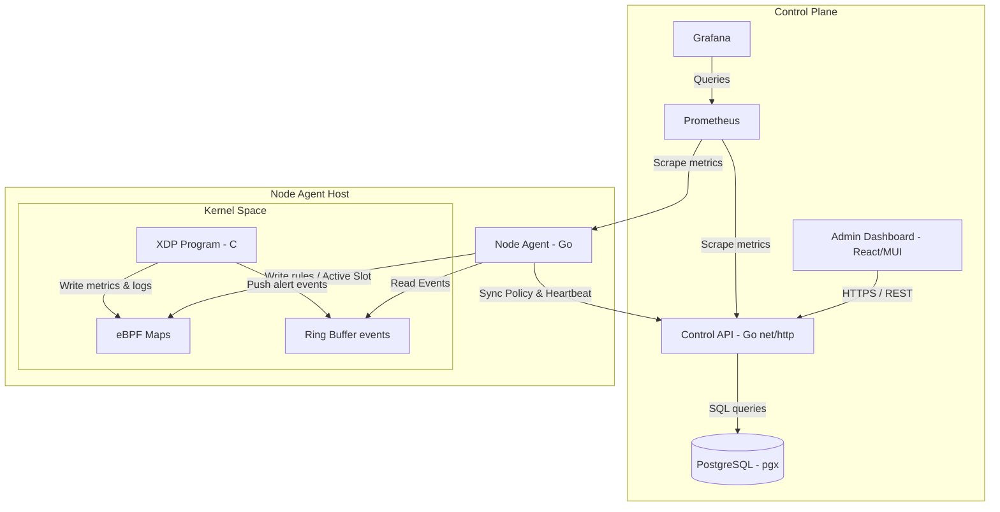

# Codebase Architecture

**Pattern:** Distributed Node Agent with Centralized Control Plane (Modular Monolith Backend + React SPA Frontend).

## High-Level Architecture

The system consists of three main tiers:
1. **Data Plane (eBPF/XDP):** Runs in the Linux kernel on the Node Agent hosts, processing incoming network packets.
2. **Node Agent:** A Go daemon running on the host that loads the eBPF object, attaches to interfaces, consumes ring buffer events, and periodically syncs policy with the Control Plane.
3. **Control Plane:** A Go HTTP server (Control API) backed by PostgreSQL. It aggregates configs/metrics, manages administrative RBAC/sessions, pulls threat feed lists (e.g. AbuseIPDB), and provides an HTTP API for the Admin Dashboard (React SPA).

---

## Identified Patterns

### 1. eBPF Double-Buffering (Map Flipping)
To prevent packet drop or race conditions during policy application, the eBPF program implements double-buffered maps (suffixed with `_a` and `_b`).
* **Active Slot:** Managed by a single-element array map `runtime_config`. The key `active_slot` (0 or 1) determines whether the XDP program looks up rules in suffix `_a` or `_b`.
* **Application Flow:** 
  1. The Node Agent fetches a new policy snapshot.
  2. The Node Agent clears the maps of the *inactive* slot.
  3. The Node Agent populates whitelist, blacklist, services, and rules into the *inactive* slot.
  4. The Node Agent writes the new `active_slot` to `runtime_config` to flip the active buffers atomically.
  5. The Node Agent clears the *previously active* slot.
* **Example:** See `ApplyPolicySnapshot` in [policy_apply.go](file:///root/anti-ddos/internal/agent/policy_apply.go#L46) and XDP lookups in [xdp_data_plane.bpf.c](file:///root/anti-ddos/bpf/xdp_data_plane.bpf.c).

### 2. Scoped RBAC & Tenant Isolation
Users and rules are structured around tenants and ownership:
* **Roles:** `admin` (global system admin), `operator` (writes policies/services), `viewer` (read-only views).
* **Policy Scopes:** Policies can be scoped to specific users, services, or globally. The Go Control Plane evaluates policy access based on effective scopes.
* **Example:** See [policy_scope.go](file:///root/anti-ddos/internal/control/policy_scope.go).

### 3. Audit Trail Pattern
Every write operation to the database must be audited under the same transaction to guarantee consistency.
* **Implementation:** The `Store` executes mutation methods within a database transaction. Before committing, it calls `insertAudit()` which inserts the change payload, user metadata, and action parameters into the `audit_events` partitioned table.
* **Example:** See `UpdateUser` in [admin_console.go](file:///root/anti-ddos/internal/control/admin_console.go#L13).

---

## Data Flow

### 1. Security Event Logging
1. A packet matches a dropping/sampling/observing rule in [xdp_data_plane.bpf.c](file:///root/anti-ddos/bpf/xdp_data_plane.bpf.c).
2. The XDP program submits a record to the `events` `BPF_MAP_TYPE_RINGBUF` map.
3. The Node Agent daemon runs a goroutine consuming from the ringbuf using `ConsumeRingbuf()` in [ringbuf.go](file:///root/anti-ddos/internal/agent/ringbuf.go).
4. The Agent batches these events and sends them via an HTTP POST request to the Control API `/v1/security-events` endpoint (processed by `SecurityEventForwarder` in [event_forwarder.go](file:///root/anti-ddos/internal/agent/event_forwarder.go)).
5. The Control API parses, normalizes, and bulk inserts the events into the `security_events` table in PostgreSQL.

### 2. IP Threat Feed Synchronization
1. The Control Plane runs a scheduler that queries due feeds (`SyncDueFeeds` in [feed.go](file:///root/anti-ddos/internal/control/feed.go#L71)).
2. It fetches list content from AbuseIPDB or custom JSON URLs.
3. The response is parsed, aggregated (avoiding whitelist conflicts), and saved to the `manual_blacklist_entries` table.
4. When a Node Agent fetches its next heartbeat configuration, it pulls the combined active blacklist rules.

---

## Code Organization

* **`cmd/`** - Execution entrypoints:
  * `agent/` - Launching the Node Agent on host.
  * `control-api/` - Starting the management REST API server.
  * `control-admin/` - Management operations (e.g. bootstrap, user password resets).
  * `policygen/` - CLI tool to generate static rule snapshots.
* **`internal/`** - Private library modules:
  * `agent/` - BPF loader, policy application, ring buffer consumer, metric reporting, Control API client.
  * `control/` - Database CRUD stores, RBAC logic, server routing handlers, telemetry integration, audit tracking, feed synchronization.
* **`bpf/`** - Data plane logic:
  * `xdp_data_plane.bpf.c` - Core packet parsing, rate-limiting, whitelist/blacklist checks, and redirect/drop execution.
  * `xdp_pass.bpf.c` - Simple pass-through program used for output interface queues.
* **`web/`** - Frontend Single Page Application:
  * `dashboard/` - React frontend with MUI dashboard widgets, real-time metric charts, and management tabular views.
