# Allocated CIDR Management Design

**Spec**: `.specs/features/allocated-cidr-management/spec.md`
**Status**: Draft

---

## Architecture Overview

This feature is implemented entirely in the Control Plane (Control API, PostgreSQL database, and Admin Dashboard). It does not require modifying the Node Agent or the eBPF data plane since XDP rules are built from the backend services approved by the Control Plane.

```mermaid
sequenceDiagram
    autonumber
    actor Admin
    actor User
    participant API as Control API REST Server
    participant DB as PostgreSQL Database

    rect rgb(20, 30, 45)
        note right of Admin: Allocation Management (Admin Only)
        Admin->>API: POST /v1/users/{userId}/allocated-cidrs {cidr}
        API->>DB: Begin Transaction & Query Overlaps (cidr && other_cidr)
        alt Overlap detected
            DB-->>API: Conflict found with another user
            API-->>Admin: HTTP 400 Bad Request (Conflict details)
        else Disjoint
            API->>DB: INSERT INTO allocated_cidrs
            DB-->>API: Success
            API-->>Admin: HTTP 201 Created (AllocatedCIDR)
        end
    end

    rect rgb(30, 20, 45)
        note right of User: Service Configuration & Validation
        User->>API: POST /v1/services {backend_cidr: "10.0.0.5/32"}
        API->>DB: Check Containment (backend_cidr <<= allocated_cidr)
        alt Containment valid
            API->>DB: INSERT INTO backend_services
            API-->>User: HTTP 201 Created
        else Containment invalid / No allocation
            API-->>User: HTTP 400 Bad Request (Not within allocated CIDRs)
        end
    end
```



---

## Code Reuse Analysis

### Existing Components to Leverage

| Component | Location | How to Use |
| --- | --- | --- |
| Transaction Scoping | [owner.go](file:///root/anti-ddos/internal/control/owner.go) | Reuse `beginActorOwnerTx` for user-isolated queries and `beginUnscopedTx` for admin operations. |
| Audit Trail Logging | [store.go](file:///root/anti-ddos/internal/control/store.go) | Reuse `insertAudit` inside transactions to log create/delete allocations. |
| User Details Drawer | [AccessView.tsx](file:///root/anti-ddos/web/dashboard/src/views/AccessView.tsx) | Reuse the table actions and `AdminDrawer` structures to add a CIDR management interface. |
| DB Migrations Runner | [migrations.go](file:///root/anti-ddos/internal/control/migrations.go) | Add Version 8 to run `CREATE TABLE` and the migration script. |

### Integration Points

| System | Integration Method |
| --- | --- |
| Service Mutation Validation | Intercept calls in `CreateService` and `UpdateService` to perform CIDR check. |
| Database Schemas | Integrate `allocated_cidrs` table with a foreign key referencing `app_users(id)`. |

---

## Components

### 1. Database Migration (Version 8)
- **Purpose**: Creates the storage structure and populates initial allocations for pre-existing backend services.
- **Location**: [migrations.go](file:///root/anti-ddos/internal/control/migrations.go)
- **Schema Details**:
  - `allocated_cidrs` table with `id` (UUID), `user_id` (UUID), `cidr` (INET), `created_at` (TIMESTAMPTZ), `updated_at` (TIMESTAMPTZ).
  - Unique constraint on `(user_id, cidr)` to avoid duplicate identical ranges.
  - GIST index on `cidr` for fast containment and overlap operations (`gist (cidr inet_ops)`).
  - Migration script:
    ```sql
    INSERT INTO allocated_cidrs (id, user_id, cidr)
    SELECT gen_random_uuid(), owner_user_id, backend_cidr
    FROM backend_services
    WHERE deleted_at IS NULL
    ON CONFLICT (user_id, cidr) DO NOTHING;
    ```

### 2. Database Storage Logic
- **Purpose**: Implements database interactions for allocation management and containment validations.
- **Location**: `internal/control/allocated_cidrs_store.go` (New File) or integrated in [policy_store.go](file:///root/anti-ddos/internal/control/policy_store.go)
- **Interfaces**:
  - `ListUserAllocatedCIDRs(ctx context.Context, userID string) ([]AllocatedCIDR, error)`: Fetches active CIDRs for the given user.
  - `CreateAllocatedCIDR(ctx context.Context, actor *Actor, targetUserID string, cidr string, reason string) (AllocatedCIDR, error)`: Validates format, runs disjoint check against other users, inserts record, and writes audit event.
  - `DeleteAllocatedCIDR(ctx context.Context, actor *Actor, targetUserID string, allocationID string, reason string) error`: Checks containment usage of this allocation, deletes row, and writes audit event.
  - `ValidateServiceCIDR(ctx context.Context, tx pgx.Tx, ownerUserID string, backendCIDR string) error`: Runs SQL check:
    ```sql
    SELECT EXISTS (
        SELECT 1 FROM allocated_cidrs
        WHERE user_id = $1 AND $2::inet <<= cidr
    )
    ```
    Returns `nil` if valid, or a descriptive error if invalid.

### 3. Control API Handlers
- **Purpose**: Exposes REST interfaces to frontend and handles routing.
- **Location**: [server.go](file:///root/anti-ddos/internal/control/server.go)
- **Interfaces**:
  - `GET /v1/me/allocated-cidrs`: Standard user fetches their own allocated CIDRs.
  - `GET /v1/users/{userId}/allocated-cidrs`: Admin lists a user's allocations.
  - `POST /v1/users/{userId}/allocated-cidrs`: Admin creates a new allocation.
  - `DELETE /v1/users/{userId}/allocated-cidrs/{id}`: Admin deletes an allocation (blocks if in use).
- **Service API Interception**:
  - Inside `CreateService` and `UpdateService`, call `ValidateServiceCIDR` within the active transaction before inserting/updating rows.

### 4. Frontend Integration
- **Purpose**: Displays CIDRs, manages allocations, and validates inputs in forms.
- **Location**: `web/dashboard/src/`
- **Interfaces**:
  - Add type `AllocatedCIDR` in `types.ts`.
  - Add API client calls in `api.ts`:
    - `meAllocatedCIDRs()`
    - `userAllocatedCIDRs(userId)`
    - `createAllocatedCIDR(userId, cidr, reason)`
    - `deleteAllocatedCIDR(userId, id, reason)`
  - **Account Admin Panel (`AccessView.tsx`)**:
    - Add a "CIDRs" button next to "Edit" in the users table for admins.
    - Click opens a drawer displaying active allocations, a simple add form (with a text field and standard Add button), and trash icons next to allocations.
  - **Service Form (`ServicesView.tsx`)**:
    - Load user's allocated CIDRs.
    - Show list of active allocations below the "Backend CIDR" field as helper labels.
    - Highlight inputs that do not match the subnet boundaries.

---

## Data Models

### AllocatedCIDR (Go Struct)
```go
type AllocatedCIDR struct {
	ID        string    `json:"id"`
	UserID    string    `json:"user_id"`
	CIDR      string    `json:"cidr"`
	CreatedAt time.Time `json:"created_at"`
	UpdatedAt time.Time `json:"updated_at"`
}
```

### AllocatedCIDR (TypeScript Interface)
```typescript
export interface AllocatedCIDR {
  id: string;
  user_id: string;
  cidr: string;
  created_at: string;
  updated_at: string;
}
```

---

## Error Handling Strategy

| Error Scenario | Handling | User Impact |
| --- | --- | --- |
| Overlapping CIDR during create | Transaction rollback; query overlapping user info and format error. | Info alert: "CIDR overlaps with user {username}'s allocation: {cidr}" |
| Deleting an active allocation | Check service references; query blocking services; return detailed list. | Alert: "Cannot delete: used by active service(s) ({service_names})" |
| Out-of-bounds service CIDR | Reject operation; return validation error. | Validation message: "Backend CIDR {cidr} is not contained within your allocated blocks" |
| Invalid CIDR string format | Regex/Parser validation. | Input error: "Invalid CIDR block format (e.g. 192.168.1.0/24)" |

---

## Tech Decisions

| Decision | Choice | Rationale |
| --- | --- | --- |
| Validation layer | Control Plane API (Go + Postgres) | Datapath checks are unnecessary since invalid configurations are prevented from sync. |
| Containment operation | SQL operator `<<=` | Native, indexes-friendly network calculation. |
| Overlap comparison | SQL operator `&&` | Fast overlap check to enforce disjoint allocations. |
