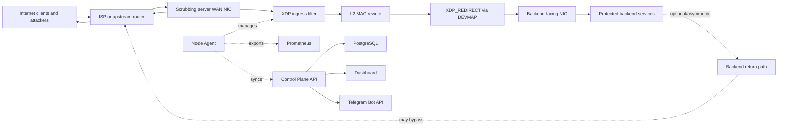
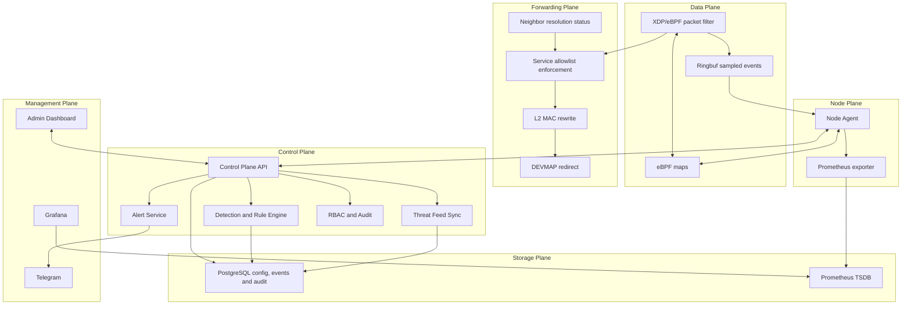
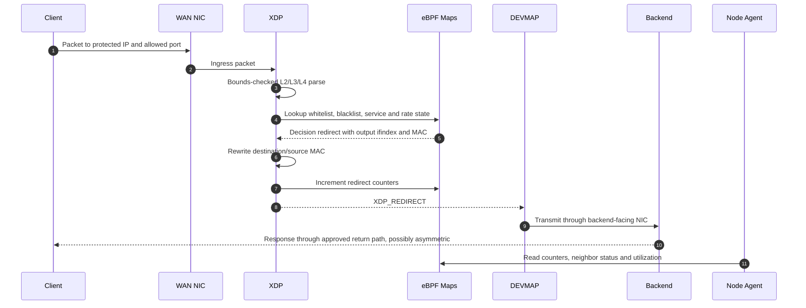
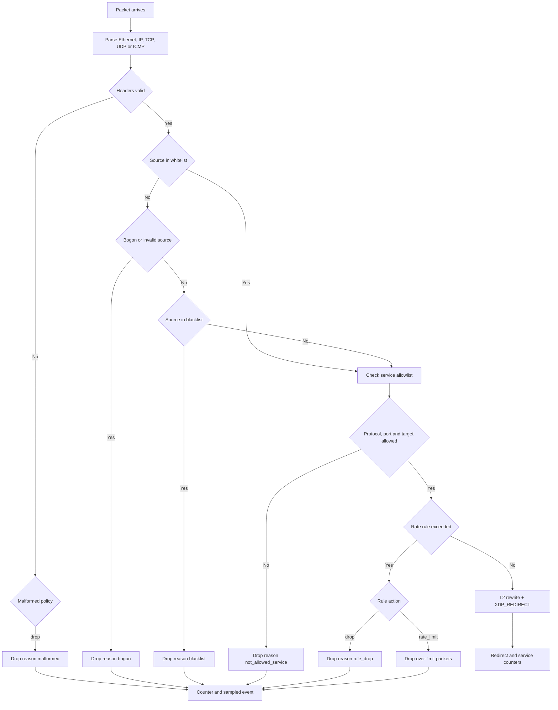
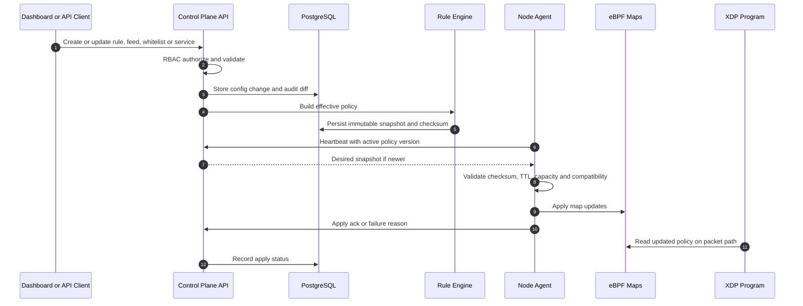
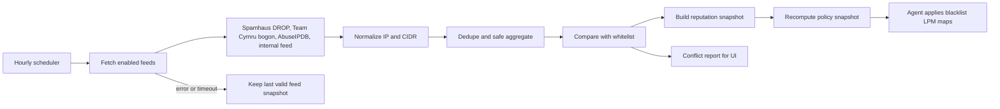
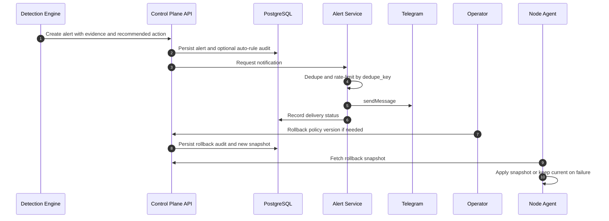
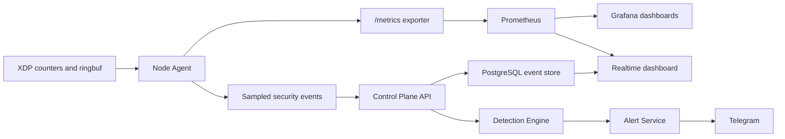
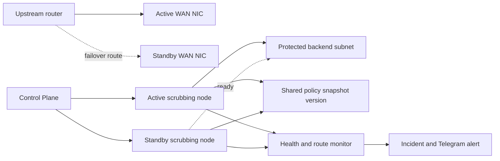
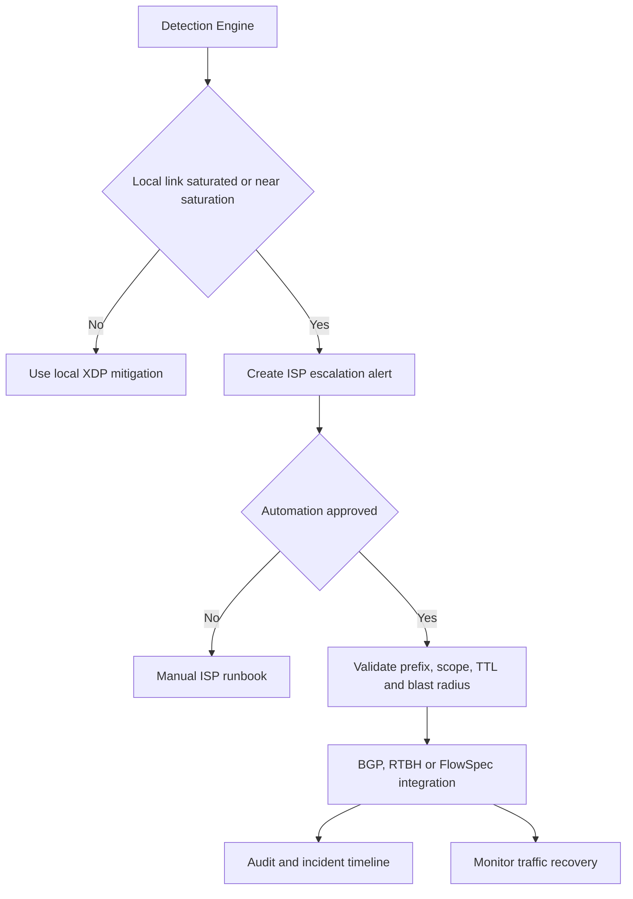

# High-Level Design: Anti-DDoS Scrubbing Gateway eBPF/XDP

**Version:** 1.0  
**Date:** 2026-05-27  
**Status:** Draft  
**Source of truth:** `docs/PRD-Anti-DDoS.md` v1.2 and `docs/System-Architecture-Design.md` v1.0
**Scope:** P1 single-node MVP in detail; P2/P3 as extension architecture with dependencies and risks

---

## 1. Executive Summary

The system is an Anti-DDoS scrubbing gateway placed in front of protected backend services. Internet traffic enters the scrubbing server through the WAN NIC, is filtered as early as possible by XDP/eBPF, and only clean traffic matching backend service allowlists is redirected through L2 MAC rewrite and XDP DEVMAP to the backend-facing interface.

The MVP protects against volumetric L3/L4 attacks: UDP flood, TCP SYN flood, ICMP flood, packet flood, invalid source traffic, bad reputation IP/CIDR traffic, and service/port traffic outside the declared allowlist. The gateway does not terminate TLS, proxy HTTP, inspect payloads, run CAPTCHA/challenges, or replace the existing WAF. L7 enforcement remains the responsibility of the WAF.

Primary design decisions:

| Topic | Decision |
|---|---|
| Deployment model | XDP ingress filter plus DEVMAP redirect gateway before backend |
| MVP runtime | Ubuntu 24.04, native XDP preferred |
| Fallback | Generic XDP or TC only with explicit performance warning |
| Storage | PostgreSQL for config, policies, audit and events; Prometheus for realtime time-series metrics |
| Policy source | Control Plane API builds immutable policy snapshots |
| Data plane fail-safe | XDP keeps running the last valid snapshot when agent or control plane fails |
| Alerting | Telegram is required for MVP alerts |
| HA/upstream | P2/P3 extension; not enabled until routing/upstream dependencies are tested |

---

## 2. Scope By Phase

| Phase | Scope | Design depth |
|---|---|---|
| P1 - MVP | Single active scrubbing node, XDP filtering, DEVMAP redirect, service allowlist, baseline detection, rate-limit/drop rules, threat feed sync, RBAC, audit, rollback, Prometheus/Grafana, Telegram, ISP escalation runbook | Detailed |
| P2 - Operations expansion | Incident grouping, active-passive HA, richer runbooks and incident summaries | Extension design with dependency gates |
| P3 - Upstream automation | BGP/RTBH/FlowSpec integration after upstream approval and routing tests | Extension design only |

Out of MVP scope:

- L7/DPI, HTTP payload inspection, bot fingerprinting, CAPTCHA/challenge.
- Automatic upstream mitigation.
- Multi-tenant SaaS, SSO, active-active HA.
- Protection when the inbound Internet link is already saturated before reaching the scrubbing server.

---

## 3. Non-Functional Requirements

| Area | Requirement |
|---|---|
| Performance | 10 Gbps MVP gate on target hardware, with 40 Gbps benchmark report before SLA commitment |
| Latency | XDP packet path must do bounded parsing, bounded lookups, no dynamic allocation and minimal event emission |
| Reliability | Data plane must keep the last valid policy when control plane is down |
| Operability | Every rule, feed, alert, rollback and forwarding policy change must be auditable |
| Observability | Main metrics must refresh within 3 seconds on dashboard and be scrapable by Prometheus |
| Security | Secrets such as Telegram bot token and feed API keys must be encrypted or protected at rest and redacted in logs |
| Compatibility | Ubuntu 24.04 target, CO-RE/BTF preferred, native XDP preferred |
| Retention | Raw/security events 30 days, aggregated metrics 90 days, audit logs 365 days |

---

## 4. Deployment View

Deployment constraints:

- WAN interface receives protected public traffic.
- Backend-facing output interface reaches protected backend IP/CIDR.
- Agent resolves output ifindex and next-hop/backend MAC through routing/ARP/neighbor data before applying a service policy.
- Backend response path may be asymmetric in MVP; response traffic is not required to return through the scrubbing gateway.
- DEVMAP redirect health, neighbor resolution status and redirect failures must be exported.
- The DEVMAP redirect path must be benchmarked together with XDP filtering, not only drop-only performance.

---

## 5. Component Architecture

| Component | Responsibility | Critical contract |
|---|---|---|
| XDP/eBPF filter | Parse, classify, drop/pass/rate-limit packets | Verifier-safe, bounded, no unbounded loops, no dynamic allocation |
| eBPF maps | Share policy/state/counters between XDP and userspace | Explicit max entries, memory budget and map versioning |
| DEVMAP forwarding | L2 rewrite and redirect clean traffic to backend services | No traffic outside service allowlist reaches backend; target failures fail closed |
| Node Agent | Load/attach/rollback XDP, apply policy snapshots, read maps/events | Keep last valid policy and report stale/apply errors |
| Control Plane API | Source of truth for policy, users, feeds and rollback | RBAC, validation, immutable policy versions, audit |
| Detection and Rule Engine | Baseline, anomaly scoring, auto-enforce TTL rules | Evidence, confidence, TTL and affected service required |
| Threat Feed Sync | Fetch, normalize, dedupe and aggregate blacklist feeds | Hourly schedule, source metadata, conflict report, snapshot retention |
| Alert Service | Deduplicate and deliver Telegram alerts | Rate-limit, retry backoff, delivery log |
| PostgreSQL | Store durable config, policy, events and audit | Partition large time-based tables and enforce retention |
| Prometheus | Store realtime metrics and recording rules | Metric names/labels follow Prometheus data model |

---

## 6. Data Plane Flow

### 6.1 Allowed Traffic

### 6.2 Drop And Rate Limit

Decision order:

1. Parse headers with bounds checks.
2. Apply whitelist precedence.
3. Apply malformed/bogon/invalid-source policy.
4. Apply blacklist IP/CIDR reputation.
5. Validate service allowlist by destination IP, protocol, port and resolved redirect target.
6. Apply per-source, per-service or per-rule rate limit.
7. Rewrite L2 headers, redirect through DEVMAP, increment per-CPU counters and emit sampled event only when allowed by sampling policy.

---

## 7. Control Plane Flow

### 7.1 Policy Snapshot Sync

Snapshot rules:

- Policy snapshots are immutable and versioned monotonically.
- Snapshot checksum is verified before map apply.
- Agent rejects snapshots that exceed map capacity or unsupported feature flags.
- Failed apply keeps the current data plane unchanged.
- Agent loads the last local valid snapshot on restart before requesting a newer snapshot.

### 7.2 Feed Sync

Feed rules:

- Spamhaus DROP, Team Cymru bogon, AbuseIPDB and the internal HTTP JSON feed are mandatory for P1 production readiness.
- Missing required credentials, quota/license metadata or internal feed endpoint blocks production readiness.
- The internal feed JSON contract includes IP/CIDR, score, action, TTL, reason and source metadata.
- Feed failure must not delete currently enforced blacklist entries.
- Whitelist precedence is default for conflicts.
- Source, license/quota, update interval, item count and error details are persisted.
- CIDR aggregation must not broaden the block range beyond safe input coverage.

### 7.3 Alert And Rollback

Rollback targets:

- Rule rollback time target: <= 30 seconds from UI/API action when agent is reachable.
- Rollback creates a new policy snapshot with `rollback_from`.
- Audit stores actor, reason, before/after diff and affected services.

---

## 8. Observability Architecture

Metric groups:

| Group | Examples | Purpose |
|---|---|---|
| Agent health | `agent_up`, `agent_last_seen_seconds`, `agent_policy_stale` | Detect stale or failed agents |
| XDP runtime | `xdp_mode`, `xdp_attach_errors_total`, `xdp_program_version` | Track attach mode and failures |
| Traffic | `traffic_pps`, `traffic_bps`, `traffic_cps` | Realtime anomaly input |
| Packet decisions | `xdp_packets_total`, `xdp_bytes_total` | Pass/drop/rate-limit by reason |
| Forwarding | `redirected_packets_total`, `not_allowed_service_total`, `redirect_errors_total`, `neighbor_unresolved_total` | Validate DEVMAP forwarding |
| Maps | `ebpf_map_entries`, `ebpf_map_capacity`, `ebpf_map_utilization_ratio` | Prevent map exhaustion |
| Feeds | `feed_sync_success_total`, `feed_sync_errors_total`, `feed_entries_active` | Monitor reputation inputs |
| Alerts | `alerts_created_total`, `alerts_sent_total`, `alerts_failed_total` | Monitor alert lifecycle |

Prometheus stores realtime and 90-day aggregated metrics through retention and recording rules. PostgreSQL stores sampled raw security events for 30 days and audit records for 365 days.

---

## 9. Public Contracts

### 9.1 Agent To Control Plane

| Operation | Direction | Main payload | Result |
|---|---|---|---|
| Register agent | Agent -> API | hostname, interfaces, kernel version, XDP/DEVMAP capability, agent version | agent id, desired config |
| Heartbeat | Agent -> API | status, active policy version, XDP mode, uptime, map utilization | desired policy version |
| Fetch snapshot | Agent -> API | agent id, active version | immutable snapshot and checksum |
| Apply ack | Agent -> API | version, status, map stats, errors | apply status persisted |
| Report events | Agent -> API | sampled packet and rule events | event store and detection input |
| Report health | Agent -> API or Prometheus | redirect health, neighbor resolution status, attach health, stale status | dashboard and alerts |

### 9.2 Policy Snapshot

| Field | Description |
|---|---|
| `version` | Monotonic policy version |
| `checksum` | Integrity check over normalized snapshot content |
| `created_at` | Snapshot creation time |
| `created_by` | User or system actor |
| `expires_at` | Optional emergency snapshot expiry |
| `rules` | Drop, rate-limit, observe and sample rules |
| `whitelist` | CIDR entries with owner, reason, priority and expiry |
| `blacklist` | Normalized reputation entries with source metadata |
| `service_allowlist` | Protected backend/service definitions with output interface, ifindex and resolved MAC |
| `xdp_config` | Mode, thresholds, sampling, map capacity hints and flags |
| `rollback_from` | Previous version when created by rollback |

### 9.3 Alert Event

| Field | Description |
|---|---|
| `id` | Alert id |
| `severity` | `info`, `warning`, `critical` |
| `type` | `anomaly`, `auto_enforce`, `feed_failure`, `redirect_failure`, `neighbor_unresolved`, `isp_escalation_needed`, `agent_stale` |
| `dedupe_key` | Rule/service/vector/time-window dedupe key |
| `affected_service` | Backend service or redirect target |
| `vector` | UDP flood, SYN flood, ICMP flood, blacklist hit, not-allowed-service spike |
| `evidence` | Peak bps/pps/cps, top sources, top ports and rule counters |
| `action` | `observe`, `drop`, `rate_limit`, `notify`, `escalate_isp` |
| `delivery_status` | `created`, `sent`, `failed`, `deduped`, `resolved` |

### 9.4 Operator Workflows

| Workflow | Owner | Expected result |
|---|---|---|
| Add whitelist entry | Admin, Operator | Validated CIDR, reason, owner, expiry and audit |
| Change service allowlist | Admin, Operator | Output interface and neighbor validation, snapshot update, apply status |
| Rollback policy | Admin, Operator | New rollback snapshot applied within target time |
| Test Telegram | Admin, Operator | Delivery result visible in dashboard |
| Review attack source | Admin, Operator, Viewer | Event history, counters, reputation and rule state |
| Emergency disable rule | Admin, Operator | Rule disabled through new snapshot and audit |
| ISP escalation | Network/SRE | Runbook data prepared with peak traffic, target and vectors |

---

## 10. P2 Active-Passive HA Extension

HA design rules:

- Standby must receive the same immutable policy snapshot before it is eligible.
- Failover requires tested routing/IP ownership design, such as upstream route change, VRRP, anycast, or provider-managed failover.
- Rate state is not assumed to be synchronized in P2; short-term rate counters reset on failover unless a future state sync design is approved.
- Failover and failback must generate audit events, incident entries and Telegram alerts.

P2 dependency gates:

- NIC and driver compatibility validated on both nodes.
- Route failover tested under packet load.
- Backend return path verified after failover.
- Control plane supports multi-agent policy apply status.

---

## 11. P3 Upstream Mitigation Extension

P3 design rules:

- Automation is disabled by default.
- Every upstream action must have explicit guardrails: allowed prefixes, TTL, max affected services, approval policy and rollback.
- Local XDP remains the first response when the inbound link is not saturated.
- RTBH/FlowSpec can protect availability but may intentionally drop traffic; the blast radius must be visible before execution.

P3 dependency gates:

- Written authorization from upstream provider.
- Lab validation of route advertisement/withdrawal and rollback.
- Approval workflow and emergency disable tested.
- Incident evidence payload approved by Network/SRE.

---

## 12. Failure Modes

| Failure | Expected behavior | Visibility |
|---|---|---|
| eBPF program load fails | Keep current program or rollback to previous program | Dashboard, Prometheus, Telegram if severity threshold met |
| Native XDP attach fails | Fallback according to policy or keep current mode | Performance limitation alert |
| Control plane down | XDP continues with last valid policy | Stale policy metric and alert |
| Agent restart | Load local valid snapshot before new sync | Agent restart event and active policy version |
| Feed sync fails | Keep last valid feed snapshot | Feed status error and alert if prolonged |
| Map capacity exceeded | Reject snapshot, keep current policy | Apply failure reason and map utilization alert |
| Redirect target or neighbor failure | Fail closed instead of forwarding wrong path | Redirect/neighbor metric, dashboard warning, Telegram |
| Telegram API failure | Retry with backoff and record failure | Alert delivery log |
| Link saturation | Local XDP may not help once link is full | ISP escalation alert and runbook |

---

## 13. Requirement Traceability

| PRD ID | HLD coverage | LLD coverage |
|---|---|---|
| PRD-001 | Observability, detection architecture | Baseline anomaly algorithm, metrics, baseline schema |
| PRD-002 | Dashboard and Prometheus metric groups | Prometheus metric names and event storage |
| PRD-003 | Data plane flow and failure modes | XDP pipeline, map schema, parser pseudocode |
| PRD-004 | Policy sync, alert and rollback | Token bucket, auto-enforce TTL, rule lifecycle |
| PRD-005 | Feed sync flow | Feed schema, normalize/dedupe/CIDR aggregation algorithm |
| PRD-006 | Operator workflows | Whitelist schema, conflict handling, snapshot build |
| PRD-007 | Deployment and DEVMAP forwarding flow | Service allowlist/devmap maps, forwarding policy schema |
| PRD-008 | Alert event contract | Alert dedupe/rate-limit/retry algorithm and delivery schema |
| PRD-009 | RBAC and audit contracts | Users, roles, audit tables and rollback schema |
| PRD-010 | Data plane fail-safe | Policy snapshot apply/fail-safe algorithm |
| PRD-011 | P3/manual ISP flow | Upstream action schema and escalation algorithm |
| PRD-012 | P2 incident extension | Incident schema and grouping algorithm |
| PRD-013 | P2 HA extension | Active-passive failover algorithm |
| PRD-014 | P3 upstream extension | Upstream action state and guardrail algorithm |

---

## 14. References

- Linux Kernel Documentation - BPF maps: https://docs.kernel.org/bpf/maps.html
- Linux Kernel Documentation - AF_XDP: https://docs.kernel.org/networking/af_xdp.html
- Prometheus data model: https://prometheus.io/docs/concepts/data_model/
- PostgreSQL table partitioning: https://www.postgresql.org/docs/current/ddl-partitioning.html
- Telegram Bot API `sendMessage`: https://core.telegram.org/bots/api#sendmessage
