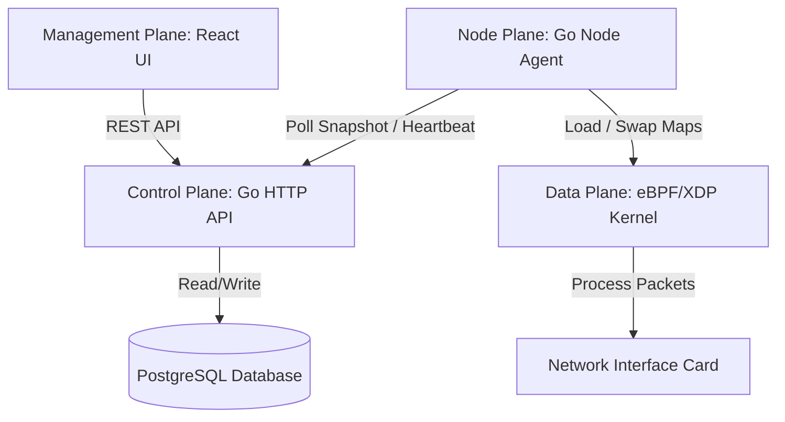

# High-Level Design: Anti-DDoS Scrubbing Gateway

The Anti-DDoS Scrubbing Gateway is a high-performance L3/L4 packet filtration and mitigation platform designed to protect server infrastructure from volumetric and protocol-based DDoS attacks. It combines a kernel-level eBPF/XDP data plane with a robust Go control plane and a React-based management interface.

---

## Scope & Target Use Cases

- **Target Layer:** L3/L4 volumetric attack mitigation (e.g., UDP floods, UDP reflection, ICMP floods, TCP SYN floods, port scans).
- **Technology Hooks:** eBPF/XDP running at the host driver level (for maximum performance) or generic network interface level.
- **Out of Scope:** L7 protocol termination (WAF, HTTP inspection, SSL/TLS decryption), deep packet inspection, and reverse proxying.

---

## 1. Actors & Security Role Behavior

The platform utilizes three distinct logical actors, separating tenant-owned infrastructure from global admin operations and daemon nodes.

| Actor | Goal | Permissions & Operational Scope | Verification Method |
|---|---|---|---|
| **User** (`RoleUser`) | Manage L3/L4 protection settings for their own infrastructure. | - Read/write access to owned Services, Rules, Whitelist, Manual Blacklist, UDP Port Blocks, and Snapshots.<br>- **Restricted:** Cannot view or configure Telegram integrations, cannot view the Incidents/Alerts logs, and cannot read/edit global reputation feeds. | JWT bearer session containing role claims and scoped `owner_user_id`. |
| **Admin** (`RoleAdmin`) | Administer the scrubbing platform, manage threat feeds, and assist tenant users. | - Read/write access to global accounts, threat feed configuration/sync logs, and admin-global policy scopes.<br>- **Alerting:** Complete access to view Incidents, configure/test system-wide Telegram integrations, and evaluate manual ISP Escalations.<br>- **Impersonation:** Can open user config contexts in read-only mode (`view-user`). | JWT bearer session with admin claims. View-user sessions inject `ViewingUser` metadata. |
| **Node Agent** | Pull, verify, and apply compiled security policies to the local eBPF data plane. | - Periodically sends heartbeats to the control plane.<br>- Fetches compiled signed policy snapshots.<br>- Updates XDP map entries and reports local apply status. | Node authentication token verified by the Control API. |

---

## 2. Platform Architecture

The system is decomposed into five distinct operational planes:



### A. Data Plane (Kernel Space - eBPF/XDP)
- **xdp_entry Hook:** Attaches to the WAN network interfaces. Evaluates packet headers directly at the driver RX queue, bypassing the standard kernel network stack for minimal latency.
- **IP Set Matching:** Employs eBPF Hash Maps to verify incoming packets against Whitelist (allow-pass), Blacklist (drop), and UDP Source Port blocks.
- **Rules Engine:** Evaluates custom protocol rules using priorities, protocol identifiers, IP/port matching criteria, and TCP flags.
- **Actions:**
  - `XDP_PASS`: Forward valid packet to host stack.
  - `XDP_DROP`: Drop packet immediately.
  - `XDP_TX` / Devmap: Redirect packet directly out of a specified interface.
- **Telemetry & Sampling:** Uses atomic eBPF array maps for packet/byte action counters, and a perf event ring buffer to sample drop events for the control plane.

### B. Forwarding Plane (Redirection)
- Valid traffic destined for protected backend services is redirected via an eBPF Device Map (`tx_devmap`).
- Performs L2 MAC address re-writing. Before forwarding, the Node Agent resolves target gateway MAC addresses (ARP/Neighbor discovery) corresponding to the configured `output_interface`. If address resolution fails, the path fails closed for security.

### C. Node Plane (Go Agent Daemon)
- Runs as a system service on the scrubbing host.
- **Heartbeat Daemon:** Reports network interface statistics, eBPF attachment statuses, and current policy versions.
- **A/B Map Switching:** Employs double-buffering for configuration tables. New policy parameters are written to inactive maps; switching is performed atomically by flipping an active slot selector array.
- **Metrics Export:** Exposes a Prometheus `/metrics` endpoint collecting system load, eBPF drop counters, and queue telemetry.

### D. Control Plane (Go API Server)
- **REST Endpoints:** Exposes authenticated endpoints for policy CRUD, user administration, snapshot rollbacks, and agent synchronization.
- **Authentication:** Password validation via `bcrypt` hashing, yielding cryptographically signed JWT session tokens.
- **Snapshot Generator:** Compiles active services, rules, ports, and whitelists/blacklists into a single JSON-serialized, checksum-signed `PolicySnapshot` package.
- **Incident & Alert Engine:** Restricts alert creation and evaluation to administrative roles. Centralizes Telegram alerts delivery via a unscoped admin configuration, ensuring platform-wide alerts routing.

### E. Management Plane (React Dashboard, Prometheus, Grafana)
- Renders the responsive user interface built with React, Vite, and TailwindCSS/Vanilla CSS.
- **RBAC Guarding:** Sidebar navigation groups and interactive forms dynamically enable or disable features based on active claims (e.g. hiding the Incidents tab and Reputation feeds for regular users).
- **View-User impersonation:** Re-scopes client-side fetch wrappers to read the target user's context in read-only mode, disabling all forms and mutation APIs.

---

## 3. Database & Data Isolation

Data separation is enforced at the database and query parsing layer.

```
       +---------------------------------------------+
       |           Control Plane REST API            |
       +---------------------------------------------+
                              |
       +---------------------------------------------+
       |   User Request    |     Admin View Session  |
       |  (Scoped Token)   |   (Impersonating Token) |
       +---------------------------------------------+
              |                           |
              V                           V
     WHERE owner_user_id =        WHERE owner_user_id =
         actor.ID                   actor.ViewingUserID
```

- **Tenant Isolation:** All operational tables (Services, Rules, Whitelist, Manual Blacklist, UDP Port Blocks, and Snapshots) contain an `owner_user_id` column. Non-admin operations query these tables using a strict `WHERE owner_user_id = ?` clause derived from the caller's JWT token.
- **Threat Intelligence Sync:** Threat feed configurations and logs are stored globally without owner constraints.
- **Effective Reputation Union:** When the control plane builds a `PolicySnapshot` for a tenant user, it dynamically merges the global administrative threat reputation IPs with the user's manual blacklist. The generated blacklist items derived from feeds are flagged with `Source: "threat-feed"` and `Editable: false`, ensuring they display as read-only in the user's interface.

---

## 4. Policy Compilation & Execution Flow

The sequence below outlines how security policies move from dashboard modifications to active data plane enforcement:

```
[Dashboard UI] -- 1. Mutate Config (Audit Reason) --> [Control Plane API]
                                                             |
                                                     2. Validate & Persist
                                                             |
                                                     3. Compile Snapshot (Signed SHA-256)
                                                             |
[Node Agent]   <-- 4. Poll Heartbeat (vX) ----------- [DB Store / Cache]
     |
5. Verify Checksum & Load Inactive A/B Maps
     |
6. Flip Active Slot Map -> [Active Data Plane]
```

1. **Mutation Trigger:** User modifies policy (e.g., adds a Whitelist CIDR) via the React UI, supplying an audit trail reason.
2. **Store Validation:** Control plane validates IP constraints, CIDR formatting, and role authorization. The changes are committed inside a database transaction.
3. **Snapshot Build:** The snapshot compilation engine generates a new JSON structure, calculates a SHA-256 integrity hash, signs the version, and bumps the policy version counter.
4. **Agent Polling:** The host Node Agent polls the control plane via `/v1/agent/policy`, presenting its current active configuration version.
5. **Payload Verification:** If a newer version is available, the agent downloads the snapshot, verifies the SHA-256 checksum, and begins loading the rules into the eBPF A/B inactive map slot.
6. **Atomic Activation:** The agent updates ARP/Mac forwarding caches and flips the active slot selector array in kernel memory, enabling the new rules instantly with zero packet loss.

---

## 5. Security & Safety Gates

- **Token Masking:** Telegram bot tokens and threat-intelligence credentials are masked in JSON responses (`*****`) and audit log entries.
- **Write-Only Credentials:** Database credentials and webhook secrets are encrypted at rest.
- **Impersonation Safe-Checks:** Admin sessions in `view-user` mode are marked `read_only = true` at the Go handler level, enforcing that any write calls (POST/PUT/PATCH/DELETE) return `403 Forbidden`.
- **System Isolation:** XDP attachment and device redirection require explicit, manual configuration by root-privileged operators on the host host to prevent arbitrary packet sniffing.

