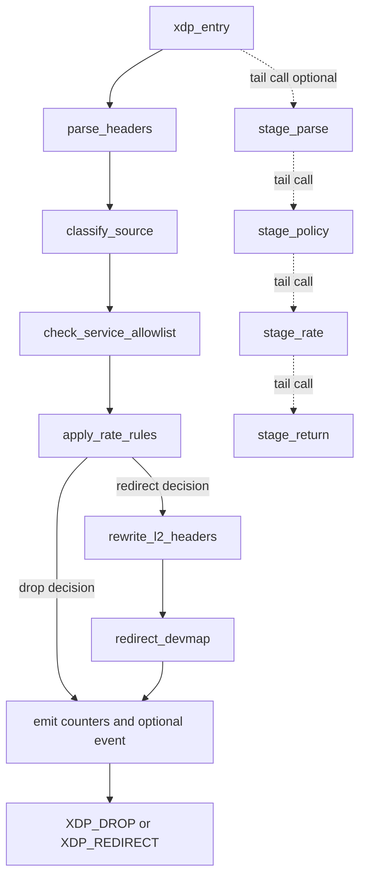
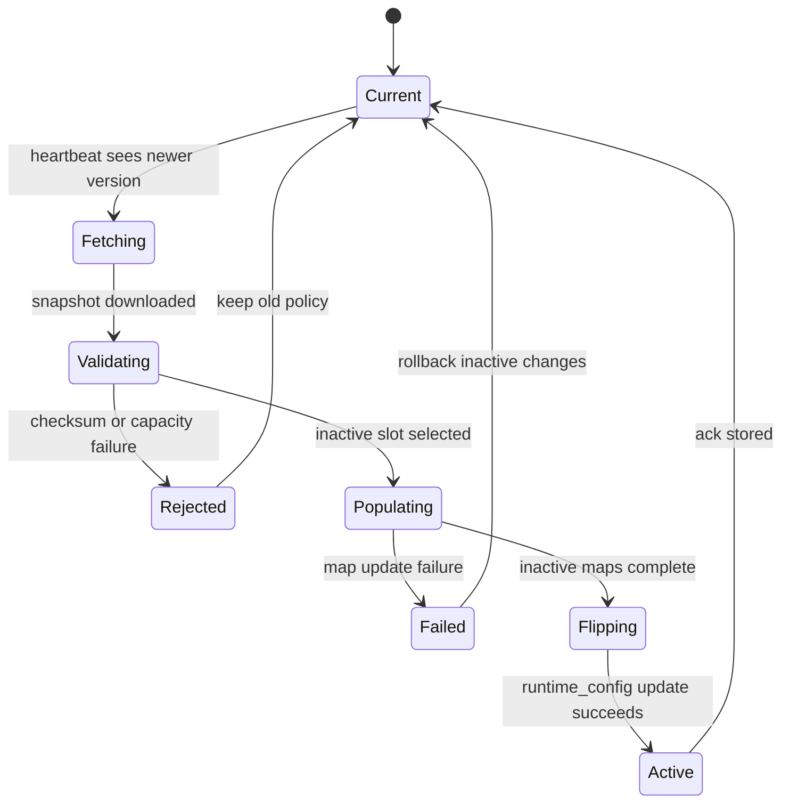
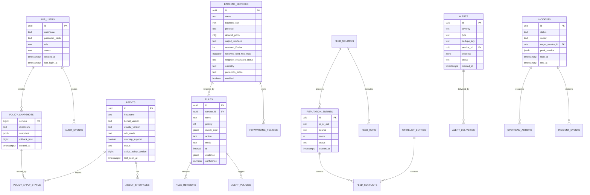
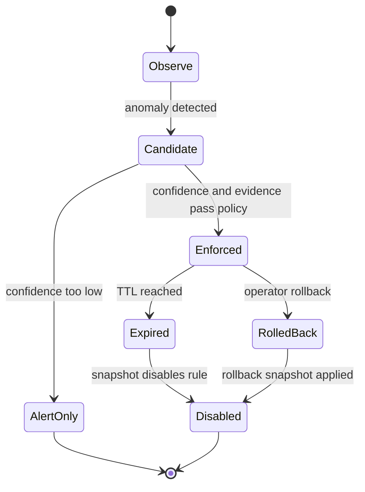

# Low-Level Design: Anti-DDoS Scrubbing Gateway eBPF/XDP

**Version:** 1.0  
**Date:** 2026-05-27  
**Status:** Draft  
**Source of truth:** `docs/PRD-Anti-DDoS.md` v1.2, `docs/System-Architecture-Design.md` v1.0, `docs/HLD.md` v1.0
**Storage baseline:** PostgreSQL for durable state; Prometheus for realtime metrics and 90-day aggregated time-series

---

## 1. Design Constraints

P1 implements a single active Ubuntu 24.04 scrubbing node. Native XDP is the target mode; generic XDP or TC fallback is allowed only when configured and must raise a performance warning. The main redirect path is L2 MAC rewrite plus `XDP_REDIRECT` through a DEVMAP. IPv4 is mandatory for MVP. IPv6 keys and schema are reserved, but IPv6 enforcement can be disabled until explicitly enabled.

The XDP program must remain verifier-safe:

- Every packet pointer access must be bounds checked against `data_end`.
- All loops must be bounded at compile time or replaced with fixed checks.
- No dynamic allocation is allowed on the packet path.
- High-frequency counters use per-CPU maps.
- Event emission uses ringbuf sampling and must never block packet processing.
- Policy maps have explicit `max_entries` and memory budgets before program load.
- Fragmented packets or packets without enough L4 header to match service/port are dropped by default.
- DEVMAP, output interface and neighbor/MAC failures fail closed with explicit counters and alerts.

Policy maps that need atomic replacement use A/B double-buffering. The logical map names in this document, such as `whitelist_lpm` and `blacklist_lpm`, are implemented as physical active/inactive map pairs when atomic snapshot apply is required.

---

## 2. XDP Program Layout



Program sections:

| Section | Purpose | Required in P1 |
|---|---|---|
| `SEC("xdp") xdp_entry` | Main entrypoint attached to WAN interface | Yes |
| `stage_parse` | Optional tail-call stage for parser if instruction count grows | No |
| `stage_policy` | Optional tail-call stage for whitelist/blacklist/service checks | No |
| `stage_rate` | Optional tail-call stage for token bucket and counters | No |
| `stage_return` | Optional tail-call stage for final decision/event/redirect | No |

XDP return codes:

| Return | Meaning |
|---|---|
| `XDP_PASS` | Reserved for explicitly configured fallback or diagnostic policy |
| `XDP_DROP` | Packet is dropped at ingress |
| `XDP_REDIRECT` | Default P1 success path after service allowlist, rate check and L2 rewrite |
| `XDP_TX` | Not used in MVP |

---

## 3. Packet Metadata

The parser writes a compact stack-local metadata struct. All fields must be initialized.

```c
enum l4_proto {
    L4_UNKNOWN = 0,
    L4_ICMP = 1,
    L4_TCP = 6,
    L4_UDP = 17,
};

enum packet_action {
    ACTION_PASS = 0,
    ACTION_DROP = 1,
    ACTION_RATE_LIMIT = 2,
    ACTION_OBSERVE = 3,
    ACTION_SAMPLE = 4,
    ACTION_NOT_FORWARD = 5,
    ACTION_REDIRECT = 6,
};

enum drop_reason {
    REASON_NONE = 0,
    REASON_MALFORMED = 1,
    REASON_BOGON = 2,
    REASON_BLACKLIST = 3,
    REASON_NOT_ALLOWED_SERVICE = 4,
    REASON_RATE_LIMIT = 5,
    REASON_RULE_DROP = 6,
    REASON_MAP_ERROR = 7,
    REASON_REDIRECT_ERROR = 8,
    REASON_NEIGHBOR_UNRESOLVED = 9,
    REASON_FRAGMENT = 10,
};

struct packet_meta {
    __u32 src_v4;
    __u32 dst_v4;
    __u16 src_port;
    __u16 dst_port;
    __u8 proto;
    __u8 tcp_flags;
    __u16 pkt_len;
    __u32 service_id;
    __u32 rule_id;
    __u8 is_fragment;
    __u8 is_malformed;
    __u8 action;
    __u8 reason;
};
```

Notes:

- IP addresses are kept in network byte order.
- CPS in MVP means rate of new TCP SYN packets observed at XDP, not fully established TCP connections.
- Fragment handling defaults to drop with `REASON_FRAGMENT`. A future per-service exception requires an explicit product decision and test plan.

---

## 4. eBPF Map Contracts

### 4.1 Map Inventory

| Logical map | Physical implementation | Type | Hot path | Producer | Consumer |
|---|---|---|---|---|---|
| `whitelist_lpm` | `whitelist_v4_a`, `whitelist_v4_b`; future v6 pair | `BPF_MAP_TYPE_LPM_TRIE` | Yes | Agent | XDP |
| `blacklist_lpm` | `blacklist_v4_a`, `blacklist_v4_b`; future v6 pair | `BPF_MAP_TYPE_LPM_TRIE` | Yes | Agent | XDP |
| `service_allowlist` | `service_allowlist_a`, `service_allowlist_b` | `BPF_MAP_TYPE_HASH` | Yes | Agent | XDP |
| `tx_devmap` | Shared pinned map | `BPF_MAP_TYPE_DEVMAP` | Yes | Agent | XDP |
| `rate_state` | Shared map | `BPF_MAP_TYPE_LRU_HASH` | Yes | XDP | XDP, Agent |
| `rule_config` | `rule_config_a`, `rule_config_b` plus active slot config | `BPF_MAP_TYPE_ARRAY` | Yes | Agent | XDP |
| `drop_counters` | Shared map | `BPF_MAP_TYPE_PERCPU_HASH` | Yes | XDP | Agent |
| `events` | Shared map | `BPF_MAP_TYPE_RINGBUF` | Sampled | XDP | Agent |
| `prog_array` | Shared map | `BPF_MAP_TYPE_PROG_ARRAY` | Optional | Agent | XDP |
| `runtime_config` | Shared map | `BPF_MAP_TYPE_ARRAY` | Yes | Agent | XDP |

The immutable policy maps use double-buffering:

1. XDP reads active slot from `runtime_config[0]`.
2. Agent clears and populates the inactive slot.
3. Agent flips active slot and policy version by a single `runtime_config` update.
4. Agent clears the previously active slot after successful ack.

This avoids a partially applied policy becoming visible on the packet path.

### 4.2 Shared Structs

```c
#define MAX_RULES 4096
#define MAX_SERVICES 4096
#define MAX_EVENT_SAMPLE_DENOM 1000000

struct runtime_config_value {
    __u32 active_slot;          /* 0 or 1 */
    __u32 policy_version;
    __u32 malformed_policy;     /* default ACTION_DROP in MVP */
    __u32 sample_denom;         /* 1 means sample all, 0 disables events */
    __u64 updated_at_unix_ns;
};

struct lpm_v4_key {
    __u32 prefixlen;
    __u32 addr;
};

struct cidr_policy_value {
    __u32 entry_id;
    __u32 priority;
    __u32 action;
    __u32 source_type;
    __u32 scope;                /* global or service_scoped */
    __u32 service_id;           /* 0 for global */
    __u32 score;
    __u32 rule_id;
    __u64 expires_at_unix_ns;
};

struct service_key {
    __u32 dst_v4;
    __u16 dst_port;
    __u8 proto;
    __u8 pad;
};

struct service_value {
    __u32 service_id;
    __u32 forwarding_policy_id;
    __u32 action;
    __u32 priority;
    __u32 default_rule_id;
    __u32 output_ifindex;
    __u32 devmap_key;
    __u32 neighbor_status;      /* resolved or unresolved */
    __u8 dst_mac[6];
    __u8 src_mac[6];
    __u16 pad;
};

struct rule_value {
    __u32 rule_id;
    __u32 priority;
    __u32 action;
    __u32 mode;                 /* observe or enforce */
    __u32 service_id;
    __u32 threshold_pps;
    __u32 threshold_bps;
    __u32 threshold_cps;
    __u32 burst_packets;
    __u32 burst_bytes;
    __u32 sample_denom;
    __u64 expires_at_unix_ns;
};

struct rate_key {
    __u32 src_v4;
    __u32 service_id;
    __u32 rule_id;
    __u8 proto;
    __u8 dimension;             /* source, subnet, service, source_service */
    __u16 pad;
};

struct rate_value {
    __u64 last_refill_ns;
    __u64 tokens_packets;
    __u64 tokens_bytes;
    __u64 syn_seen;
    __u64 packets_seen;
    __u64 bytes_seen;
};

struct counter_key {
    __u32 reason;
    __u32 rule_id;
    __u32 service_id;
    __u8 proto;
    __u8 action;
    __u16 pad;
};

struct counter_value {
    __u64 packets;
    __u64 bytes;
};

struct event_record {
    __u64 ts_mono_ns;
    __u32 policy_version;
    __u32 src_v4;
    __u32 dst_v4;
    __u16 src_port;
    __u16 dst_port;
    __u8 proto;
    __u8 tcp_flags;
    __u8 action;
    __u8 reason;
    __u32 service_id;
    __u32 rule_id;
    __u32 pkt_len;
};
```

Implementation notes:

- `expires_at_unix_ns` is informational in XDP for policy values. The Control Plane and Agent remove expired entries from snapshots. XDP may check it only when a trusted wall-clock mapping is available.
- `rate_state` is approximate under concurrent updates. Small over-pass is acceptable and must be covered by conservative thresholds and burst settings.
- If exact global rate limiting becomes mandatory, use a separate design with synchronized state or stricter per-CPU budget division.

### 4.3 Map Sizing Defaults

| Map | Default max entries | Capacity note |
|---|---:|---|
| `whitelist_lpm` | 65,536 | Manual whitelist plus emergency allow entries |
| `blacklist_lpm` | 1,000,000 | Aggregated feed entries; reject snapshot above capacity |
| `service_allowlist` | 16,384 | Protected IP/protocol/port tuples |
| `tx_devmap` | 128 | Output interfaces used by service policies |
| `rate_state` | 2,000,000 | LRU eviction prevents unbounded attack state |
| `rule_config` | 4,096 | Active rules per snapshot |
| `drop_counters` | 262,144 | Composite reason/rule/service counters |
| `events` | 64 MiB | Tuned by node memory budget and sampling policy |
| `prog_array` | 16 | Optional pipeline stages |

Final values must be benchmarked against available locked memory, kernel limits, NIC queues and expected feed sizes.

---

## 5. XDP Packet Decision Algorithm

```text
function xdp_entry(ctx):
    meta = zeroed packet_meta
    cfg = runtime_config[0]
    if cfg is missing:
        count(REASON_MAP_ERROR, ACTION_DROP)
        return XDP_DROP

    parse_result = parse_l2_l3_l4(ctx, meta)
    if parse_result == MALFORMED:
        meta.reason = REASON_MALFORMED
        meta.action = ACTION_DROP
        count(meta.reason, meta.action)
        maybe_sample(meta, cfg)
        return XDP_DROP

    if meta.is_fragment:
        meta.reason = REASON_FRAGMENT
        meta.action = ACTION_DROP
        count(meta.reason, meta.action)
        maybe_sample(meta, cfg)
        return XDP_DROP

    whitelist = lookup_active_whitelist(cfg.active_slot, meta.src_v4)

    if whitelist missing and is_bogon_or_invalid_source(meta.src_v4):
        meta.reason = REASON_BOGON
        meta.action = ACTION_DROP
        count(meta.reason, meta.action)
        maybe_sample(meta, cfg)
        return XDP_DROP

    service = lookup_active_service(cfg.active_slot, meta.dst_v4, meta.proto, meta.dst_port)
    if service missing:
        meta.reason = REASON_NOT_ALLOWED_SERVICE
        meta.action = ACTION_DROP
        count(meta.reason, meta.action)
        maybe_sample(meta, cfg)
        return XDP_DROP

    meta.service_id = service.service_id
    whitelist_applies = whitelist exists and (
        whitelist.scope == GLOBAL or whitelist.service_id == service.service_id
    )

    blacklist = lookup_active_blacklist(cfg.active_slot, meta.src_v4)
    if not whitelist_applies and blacklist exists and blacklist.action == ACTION_DROP:
        meta.rule_id = blacklist.rule_id
        meta.reason = REASON_BLACKLIST
        meta.action = ACTION_DROP
        count(meta.reason, meta.action)
        maybe_sample(meta, cfg)
        return XDP_DROP

    if service.neighbor_status != NEIGHBOR_RESOLVED:
        meta.reason = REASON_NEIGHBOR_UNRESOLVED
        meta.action = ACTION_DROP
        count(meta.reason, meta.action)
        maybe_sample(meta, cfg)
        return XDP_DROP

    rule = select_rule(cfg.active_slot, service.default_rule_id, meta)
    if rule exists and not whitelist_applies:
        decision = apply_rule_and_rate_limit(rule, meta)
        if decision == DROP:
            count(meta.reason, ACTION_DROP)
            maybe_sample(meta, cfg)
            return XDP_DROP

    if rewrite_eth_addrs(ctx, service.dst_mac, service.src_mac) fails:
        meta.reason = REASON_REDIRECT_ERROR
        meta.action = ACTION_DROP
        count(meta.reason, meta.action)
        maybe_sample(meta, cfg)
        return XDP_DROP

    meta.action = ACTION_REDIRECT
    count(REASON_NONE, ACTION_REDIRECT)
    return bpf_redirect_map(&tx_devmap, service.devmap_key, XDP_DROP)
```

Parser requirements:

- Ethernet header must fit before reading `h_proto`.
- IPv4 header length must be validated before reading L4.
- TCP/UDP/ICMP header must fit before reading ports or flags.
- Fragmented packets must not read missing L4 headers and are dropped by default.
- Unknown protocols pass or drop only by explicit rule.
- A global whitelist bypasses blacklist and rate-limit for all services but still requires a service allowlist match.
- A service-scoped whitelist applies only after the packet resolves to that service.
- `bpf_redirect_map(..., XDP_DROP)` makes missing DEVMAP entries fail closed.

---

## 6. Token Bucket Rate Limit

Each enforce rule may define packet, byte and SYN-packet thresholds. A packet must pass all configured buckets.

```text
function apply_token_bucket(rule, meta):
    key = build_rate_key(meta.src_v4, meta.service_id, rule.rule_id, meta.proto)
    state = rate_state.lookup_or_init(key)
    now = bpf_ktime_get_ns()

    elapsed = max(0, now - state.last_refill_ns)
    packet_refill = elapsed * rule.threshold_pps / 1_000_000_000
    byte_refill = elapsed * rule.threshold_bps / 8 / 1_000_000_000

    state.tokens_packets = min(rule.burst_packets, state.tokens_packets + packet_refill)
    state.tokens_bytes = min(rule.burst_bytes, state.tokens_bytes + byte_refill)
    state.last_refill_ns = now

    if rule.threshold_cps > 0 and meta.proto == TCP and meta.tcp_flags has SYN and not ACK:
        update SYN bucket using threshold_cps

    if state.tokens_packets < 1:
        meta.reason = REASON_RATE_LIMIT
        return DROP

    if rule.threshold_bps > 0 and state.tokens_bytes < meta.pkt_len:
        meta.reason = REASON_RATE_LIMIT
        return DROP

    state.tokens_packets -= 1
    state.tokens_bytes -= meta.pkt_len when bps bucket enabled
    return PASS
```

Rules:

- `observe` mode updates counters/events but never drops due to threshold.
- `enforce` mode drops over-limit packets.
- `drop` action does not need token bucket; it drops every matching packet.
- Auto-enforce rules default to `rate_limit`; `drop` is reserved for blacklist/bogon/manual rules or explicit high-confidence escalation.
- LRU eviction is acceptable because evicted attackers lose accumulated state and are reinitialized with conservative burst.

---

## 7. Policy Snapshot Apply



Apply algorithm:

```text
function apply_snapshot(snapshot):
    verify checksum over canonical JSON
    verify snapshot.version > active_version
    verify feature flags supported by agent and XDP object
    estimate map entries and memory
    reject if any map would exceed capacity

    inactive_slot = 1 - runtime_config.active_slot
    clear policy maps for inactive_slot

    populate whitelist_lpm[inactive_slot]
    populate blacklist_lpm[inactive_slot]
    populate service_allowlist[inactive_slot]
    populate tx_devmap with required output ifindexes
    populate rule_config[inactive_slot]

    if any population step fails:
        clear inactive_slot
        report failure
        keep active_slot unchanged

    update runtime_config[0] with inactive_slot and snapshot.version
    persist local snapshot as last_valid
    ack success to Control Plane
    clear old slot asynchronously
```

Local fail-safe:

- On agent restart, load the last local valid snapshot before network sync.
- If Control Plane is unreachable, keep the active XDP program and current maps.
- If eBPF program load fails, keep the current program or rollback to the previously pinned program.
- If native attach fails, use configured fallback or keep current attach mode.
- If output interface, DEVMAP target or neighbor/MAC resolution fails, reject the new snapshot and keep the current active policy.

---

## 8. PostgreSQL Schema

### 8.1 ERD



### 8.2 Table Catalog

| Table | Purpose | Key columns | Indexes |
|---|---|---|---|
| `app_users` | Local RBAC users | `id`, `username`, `role`, `status`, `password_hash` | unique `username`, `role` |
| `user_sessions` | Dashboard/API sessions | `id`, `user_id`, `expires_at`, `revoked_at` | `user_id`, `expires_at` |
| `agents` | Registered scrubbing agents | `id`, `hostname`, `xdp_mode`, `devmap_support`, `status`, `active_policy_version`, `last_seen_at` | `hostname`, `status`, `last_seen_at` |
| `agent_interfaces` | WAN/LAN interface metadata | `agent_id`, `name`, `ifindex`, `mac`, `role`, `link_speed_bps` | unique `agent_id,name` |
| `backend_services` | Protected services | `id`, `backend_cidr`, `protocol`, `allowed_ports`, `output_interface`, `resolved_ifindex`, `resolved_next_hop_mac`, `neighbor_resolution_status`, `protection_mode`, `criticality` | `enabled`, `backend_cidr` using GiST |
| `forwarding_policies` | Service allowlist rules | `id`, `service_id`, `match_protocol`, `match_dst_port`, `backend_target`, `output_interface`, `resolved_ifindex`, `resolved_dst_mac`, `action`, `priority`, `version` | `service_id`, `version`, `priority` |
| `rules` | Current mitigation rules | `id`, `service_id`, `priority`, `match_expr`, `action`, `mode`, `ttl`, `expires_at`, `confidence` | `service_id`, `mode`, `expires_at`, `priority` |
| `rule_revisions` | Rule history | `rule_id`, `version`, `before`, `after`, `reason`, `actor_id` | `rule_id,version` |
| `policy_snapshots` | Immutable effective policies | `version`, `checksum`, `snapshot`, `rollback_from`, `created_by` | `created_at`, `rollback_from` |
| `policy_apply_status` | Agent apply result | `agent_id`, `policy_version`, `status`, `error`, `map_stats` | unique `agent_id,policy_version` |
| `whitelist_entries` | Manual allow CIDRs | `ip_or_cidr`, `scope`, `service_id`, `label`, `reason`, `owner`, `priority`, `expires_at`, `enabled` | GiST `ip_or_cidr`, `scope`, `service_id`, `expires_at` |
| `feed_sources` | Feed configuration | `name`, `type`, `url`, `enabled`, `required_for_production`, `interval_seconds`, `license_note`, `quota_metadata`, `secret_ref` | unique `name`, `enabled` |
| `feed_runs` | Feed execution log | `source_id`, `started_at`, `finished_at`, `status`, `items_fetched`, `error` | `source_id,started_at` |
| `reputation_entries` | Effective blacklist/reputation | `ip_or_cidr`, `source`, `score`, `status`, `first_seen_at`, `last_seen_at`, `expires_at` | GiST `ip_or_cidr`, `source`, `status` |
| `feed_conflicts` | Whitelist/blacklist conflicts | `whitelist_id`, `reputation_id`, `status`, `detected_at` | `status`, `detected_at` |
| `baseline_profiles` | Approved traffic baselines | `service_id`, `interface`, `metric`, `window`, `expected_min`, `expected_max`, `confidence` | `service_id,metric,window` |
| `alert_policies` | Alert routing/rate policy | `rule_id`, `severity`, `telegram_chat_id`, `rate_limit_seconds`, `template`, `enabled` | `rule_id`, `enabled` |
| `alerts` | Alert instances | `severity`, `type`, `dedupe_key`, `service_id`, `evidence`, `status` | `dedupe_key`, `status`, `created_at` |
| `alert_deliveries` | Telegram delivery attempts | `alert_id`, `channel`, `status`, `attempt`, `error`, `sent_at` | `alert_id`, `status` |
| `security_events` | Sampled packet/rule events | `observed_at`, `agent_id`, `service_id`, `src_ip`, `dst_ip`, `action`, `reason`, `rule_id` | partitioned by `observed_at`, indexes on `src_ip`, `service_id` |
| `audit_events` | Durable audit log | `actor_id`, `action`, `entity_type`, `entity_id`, `before`, `after`, `reason`, `created_at` | partitioned by `created_at`, `actor_id`, `entity_type` |
| `incidents` | P2 incident grouping | `status`, `vector`, `target_service_id`, `peak_metrics`, `start_at`, `end_at`, `summary` | `status`, `start_at`, `target_service_id` |
| `incident_events` | Alert/rule events in incidents | `incident_id`, `alert_id`, `rule_id`, `event_type`, `created_at` | `incident_id`, `created_at` |
| `upstream_actions` | P3 upstream mitigation actions | `incident_id`, `action_type`, `prefix`, `ttl`, `status`, `approval`, `started_at`, `ended_at` | `status`, `prefix`, `started_at` |

### 8.3 DDL Patterns

Large time-based tables use PostgreSQL declarative partitioning.

```sql
CREATE TABLE security_events (
    id uuid NOT NULL,
    observed_at timestamptz NOT NULL,
    agent_id uuid NOT NULL REFERENCES agents(id),
    service_id uuid REFERENCES backend_services(id),
    src_ip inet NOT NULL,
    dst_ip inet NOT NULL,
    src_port integer,
    dst_port integer,
    protocol text NOT NULL,
    action text NOT NULL,
    reason text NOT NULL,
    rule_id uuid,
    packet_len integer,
    metadata jsonb NOT NULL DEFAULT '{}'::jsonb,
    PRIMARY KEY (id, observed_at)
) PARTITION BY RANGE (observed_at);

CREATE TABLE audit_events (
    id uuid NOT NULL,
    created_at timestamptz NOT NULL,
    actor_id uuid REFERENCES app_users(id),
    action text NOT NULL,
    entity_type text NOT NULL,
    entity_id text NOT NULL,
    before jsonb,
    after jsonb,
    reason text,
    request_id text,
    PRIMARY KEY (id, created_at)
) PARTITION BY RANGE (created_at);

CREATE TABLE policy_snapshots (
    version bigint PRIMARY KEY,
    checksum text NOT NULL,
    snapshot jsonb NOT NULL,
    rollback_from bigint REFERENCES policy_snapshots(version),
    created_by uuid REFERENCES app_users(id),
    created_at timestamptz NOT NULL DEFAULT now()
);
```

Retention:

| Data | Store | Default retention | Cleanup |
|---|---|---:|---|
| Raw/security events | PostgreSQL `security_events` | 30 days | Drop or detach old partitions |
| Aggregated metrics | Prometheus recording rules | 90 days | Prometheus retention config |
| Audit events | PostgreSQL `audit_events` | 365 days | Drop or archive partitions |
| Policy snapshots | PostgreSQL | 365 days minimum or audit retention | Keep versions needed for rollback/investigation |
| Feed run logs | PostgreSQL | 90 days | Partition or timestamp delete |
| Alert deliveries | PostgreSQL | 90 days | Timestamp delete or partition |

Secrets:

- `feed_sources.secret_ref` and Telegram bot credentials must refer to a secret store or encrypted column.
- Logs and audit diffs must redact secret values.
- API responses must never return plaintext tokens.
- Production readiness is blocked unless all required P1 feed sources have valid credential/license/quota metadata and the internal HTTP JSON endpoint is configured.

---

## 9. Prometheus Metrics

Prometheus stores time series as a metric name plus label dimensions. Labels must stay bounded. Do not put `src_ip`, raw CIDR, user input, or alert text into high-cardinality metrics; use PostgreSQL events for that.

| Metric | Type | Labels | Purpose |
|---|---|---|---|
| `anti_ddos_agent_up` | gauge | `agent_id`, `hostname` | Agent health |
| `anti_ddos_agent_last_seen_seconds` | gauge | `agent_id` | Seconds since last heartbeat |
| `anti_ddos_policy_active_version` | gauge | `agent_id` | Active policy version |
| `anti_ddos_policy_apply_errors_total` | counter | `agent_id`, `reason` | Snapshot apply failures |
| `anti_ddos_xdp_attach_errors_total` | counter | `agent_id`, `interface`, `mode` | Attach/load errors |
| `anti_ddos_xdp_mode` | gauge | `agent_id`, `interface`, `mode` | Active XDP mode as labeled gauge |
| `anti_ddos_xdp_packets_total` | counter | `agent_id`, `interface`, `action`, `reason`, `protocol`, `service_id`, `rule_id` | Packet decisions |
| `anti_ddos_xdp_bytes_total` | counter | Same as packet counter | Byte decisions |
| `anti_ddos_traffic_pps` | gauge | `agent_id`, `interface`, `protocol`, `service_id` | Realtime packet rate |
| `anti_ddos_traffic_bps` | gauge | `agent_id`, `interface`, `protocol`, `service_id` | Realtime bit rate |
| `anti_ddos_traffic_cps` | gauge | `agent_id`, `interface`, `service_id` | TCP SYN rate approximation |
| `anti_ddos_redirected_packets_total` | counter | `agent_id`, `service_id`, `protocol`, `output_interface` | DEVMAP redirected packets |
| `anti_ddos_not_allowed_service_total` | counter | `agent_id`, `interface`, `protocol` | Service allowlist misses |
| `anti_ddos_redirect_errors_total` | counter | `agent_id`, `service_id`, `output_interface`, `reason` | DEVMAP/rewrite failures |
| `anti_ddos_neighbor_unresolved_total` | counter | `agent_id`, `service_id`, `output_interface` | Packets dropped due to unresolved neighbor |
| `anti_ddos_neighbor_resolution_status` | gauge | `agent_id`, `service_id`, `output_interface` | 1 resolved, 0 unresolved |
| `anti_ddos_ebpf_map_entries` | gauge | `agent_id`, `map_name` | Current entries |
| `anti_ddos_ebpf_map_capacity` | gauge | `agent_id`, `map_name` | Max entries |
| `anti_ddos_ebpf_map_utilization_ratio` | gauge | `agent_id`, `map_name` | Capacity ratio |
| `anti_ddos_ringbuf_events_total` | counter | `agent_id`, `status` | Emitted or dropped sampled events |
| `anti_ddos_feed_sync_success_total` | counter | `source` | Feed successes |
| `anti_ddos_feed_sync_errors_total` | counter | `source`, `reason` | Feed failures |
| `anti_ddos_feed_entries_active` | gauge | `source` | Active reputation entries |
| `anti_ddos_alerts_created_total` | counter | `type`, `severity` | Alert creation |
| `anti_ddos_alerts_sent_total` | counter | `channel`, `severity` | Successful alert deliveries |
| `anti_ddos_alerts_failed_total` | counter | `channel`, `reason` | Failed alert deliveries |

Recording rules:

- 1-minute and 5-minute rates for `anti_ddos_xdp_packets_total` and `anti_ddos_xdp_bytes_total`.
- Per-service peak bps/pps/cps windows for anomaly detection.
- Drop ratio by reason and service.
- Redirect and neighbor health availability by service.

---

## 10. Baseline Anomaly Algorithm

```text
function evaluate_baseline(service, interface, window):
    metrics = read Prometheus rates for pps, bps, cps, protocol mix, ports, drops
    baseline = load approved baseline profile for service/interface/window

    if baseline has less than 24h approved history:
        confidence = LOW
        thresholds = service overrides or defaults by protocol and criticality
    else:
        confidence = baseline.confidence
        thresholds = baseline expected_min/expected_max plus configured tolerance

    signals = []
    if pps > max(absolute_pps, baseline.pps_max * relative_multiplier):
        signals.add("pps_spike")
    if bps > max(absolute_bps, baseline.bps_max * relative_multiplier):
        signals.add("bps_spike")
    if cps > max(absolute_cps, baseline.cps_max * relative_multiplier):
        signals.add("syn_spike")
    if protocol distribution shifts beyond tolerance:
        signals.add("protocol_shift")
    if not_allowed_service rate spikes:
        signals.add("not_allowed_service_spike")

    anomaly_score = weighted_sum(signals, confidence, service.criticality)
    if confidence == LOW:
        create alert only with observe recommendation
    else if anomaly_score >= auto_enforce_threshold:
        create recommended mitigation with evidence
    else if anomaly_score >= alert_threshold:
        create alert only
```

Baseline recalibration:

- Admin or Operator approval is required before replacing an approved baseline.
- Recalibration stores before/after values and reason in audit log.
- Low-confidence default thresholds must be visible in Dashboard.
- New services without 24 hours of baseline still enforce feed/manual/service allowlist rules, but anomaly auto-enforce remains alert/observe only.

---

## 11. Auto-Enforce TTL And Rollback



```text
function maybe_auto_enforce(anomaly):
    require anomaly.evidence has peak pps/bps/cps and affected service
    require anomaly.confidence >= policy.min_confidence
    require no active whitelist conflict for proposed source/prefix
    choose action = rate_limit by default
    ttl = bounded between 5 minutes and 60 minutes, default 15 minutes

    rule = create rule(mode="enforce", action=action, ttl=ttl, evidence=anomaly.evidence)
    audit actor = "system"
    snapshot = build_effective_policy()
    publish snapshot
    create alert(type="auto_enforce", action=action)
```

TTL expiry:

- Scheduler finds expired rules.
- Rule is disabled, audit event is written, and a new policy snapshot is created.
- Agent applies the new snapshot through normal sync.
- If attack evidence remains above threshold, the Rule Engine may extend TTL within the 60-minute max and must audit the extension.

Rollback:

- Admin or Operator selects target policy version.
- Control Plane creates a new snapshot whose content equals the target version and sets `rollback_from` to the current version.
- Rollback is audited and distributed like any other snapshot.

---

## 12. Feed Sync Algorithm

```text
function sync_feed(source):
    require source is one of mandatory P1 feeds or optional future feeds
    if mandatory source lacks credentials, quota/license metadata or endpoint:
        mark production_readiness = blocked
        record feed_run failure
        return

    fetch source with timeout and configured auth
    if fetch fails:
        record feed_run failure
        keep last valid source snapshot
        alert if error duration exceeds policy
        return

    entries = parse IP and CIDR lines or JSON payload
    normalized = []
    for entry in entries:
        cidr = normalize_to_cidr(entry)
        if cidr is invalid or outside supported family:
            record parse error and continue
        normalized.add(cidr with source metadata, score, ttl)

    deduped = dedupe exact CIDR by source/action/ttl
    aggregated = aggregate sibling CIDRs only when safe
    conflicts = compare aggregated entries with whitelist
    effective = aggregated minus entries suppressed by whitelist precedence

    store reputation_entries and feed_conflicts
    build new policy snapshot if effective set changed
```

Mandatory P1 feeds:

- Spamhaus DROP.
- Team Cymru bogon.
- AbuseIPDB.
- Internal HTTP JSON feed with IP/CIDR, score, action, TTL, reason and source metadata.

Safe aggregation rule:

- Two adjacent CIDRs may be merged only when they have the same source, action, score band, TTL policy and no whitelist conflict inside the broader prefix.
- If uncertain, keep narrower CIDRs.

---

## 13. Ringbuf Sampling And Backpressure

```text
function maybe_sample(meta, cfg):
    if cfg.sample_denom == 0:
        return
    if meta.reason is critical:
        denom = min(cfg.sample_denom, critical_reason_sample_denom)
    else:
        denom = cfg.sample_denom

    if pseudo_random(packet hash, counter) % denom != 0:
        return

    rec = bpf_ringbuf_reserve(events, sizeof(event_record), 0)
    if rec is null:
        count_ringbuf_drop()
        return

    fill rec from packet_meta
    bpf_ringbuf_submit(rec, 0)
```

Backpressure rules:

- Ringbuf failure increments a counter and does not alter packet decision.
- High-volume reasons must be sampled.
- Dashboard top-source views use sampled events plus counters; exact per-source accounting is not guaranteed in MVP.

---

## 14. Alert Dedupe, Rate Limit And Retry

```text
function deliver_alert(alert):
    policy = load alert policy for alert.type and severity
    if recent sent alert exists with same dedupe_key inside policy.rate_limit:
        mark alert delivery as deduped
        return

    for attempt in 1..policy.max_attempts:
        result = telegram.sendMessage(chat_id, render(template, alert))
        record alert_deliveries attempt
        if result success:
            mark alert sent
            return
        sleep exponential_backoff(attempt)

    mark alert failed
```

Telegram message payload must include:

- Severity and alert type.
- Affected service.
- Vector and action.
- Peak pps/bps/cps.
- Top sources summary when available.
- Link or identifier for dashboard investigation.

---

## 15. Incident And HA Algorithms

### 15.1 P2 Incident Grouping

```text
function group_incident(alert):
    key = (alert.affected_service, alert.vector, time_bucket(alert.created_at))
    incident = find open incident by key
    if missing:
        incident = create incident(status="open", vector, service, start_at)
    attach alert and related rule events
    update peak_metrics and action timeline
    if no related alerts for quiet window:
        close incident and generate summary
```

### 15.2 P2 Active-Passive Failover

```text
function evaluate_failover():
    require standby.status == ready
    require standby.active_policy_version == active.active_policy_version
    require standby.xdp_mode acceptable
    require route or traffic-steering failover health checks passing

    if active heartbeat missing or redirect/traffic-steering health failed for failover_threshold:
        create incident event
        move route or VIP according to approved topology
        verify inbound traffic reaches standby WAN
        verify backend return path
        alert Telegram with failover result
```

Failover must not be enabled until route or traffic-steering ownership, backend return path and rollback are tested under packet load. Rate state is not synchronized in P2 unless a separate state sync design is approved.

---

## 16. Upstream Mitigation Algorithm

```text
function evaluate_upstream_escalation(anomaly):
    if local link utilization <= 85% for 60s and packet loss < threshold:
        prefer local XDP mitigation
        return

    evidence = build ISP payload with peak bps, peak pps, target, vector, start time, top sources
    create alert type "isp_escalation_needed"

    if upstream automation disabled:
        show manual runbook
        return

    require approval policy satisfied
    require prefix in allowlist
    require ttl <= max_upstream_ttl
    require blast radius accepted

    execute upstream action: RTBH, FlowSpec or BGP route change
    monitor recovery and record rollback command
```

P3 upstream actions are disabled by default and require provider authorization, test plan, approval guardrails and emergency rollback.

---

## 17. Validation Checklist

| Area | Check |
|---|---|
| eBPF verifier | Program loads with verbose verifier log in CI or lab |
| Header parser | Unit or packet tests cover malformed Ethernet/IP/TCP/UDP/ICMP and fragments |
| Map capacity | Snapshot builder rejects policies exceeding configured max entries |
| Double-buffer apply | Failed inactive slot population does not change active policy |
| Native XDP | Attach native mode where driver supports it; fallback creates alert |
| DEVMAP forwarding | Allowed service rewrites MAC and returns `XDP_REDIRECT`; non-allowlisted service is dropped and counted |
| Redirect failure | Missing DEVMAP target or unresolved neighbor drops fail-closed and emits metrics/alert |
| Whitelist scope | Global whitelist bypasses blacklist/rate-limit but still requires service allowlist; service-scoped whitelist applies only to its service |
| Feed readiness | Missing required feed credential/license/quota/internal endpoint blocks production readiness |
| Performance | 10 Gbps gate is demonstrated on target hardware and 40 Gbps benchmark report is produced |
| Rate limiting | Observe mode counts only; enforce mode drops over-limit packets |
| Ringbuf | Event drop due to backpressure increments counter and does not affect packet action |
| PostgreSQL retention | Partitions or cleanup jobs enforce 30/90/365-day retention targets |
| Prometheus | Metrics use bounded labels and valid names |
| Telegram | Test alert, dedupe, retry and failure log work |
| Fail-safe | Control Plane outage keeps current XDP policy active |
| Rollback | Rollback creates new snapshot and applies within target when agent is online |

---

## 18. Requirement Traceability

| PRD ID | LLD implementation coverage |
|---|---|
| PRD-001 | `baseline_profiles`, Prometheus recording rules, baseline anomaly algorithm |
| PRD-002 | Prometheus metric catalog, `security_events`, dashboard-facing event fields |
| PRD-003 | XDP parser, map contracts, packet decision pseudocode, fail-safe behavior |
| PRD-004 | Token bucket, `rules`, `rule_revisions`, auto-enforce TTL state |
| PRD-005 | `feed_sources`, `feed_runs`, `reputation_entries`, safe CIDR aggregation |
| PRD-006 | `whitelist_entries`, conflict reports, whitelist precedence in XDP |
| PRD-007 | `backend_services`, `forwarding_policies`, `service_allowlist` and `tx_devmap` maps |
| PRD-008 | `alert_policies`, `alerts`, `alert_deliveries`, Telegram retry algorithm |
| PRD-009 | `app_users`, `user_sessions`, `audit_events`, policy snapshots and rollback |
| PRD-010 | Agent apply state, local last-valid snapshot, active/inactive policy maps |
| PRD-011 | ISP escalation algorithm and `upstream_actions` extension table |
| PRD-012 | `incidents`, `incident_events`, grouping algorithm |
| PRD-013 | Active-passive failover algorithm and multi-agent policy apply status |
| PRD-014 | Upstream mitigation guardrails and `upstream_actions` lifecycle |

---

## 19. References

- Linux Kernel Documentation - BPF maps: https://docs.kernel.org/bpf/maps.html
- Linux Kernel Documentation - AF_XDP: https://docs.kernel.org/networking/af_xdp.html
- Prometheus data model: https://prometheus.io/docs/concepts/data_model/
- PostgreSQL table partitioning: https://www.postgresql.org/docs/current/ddl-partitioning.html
- Telegram Bot API `sendMessage`: https://core.telegram.org/bots/api#sendmessage
