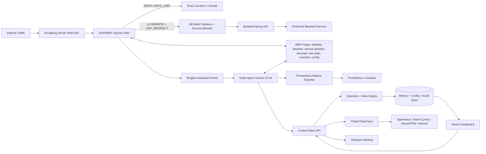

# Product Requirements Document: Hệ thống Anti-DDoS Scrubbing Gateway eBPF/XDP

**Phiên bản:** 1.2
**Ngày:** 2026-05-27
**Trạng thái:** Draft đã cập nhật tính năng quản lý protected backend service trên dashboard
**Phạm vi MVP(Minimum Viable Product):** Một scrubbing server Ubuntu 24.04 chạy eBPF/XDP, lọc volumetric L3/L4 DDoS ở WAN ingress và chuyển tiếp traffic sạch bằng L2 MAC rewrite + XDP DEVMAP redirect tới backend.

---

## 1. Tóm tắt điều hành

Hệ thống Anti-DDoS được thiết kế như một **scrubbing gateway** đứng trước backend. Traffic Internet đi vào scrubbing server, được lọc ở ingress bằng XDP/eBPF, sau đó chỉ traffic sạch và đúng allowlist service/port mới được L2 MAC rewrite và redirect qua DEVMAP tới backend-facing interface.

MVP(Minimum Viable Product) tập trung vào **volumetric L3/L4 DDoS**: packet flood, UDP flood, TCP SYN flood, ICMP flood, IP/subnet abuse và traffic từ nguồn có reputation xấu. Hệ thống không xử lý L7/DPI trong MVP(Minimum Viable Product) vì tầng L7 đã có WAF riêng chịu trách nhiệm.

Các lớp chính:

- **Data plane:** XDP/eBPF trên Ubuntu 24.04 để drop/pass/rate-limit với độ trễ thấp.
- **Forwarding plane:** XDP DEVMAP redirect chỉ chuyển tiếp traffic sạch qua backend/service allowlist.
- **Detection plane:** baseline profiling, volumetric anomaly detection và auto-enforce rule có TTL.
- **Control plane:** quản lý protected backend services, rules, blacklist/whitelist, threat feeds, RBAC, audit, rollback và agent policy sync.
- **Management plane:** dashboard quản lý service cần bảo vệ, Prometheus/Grafana metrics và Telegram alerting.

---

## 2. Quyết định sản phẩm đã chốt

| Chủ đề | Quyết định |
|---|---|
| Deployment model | Một scrubbing server đứng trước backend, XDP ingress filter + DEVMAP redirect gateway |
| Hệ điều hành MVP(Minimum Viable Product) | Ubuntu 24.04 |
| Packet filtering runtime | eBPF/XDP, ưu tiên native XDP nếu NIC/driver hỗ trợ |
| Traffic target | MVP phải đạt 10 Gbps trên hardware mục tiêu; 40 Gbps là benchmark report trước khi cam kết SLA |
| Scope bảo vệ | Volumetric L3/L4 DDoS |
| L7/DPI | Ngoài phạm vi MVP(Minimum Viable Product); WAF hiện hữu chịu trách nhiệm L7 |
| Forwarding policy | Chỉ redirect traffic sạch tới backend qua allowlist port/service đã khai báo |
| Forwarding runtime | L2 MAC rewrite + `XDP_REDIRECT` qua `BPF_MAP_TYPE_DEVMAP`; giữ nguyên IP, không NAT/DNAT |
| Backend return path | Cho phép asymmetric return path; response không bắt buộc quay lại scrubbing gateway trong MVP |
| Protected backend service registry | Dashboard là nơi quản lý danh sách backend service cần bảo vệ; thay đổi được validate, version, audit và sync xuống agent |
| Mitigation policy | Auto-enforce rule có TTL, evidence, audit và rollback |
| False positive posture | Balanced TTL: whitelist precedence, evidence bắt buộc, rollback nhanh |
| Failure mode | Data plane giữ policy snapshot gần nhất khi agent/control plane lỗi |
| Reputation feeds | Spamhaus DROP, Team Cymru/bogon, AbuseIPDB và feed nội bộ HTTP JSON đều bắt buộc cho P1 production readiness |
| Observability | Dashboard nội bộ + Prometheus/Grafana metrics |
| Alerting | Telegram là kênh cảnh báo bắt buộc trong MVP(Minimum Viable Product) |
| Admin security | Local RBAC với Admin, Operator, Viewer; chưa cần SSO |
| Admin bootstrap | Tài khoản Admin đầu tiên được tạo bằng one-time CLI/secret và bắt buộc đổi mật khẩu |
| Data retention | Raw events 30 ngày, aggregated metrics 90 ngày, audit log 365 ngày |
| HA | Single active MVP(Minimum Viable Product); active-passive là phase sau |
| Upstream mitigation | MVP(Minimum Viable Product) có runbook escalation thủ công tới ISP; chưa tự động BGP/RTBH/FlowSpec |

---

## 3. Bối cảnh và vấn đề

DDoS L3/L4 có thể làm backend mất khả dụng bằng cách:

- Làm đầy băng thông hoặc packet processing path bằng UDP/ICMP/TCP flood.
- Làm tiêu hao CPU/RAM của firewall, load balancer, kernel network stack hoặc ứng dụng.
- Gửi traffic từ nhiều nguồn phân tán, nguồn spoofed hoặc IP/subnet có reputation xấu.
- Tạo attack burst ngắn nhưng đủ lớn để gây timeout, packet loss và cascade failure.

OWASP nhấn mạnh phòng chống DoS cần layered defense, rate limiting và phân tích bottleneck. Báo cáo Cloudflare Radar 2025 Q4 cho thấy số lượng và quy mô DDoS tiếp tục tăng mạnh trong năm 2025, bao gồm các chiến dịch hyper-volumetric ở mức Tbps/Bpps. Với scope self-hosted, scrubbing gateway giúp giảm tải cho backend, nhưng vẫn cần upstream/ISP khi link vào scrubbing server bị saturate.

Vấn đề sản phẩm cần giải quyết:

- Backend cần được bảo vệ khỏi volumetric L3/L4 attack trước khi traffic vào network stack/ứng dụng.
- Đội vận hành cần visibility realtime về pps, bps, drops, top sources, ports và rule đang enforce.
- Đội vận hành cần tự quản lý danh sách backend service được bảo vệ mà không phải sửa cấu hình thủ công trên scrubbing server.
- Blacklist/whitelist/rate-limit cần quản lý tập trung, có TTL, audit và rollback.
- Cần tự động phản ứng trong vài giây với rule có TTL, nhưng vẫn giảm false positive bằng whitelist precedence và evidence.
- Cần quy trình vận hành rõ khi attack vượt khả năng scrubbing server và phải liên hệ ISP.

---

## 4. Mục tiêu sản phẩm

### 4.1 Mục tiêu chính

- Chặn hoặc rate-limit volumetric L3/L4 DDoS ở scrubbing server bằng XDP/eBPF.
- Redirect traffic sạch tới backend theo allowlist service/port đã khai báo bằng XDP DEVMAP.
- Cho phép Admin/Operator quản lý danh sách backend service cần bảo vệ trực tiếp trên dashboard.
- Tự động phát hiện spike bất thường bằng baseline L3/L4 và enforce mitigation rule có TTL.
- Tự động cập nhật, hợp nhất và áp dụng blacklist IP/CIDR theo chu kỳ 1 giờ.
- Hỗ trợ whitelist có precedence, TTL, lý do và audit.
- Cung cấp dashboard realtime, Prometheus metrics và Telegram alert.
- Hỗ trợ local RBAC, audit log, rollback rule và policy snapshot khi control plane lỗi.

### 4.2 Chỉ số thành công đề xuất

| Metric | Mục tiêu MVP(Minimum Viable Product) | Ghi chú |
|---|---:|---|
| Traffic target | 10 Gbps gate, 40 Gbps benchmark report | Phải benchmark theo NIC/kernel/RSS/queue thực tế |
| MTTD L3/L4 anomaly | <= 10 giây | Tính từ khi traffic tới scrubbing server |
| Thời gian apply rule vào XDP map | <= 1 giây | Khi agent online |
| Thời gian apply thay đổi protected service | <= 1 giây | Từ lúc policy version được approve/apply, không restart agent |
| Thời gian onboarding protected service | <= 5 phút/service | Khi đã có IP/CIDR, protocol, port và output interface |
| Chu kỳ cập nhật blacklist | 1 giờ | Theo yêu cầu đầu vào |
| Dashboard data freshness | <= 3 giây | Metrics chính |
| Prometheus scrape endpoint | Bắt buộc | Agent/control/rule metrics |
| Telegram alert latency | <= 10 giây | Nếu Telegram API khả dụng |
| Rule rollback time | <= 30 giây | Từ UI/API |
| Policy snapshot survival | Bắt buộc | Data plane tiếp tục dùng snapshot gần nhất |

### 4.3 Ngoài phạm vi MVP(Minimum Viable Product)

| Hạng mục | Lý do |
|---|---|
| L7/DPI, HTTPS payload inspection, bot fingerprinting L7 | WAF hiện hữu chịu trách nhiệm L7 |
| Tự động BGP/RTBH/FlowSpec | Cần quyền routing/upstream và kiểm thử rủi ro cao; để phase sau |
| HA active-passive/active-active | MVP(Minimum Viable Product) single active; HA cần failover/routing/state sync riêng |
| SSO/multi-tenant | MVP(Minimum Viable Product) dùng local RBAC |
| Bảo vệ khi link Internet vào scrubbing server đã saturate | Cần ISP/CDN/scrubbing upstream; MVP(Minimum Viable Product) chỉ có runbook escalation |
| ML nâng cao | MVP(Minimum Viable Product) dùng baseline/statistical anomaly + rules để dễ vận hành |

---

## 5. Người dùng mục tiêu

| Persona | Nhu cầu chính | Đau điểm hiện tại |
|---|---|---|
| Network/SRE Engineer | Giữ backend online, quản lý service cần bảo vệ, xem traffic realtime, apply/rollback mitigation nhanh | Thiếu visibility, rule thủ công, khó phản ứng với attack ngắn |
| Security Analyst/SOC | Phân loại nguồn attack, rule reason, incident evidence | Dữ liệu phân tán, khó phân biệt spike hợp lệ với attack |
| System Administrator | Cài scrubbing server, quản lý backend services, feeds, whitelist và Telegram | Cần quy trình đơn giản, an toàn, không làm gián đoạn backend |
| Product/Business Owner | Giảm downtime và bảo vệ SLA | Thiếu số liệu rõ về khả năng chống chịu |

Jobs-to-be-Done:

- Khi traffic tăng đột biến, người trực cần biết protocol/port/source nào gây spike và rule nào đang xử lý.
- Khi có backend service mới cần bảo vệ, người vận hành cần khai báo IP/CIDR, protocol, port và output interface trên dashboard rồi apply an toàn. Agent sẽ tự resolve ifindex và next-hop/backend MAC bằng routing/ARP/neighbor table.
- Khi nguồn traffic độc hại vượt ngưỡng, hệ thống cần auto-enforce rule có TTL để giảm tải ngay.
- Khi traffic sạch đi qua gateway, chỉ service/port đã khai báo mới được chuyển tiếp tới backend. Gói tin hợp lệ được L2 MAC rewrite và `XDP_REDIRECT` qua DEVMAP.
- Khi service thay đổi port, owner hoặc trạng thái bảo vệ, người vận hành cần xem diff, validate conflict và rollback nếu gây lỗi.
- Khi rule gây tác động không mong muốn, người vận hành cần rollback nhanh và xem được audit/evidence.

---

## 6. Nguyên tắc thiết kế

- **Scrub before backend:** backend chỉ nhận traffic đã qua XDP filtering và forwarding allowlist.
- **Drop as early as safe:** ưu tiên native XDP; fallback phải được ghi rõ performance limitation.
- **Auto-enforce with bounded TTL:** auto-block/rate-limit phải có TTL, reason, confidence và rollback.
- **Whitelist precedence:** whitelist được kiểm tra trước blacklist/rate-limit, nhưng không bypass service/port allowlist. Whitelist có 2 scope: `global` và `service_scoped`.
- **Service registry as source of truth:** danh sách protected backend service trên dashboard là nguồn cấu hình chính cho service allowlist, baseline và forwarding policy.
- **Forward by allowlist:** traffic không thuộc backend/service allowlist không được redirect.
- **Bounded kernel state:** eBPF maps có max entries, eviction policy và sampling/backpressure.
- **Operations-first:** mọi rule, feed, alert và forwarding policy đều có audit, counters và visibility.
- **Upstream-aware:** khi link bị saturate, hệ thống phải cảnh báo và kích hoạt runbook escalation ISP.

---

## 7. Kiến trúc đề xuất

| Thành phần | Vai trò | Yêu cầu nổi bật |
|---|---|---|
| XDP/eBPF Data Plane | Drop/pass/rate-limit ở WAN ingress | Verifier-safe, bounded maps, per-CPU counters, rollback được |
| Forwarding Plane | L2 rewrite và XDP DEVMAP redirect traffic sạch tới backend | Chỉ redirect backend/service allowlist; fail-closed khi target lỗi |
| Node Agent | Load/attach eBPF, sync maps, đọc counters/events | Ubuntu 24.04, healthcheck, keep-last-policy fail-safe |
| Detection Engine | Baseline và volumetric anomaly detection | L3/L4 metrics, auto-enforce TTL, confidence/evidence |
| Threat Feed Service | Fetch blacklist mỗi 1 giờ | Normalize, dedupe, CIDR aggregate, source metadata |
| Control Plane API | Protected service/rule/policy/feed/agent/RBAC/audit | Local RBAC, audit, validation, rollback |
| Dashboard | Realtime monitoring và quản trị | Protected service registry, rule counters, top sources, feed status, rollback |
| Metrics Exporter | Prometheus endpoint | Agent health, traffic, drop, rule, feed, forwarding metrics |
| Alert Service | Telegram alerts | Dedup, rate limit, retry, delivery log |

---

## 8. Thiết kế eBPF/XDP cấp sản phẩm

### 8.1 Maps đề xuất

| Map | Loại đề xuất | Mục đích |
|---|---|---|
| `whitelist_lpm` | `BPF_MAP_TYPE_LPM_TRIE` | Match source IP/CIDR whitelist IPv4/IPv6 |
| `blacklist_lpm` | `BPF_MAP_TYPE_LPM_TRIE` | Match source IP/CIDR blacklist đã hợp nhất |
| `service_allowlist` | `BPF_MAP_TYPE_HASH/LPM_TRIE` | Match protocol, dst port, backend/service policy sinh từ protected service registry; chứa output ifindex/MAC đã resolve |
| `tx_devmap` | `BPF_MAP_TYPE_DEVMAP` | Target output interface cho `XDP_REDIRECT` |
| `rate_state` | `BPF_MAP_TYPE_LRU_HASH` hoặc `BPF_MAP_TYPE_PERCPU_HASH` | Token bucket/sliding counters theo IP/subnet/service |
| `rule_config` | `BPF_MAP_TYPE_ARRAY` | Thresholds, mode, TTL flags, sampling rate |
| `drop_counters` | `BPF_MAP_TYPE_PERCPU_ARRAY/HASH` | Counters theo rule/reason với contention thấp |
| `events` | `BPF_MAP_TYPE_RINGBUF` | Gửi sampled packet metadata và rule events về userspace |
| `prog_array` | `BPF_MAP_TYPE_PROG_ARRAY` | Tail calls nếu pipeline lớn |

### 8.2 Thứ tự xử lý trong XDP

1. Parse Ethernet/IP/TCP/UDP/ICMP an toàn với bounds checks.
2. Check whitelist.
3. Drop invalid/bogon/malformed packet nếu policy bật.
4. Check blacklist CIDR/IP.
5. Check service/port allowlist cho traffic cần redirect.
6. Apply per-IP/per-subnet/per-service rate limit.
7. L2 MAC rewrite, `XDP_REDIRECT`, count/drop và emit sampled event theo severity.

### 8.3 Yêu cầu an toàn eBPF

- Chương trình eBPF phải có verifier log, regression tests, version và checksum.
- Agent phải rollback về chương trình trước đó nếu load/attach thất bại.
- Map size phải được giới hạn; không để attack làm phình kernel memory không kiểm soát.
- Nếu native XDP không hỗ trợ, agent phải cảnh báo và fallback theo policy đã cấu hình.
- CO-RE/BTF được ưu tiên để tăng tính portable giữa kernel versions.
- Nếu DEVMAP target, output interface hoặc neighbor/MAC resolution lỗi, data plane SHALL fail-closed bằng drop, tăng counter riêng và cảnh báo.

---

## 9. Yêu cầu chức năng

### P1 - MVP(Minimum Viable Product) bắt buộc

#### PRD-001: Baseline profiling L3/L4

- WHEN agent chạy ở chế độ observe THEN system SHALL ghi pps, bps, cps, protocol distribution, top sources, top destination ports và drops.
- WHEN đủ dữ liệu 24 giờ THEN system SHALL tạo baseline theo interface/service/time window; nếu chưa đủ dữ liệu thì dùng default threshold, đánh dấu confidence thấp và không auto-enforce anomaly.
- WHEN baseline thay đổi do traffic hợp lệ THEN Admin hoặc Operator SHALL có thể approve recalibration.

#### PRD-002: Monitor realtime và Prometheus/Grafana

- WHEN agent online THEN dashboard SHALL hiển thị pps, bps, drops, redirects, protocols, ports, sampled approximate top sources và forwarding status trong <= 3 giây.
- WHEN Prometheus scrape endpoint THEN system SHALL expose agent health, traffic, drop, redirect, rule, feed sync, map utilization và forwarding metrics.
- WHEN traffic spike THEN dashboard SHALL hiển thị anomaly score, active rule, action, TTL còn lại và affected backend/service.
- WHEN người dùng chọn IP/subnet THEN system SHALL hiển thị event history, counters, reputation status và whitelist/blacklist state.

#### PRD-003: XDP/eBPF packet filtering

- WHEN blacklist match source IP/CIDR THEN XDP SHALL drop packet và tăng counter reason `blacklist`.
- WHEN whitelist match source IP/CIDR THEN XDP SHALL bypass blacklist/rate-limit theo scope whitelist, nhưng vẫn SHALL require service/port allowlist trước khi redirect.
- WHEN packet malformed, fragmented hoặc không đủ L4 header để match service/port THEN XDP SHALL drop mặc định và tăng counter riêng.
- WHEN packet sạch match service allowlist và không vượt rate-limit THEN XDP SHALL rewrite L2 MAC và `XDP_REDIRECT` qua DEVMAP.
- WHEN DEVMAP redirect target lỗi THEN XDP SHALL drop, tăng counter `redirect_error` hoặc `neighbor_unresolved` và agent/dashboard SHALL cảnh báo.
- WHEN native XDP attach fail THEN agent SHALL fallback theo policy đã cấu hình và cảnh báo performance limitation.
- WHEN eBPF program load fail THEN agent SHALL rollback về program trước hoặc giữ trạng thái hiện tại an toàn.

#### PRD-004: Rate limiting và auto-enforce TTL

- WHEN IP/subnet/service vượt ngưỡng pps/cps/bps với đủ confidence/evidence THEN system SHALL auto-enforce `rate_limit` trước, rule có TTL.
- WHEN auto-enforce rule được tạo THEN system SHALL ghi evidence, confidence, TTL, affected service và audit event.
- WHEN rule có TTL hết hạn THEN system SHALL tự disable rule và ghi audit event.
- WHEN rule gây tác động không mong muốn THEN Admin hoặc Operator SHALL rollback version trước trong <= 30 giây.
- WHEN baseline chưa đủ 24 giờ hoặc confidence thấp THEN system SHALL chỉ alert/observe, không auto-enforce anomaly.
- WHEN auto-enforce rule được tạo THEN default TTL SHALL là 15 phút, min 5 phút, max 60 phút và có thể gia hạn trong giới hạn max nếu attack còn tiếp diễn.
- WHEN threshold được cấu hình THEN system SHALL hỗ trợ default theo protocol/criticality và override theo từng service.

#### PRD-005: IP reputation và blacklist aggregation mỗi 1 giờ

- WHEN scheduler tới chu kỳ 1 giờ THEN system SHALL fetch Spamhaus DROP, Team Cymru/bogon, AbuseIPDB và feed nội bộ HTTP JSON.
- WHEN feed trả IP/CIDR trùng lặp THEN system SHALL dedupe và aggregate CIDR nếu an toàn.
- WHEN feed lỗi hoặc timeout THEN system SHALL giữ snapshot gần nhất, cảnh báo và không xóa rule đang enforce nếu chưa hết TTL.
- WHEN IP/CIDR nằm trong whitelist THEN blacklist SHALL không được enforce và phải tạo conflict report.
- WHEN feed có license/quota/update interval THEN system SHALL lưu metadata source và tuân thủ tần suất cấu hình.
- WHEN feed bắt buộc thiếu credential/license/quota hoặc internal feed endpoint không cấu hình THEN system SHALL đánh dấu production readiness là blocked.
- WHEN internal feed HTTP JSON trả dữ liệu THEN payload SHALL chứa IP/CIDR, score, action, TTL, reason và source metadata.

#### PRD-006: IP whitelist management

- WHEN admin thêm whitelist THEN system SHALL validate IP/CIDR, scope `global` hoặc `service_scoped`, service_id nếu scoped, bắt buộc lý do, owner và expiry nếu policy yêu cầu.
- WHEN whitelist conflict với blacklist THEN UI SHALL hiển thị conflict và default precedence là whitelist.
- WHEN whitelist hết hạn THEN system SHALL disable entry và ghi audit.
- WHEN whitelist scope là `global` THEN entry SHALL bypass blacklist/rate-limit cho mọi protected service nhưng không bypass service/port allowlist.

#### PRD-007: Dashboard quản lý protected backend services và XDP DEVMAP forwarding allowlist

- WHEN Admin hoặc Operator tạo protected backend service THEN system SHALL yêu cầu tối thiểu: service name, backend IP/CIDR, protocol, allowed ports, output interface, owner, criticality, protection_mode `observe|enforce` và trạng thái enabled/disabled.
- WHEN Admin hoặc Operator sửa service THEN dashboard SHALL hiển thị policy diff, yêu cầu reason và lưu version để rollback.
- WHEN service được tạo hoặc sửa THEN system SHALL validate IP/CIDR, port range, protocol, output interface, duplicate/overlap service và conflict với policy hiện có trước khi cho apply.
- WHEN CIDR/protocol/port overlap có thể match nhiều service THEN system SHALL block apply như ambiguous overlap.
- WHEN validation phát hiện conflict có rủi ro chặn nhầm hoặc mở port ngoài ý muốn THEN system SHALL block apply hoặc yêu cầu Admin override kèm reason theo policy cấu hình.
- WHEN policy version được apply THEN control plane SHALL sync service allowlist xuống agent/XDP maps mà không cần restart agent.
- WHEN policy version được apply THEN agent SHALL resolve output ifindex và next-hop/backend MAC từ routing/ARP/neighbor table, populate `service_allowlist` và `tx_devmap`.
- WHEN Viewer truy cập danh sách backend services THEN dashboard SHALL cho search/filter theo name, owner, criticality, protocol, port, output interface, enabled state và sync status nhưng không cho chỉnh sửa.
- WHEN Admin hoặc Operator disable service THEN system SHALL ngừng redirect traffic match service đó sau khi policy version được apply, giữ audit/history và không xóa counters lịch sử.
- WHEN Admin hoặc Operator import danh sách services THEN system SHALL preview diff, validate từng dòng và chỉ apply các dòng hợp lệ sau xác nhận.
- WHEN traffic sạch không match backend/service allowlist THEN system SHALL không redirect traffic đó và SHALL tăng counter reason `not_allowed_service`.
- WHEN traffic sạch match backend IP/CIDR, protocol và allowed port THEN system SHALL L2 rewrite và `XDP_REDIRECT` tới backend qua DEVMAP.
- WHEN service allowlist sync fail hoặc stale THEN dashboard SHALL hiển thị trạng thái failed/stale, data plane SHALL giữ policy version đã apply gần nhất và Telegram SHALL cảnh báo nếu vượt ngưỡng cấu hình.
- WHEN redirect path có lỗi output interface, DEVMAP target hoặc neighbor resolution THEN system SHALL drop fail-closed, cảnh báo Telegram, expose Prometheus metric và hiển thị trên dashboard.

#### PRD-008: Telegram alerting

- WHEN alert policy trigger THEN system SHALL gửi message qua Telegram `sendMessage`.
- WHEN nhiều event trùng lặp xảy ra THEN alert service SHALL dedupe và rate-limit theo rule.
- WHEN Telegram API lỗi THEN system SHALL retry có backoff và ghi delivery failure.
- WHEN admin test config THEN system SHALL gửi test alert và hiển thị kết quả.

#### PRD-009: Local RBAC, audit log và rollback

- WHEN user đăng nhập THEN system SHALL gán một trong ba role: Admin, Operator, Viewer.
- WHEN Admin thực hiện thay đổi policy/rule/feed/user THEN system SHALL cho phép và ghi audit.
- WHEN Operator thay đổi rule/whitelist/forwarding policy THEN system SHALL cho phép theo quyền vận hành và ghi audit.
- WHEN Viewer truy cập dashboard THEN system SHALL chỉ cho xem dữ liệu, không được thay đổi policy.
- WHEN rule/policy được sửa THEN system SHALL lưu version để rollback.
- WHEN có override rủi ro cao như bỏ qua validation conflict, đổi feed setting hoặc bật enforce rule thủ công THEN system SHALL yêu cầu Admin kèm reason/audit.
- WHEN chưa có Admin đầu tiên THEN system SHALL bootstrap bằng one-time CLI/secret, bắt buộc đổi mật khẩu ở lần đăng nhập đầu và ghi audit.

#### PRD-010: Agent/control-plane fail-safe

- WHEN control plane mất kết nối THEN data plane SHALL tiếp tục chạy policy snapshot gần nhất.
- WHEN agent không sync được policy mới THEN dashboard SHALL hiển thị stale policy status và Telegram SHALL cảnh báo nếu vượt ngưỡng thời gian cấu hình.
- WHEN agent restart THEN system SHALL load snapshot hợp lệ gần nhất trước khi nhận policy mới từ control plane.

#### PRD-011: Manual ISP escalation runbook

- WHEN inbound link utilization > 85% trong 60 giây hoặc packet loss/drop-before-XDP vượt ngưỡng cấu hình THEN system SHALL cảnh báo “ISP escalation needed”.
- WHEN escalation alert được tạo THEN system SHALL hiển thị peak bps/pps, target backend/service, top vectors, thời gian bắt đầu và top source summary.
- WHEN người vận hành mở incident/runbook THEN system SHALL cung cấp thông tin cần gửi ISP để xử lý upstream thủ công.

### P2 - Sau MVP(Minimum Viable Product)

#### PRD-012: Incident workflow

- WHEN nhiều rule cùng trigger trong một time window THEN system SHALL gom thành một incident nếu cùng target/vector.
- WHEN incident đóng THEN system SHALL tạo summary về peak pps/bps, drops, duration, top sources, affected backend và actions.

#### PRD-013: Active-passive HA

- WHEN active scrubbing server lỗi THEN standby SHALL có khả năng nhận route/IP theo thiết kế failover đã kiểm thử.
- WHEN failover xảy ra THEN system SHALL ghi audit/incident và cảnh báo Telegram.

### P3 - Future upstream automation

#### PRD-014: Automated upstream mitigation integration

- WHEN bước future được phê duyệt THEN system MAY tích hợp BGP/RTBH/FlowSpec sau khi có quyền routing và kế hoạch kiểm thử riêng.

### Ngoài phạm vi MVP(Minimum Viable Product) nhưng cần ghi ranh giới

- WAF hiện hữu chịu trách nhiệm HTTP/HTTPS L7, payload inspection, bot fingerprinting và challenge/CAPTCHA.
- Anti-DDoS gateway có thể nhận metrics/log tổng hợp từ WAF ở phase sau, nhưng không enforce L7 trong MVP(Minimum Viable Product).

---

## 10. Yêu cầu phi chức năng

### Hiệu năng

- MVP SHALL đạt 10 Gbps trên hardware mục tiêu và tạo benchmark report cho 40 Gbps trên NIC, driver, RSS/queue và kernel thực tế trước khi cam kết SLA.
- XDP path SHALL tránh dynamic allocation và loop không bounded.
- Counters tần suất cao SHOULD dùng per-CPU maps để giảm contention.
- Ring buffer events SHALL có sampling/backpressure để không ảnh hưởng data plane.
- DEVMAP redirect path SHALL được benchmark cùng filtering path, không chỉ benchmark drop-only.

### Độ tin cậy

- Data plane tiếp tục chạy với policy snapshot gần nhất khi control plane mất kết nối.
- Agent phải có healthcheck, watchdog, safe detach và rollback.
- Feed sync lỗi không được xóa blacklist đang enforce nếu chưa có snapshot mới hợp lệ.
- Control plane phải hỗ trợ backup/restore config và audit log.

### Bảo mật

- Dashboard/API phải có local RBAC, session timeout và audit.
- Telegram bot token, AbuseIPDB key và feed credentials phải được mã hóa at rest và redact trong log.
- Rule changes cần reason và optional approval theo severity nếu bật policy approval.
- Admin đầu tiên phải được bootstrap bằng one-time CLI/secret; static default credential không được chấp nhận.
- eBPF object phải có version/checksum; không load binary không rõ nguồn.

### Tương thích

- MVP(Minimum Viable Product) target Ubuntu 24.04.
- Native XDP là mục tiêu hiệu năng; generic XDP/TC là fallback có cảnh báo.
- IPv4 là bắt buộc cho MVP(Minimum Viable Product); IPv6 nên được thiết kế data model ngay từ đầu và bật sau nếu chưa kịp MVP(Minimum Viable Product).
- CO-RE/BTF được ưu tiên để giảm phụ thuộc kernel-specific offsets.

### Quan sát và vận hành

- Mọi rule có counters: pass, drop, rate-limited, not-allowed-service, errors.
- Mọi agent có version, uptime, attached interfaces, XDP mode, map utilization và policy version.
- Mọi alert có lifecycle: created, sent, failed, deduped, resolved.
- Dashboard top-source trong MVP là approximate từ sampled events và aggregate counters, không cam kết exact per-source accounting ở traffic cao.
- Retention mặc định: raw/security events 30 ngày, aggregated metrics 90 ngày, audit log 365 ngày.

---

## 11. Data model cấp sản phẩm

| Entity | Trường chính |
|---|---|
| Agent | id, hostname, interfaces, kernel_version, ubuntu_version, xdp_mode, devmap_support, status, last_seen, version, active_policy_version |
| BackendService | id, name, description, backend_ip_or_cidr, protocol, allowed_ports, output_interface, resolved_ifindex, resolved_next_hop_mac, owner, criticality, enabled, protection_mode, health_status, sync_status, neighbor_resolution_status, policy_version, tags, created_at, updated_at |
| ForwardingPolicy | id, service_id, match_protocol, match_dst_port, backend_target, output_interface, resolved_ifindex, resolved_dst_mac, action, priority, version, owner, reason |
| TrafficMetric | timestamp, agent_id, interface, pps, bps, cps, drops, redirects, protocol, dst_port, service_id |
| BaselineProfile | service_id, interface, metric, window, expected_min, expected_max, confidence, updated_at |
| Rule | id, name, priority, match, action, mode, threshold, ttl, owner, evidence, confidence, version |
| ReputationEntry | ip_or_cidr, source, score, first_seen, last_seen, expires_at, status |
| WhitelistEntry | ip_or_cidr, scope, service_id, label, reason, owner, expires_at, priority |
| FeedSource | id, name, type, endpoint, credential_ref, required_for_production, license_metadata, quota_metadata, update_interval, status |
| AlertPolicy | id, rule_id, severity, telegram_chat_id, rate_limit, template, enabled |
| UserRole | user_id, role, status, created_at, last_login |
| Incident | id, status, start_at, end_at, vector, target_service, peak_metrics, actions, summary |
| AuditEvent | id, actor, action, entity, before, after, reason, timestamp |

---

## 12. Dashboard và UX yêu cầu

### 12.1 Overview

- Realtime chart: bps, pps, drops, redirects, redirected traffic.
- Attack status: normal, suspicious, active mitigation, upstream escalation needed.
- Top sources: IP/subnet/ASN/country nếu có enrichment; MVP hiển thị approximate từ sampling.
- Top protocols/ports/backend services.
- Agent health, XDP mode, map utilization và policy version.

### 12.2 Reputation/blacklist

- Feed status: last sync, next sync, items fetched, errors, quota/license metadata.
- Aggregated blacklist: search IP/CIDR, source evidence, TTL, enforce state.
- Conflict report với whitelist.
- Manual add/remove với reason và expiry.

### 12.3 Whitelist

- Thêm IP/CIDR, label, owner, expiry.
- Import/export CSV.
- Conflict detection với blacklist/rules.
- Audit history.

### 12.4 Backend service allowlist

- Danh sách protected backend services có search/filter theo name, owner, criticality, protocol, port, output interface, enabled state và sync status.
- Khai báo backend IP/CIDR, protocol, allowed ports, output interface, owner, criticality, protection_mode `observe|enforce` và tags.
- Thao tác create/edit/clone/disable/soft-delete theo RBAC; Viewer chỉ được xem.
- Import/export CSV với preview diff, lỗi validation theo từng dòng và xác nhận trước khi apply.
- Validate duplicate/ambiguous overlap CIDR, port conflict, protocol không hợp lệ, output interface không tồn tại, neighbor/MAC không resolve được và service không có allowed port.
- Hiển thị policy diff, version history, audit history và rollback cho thay đổi service/forwarding policy.
- Hiển thị counters theo service: redirected, dropped, rate-limited, not-allowed-service.
- Hiển thị trạng thái apply xuống agent: pending, applied, failed, stale, neighbor_unresolved, redirect_error.

### 12.5 Telegram alerts

- Bot token, chat_id, parse mode, template.
- Test alert.
- Per-rule rate limit, severity routing, quiet hours.
- Delivery log.

### 12.6 Rules và mitigation

- Rule table: priority, match, action, mode, TTL, counters, evidence.
- Auto-enforce TTL status.
- Promote observe rule sang enforce nếu cần.
- Rollback version.

---

## 13. Detection và mitigation logic

### 13.1 Baseline anomaly

- Tính baseline theo interface, backend service, protocol, port và time window.
- Phát hiện bất thường bằng threshold tương đối và tuyệt đối:
  - pps/bps tăng > N lần baseline.
  - SYN/ACK ratio bất thường.
  - UDP/ICMP flood theo destination port/service.
  - Tập trung bất thường theo top source/subnet.
  - Drop/not-allowed-service tăng bất thường.
- Mỗi alert phải có confidence, evidence, affected service và recommended action.
- Low-confidence hoặc service chưa đủ 24 giờ baseline SHALL chỉ tạo alert/observe; không auto-enforce anomaly.
- Static threshold default theo protocol/criticality SHALL tồn tại và mỗi service MAY override pps/bps/cps/burst.

### 13.2 Rate limit policy

Rule match dimensions:

- Source IP/CIDR.
- Destination backend/service.
- Destination port.
- Protocol TCP/UDP/ICMP.
- TCP flags cho SYN flood.
- Interface/agent group.

Actions:

- `observe`: chỉ đếm.
- `drop`: `XDP_DROP`.
- `redirect`: L2 MAC rewrite và `XDP_REDIRECT` qua DEVMAP.
- `pass`: `XDP_PASS`, chỉ dùng cho fallback/diagnostic policy được cấu hình rõ.
- `rate_limit`: token bucket/drop over limit.
- `sample`: gửi metadata về userspace.
- `not_forward`: không redirect tới backend khi không match service allowlist.

### 13.3 Reputation scoring

- Score từ Spamhaus DROP, Team Cymru/bogon, AbuseIPDB, feed nội bộ HTTP JSON và attack evidence.
- Manual whitelist override score nhưng phải có audit.
- Blacklist entries phải có TTL/source.
- Auto-block nguồn mới chỉ được tạo khi có attack context hoặc feed confidence đủ cao.

### 13.4 Upstream escalation trigger

- Khi inbound link utilization > 85% trong 60 giây, packet loss hoặc drops trước XDP cho thấy scrubbing server/link bị quá tải, hệ thống phải cảnh báo “ISP escalation needed”.
- MVP(Minimum Viable Product) yêu cầu runbook thủ công: thông tin peak bps/pps, target IP/service, top vectors, thời gian bắt đầu và contact ISP.

### 13.5 Protected backend service policy lifecycle

- Protected service lifecycle: `draft` -> `validated` -> `applied` -> `disabled` -> `archived`.
- Mỗi lần apply tạo policy version mới, cập nhật `service_allowlist` và ghi audit event với actor, reason, before/after diff.
- Service mode chỉ gồm `observe` và `enforce`; service mới chưa đủ baseline vẫn enforce feed/manual/service allowlist nhưng không auto-enforce anomaly.
- Service đang có active incident, active mitigation rule hoặc traffic lớn không được hard-delete; system SHALL yêu cầu disable/override có reason.
- Baseline, anomaly detection và forwarding counters SHALL được scope theo enabled protected service để người vận hành biết service nào đang bị ảnh hưởng.

---

## 14. Release plan

### Phase 0 - Discovery và benchmark

- Xác nhận danh sách protected backend services: IP/CIDR, allowed ports, owner, criticality, output interface, route/neighbor topology, NIC model, số queue/RSS và kernel details.
- Benchmark native XDP trên Ubuntu 24.04 với traffic đại diện: 10 Gbps là gate, 40 Gbps là report.
- Kiểm tra DEVMAP redirect throughput, không chỉ drop throughput.
- Chọn và cấu hình feed sources bắt buộc: Spamhaus DROP, Team Cymru/bogon, AbuseIPDB, feed nội bộ HTTP JSON.

### Phase 1 - Single-node scrubbing MVP(Minimum Viable Product)

- Node agent + XDP program + maps.
- Dashboard quản lý protected backend service registry.
- XDP DEVMAP redirect + backend service allowlist sinh từ registry.
- Feed sync mỗi 1 giờ, normalize/dedupe/aggregate và production readiness gate theo credential/license/quota.
- Realtime dashboard + Prometheus/Grafana metrics.
- Manual blacklist/whitelist.
- Rate limiting + auto-enforce TTL.
- Telegram alerts.
- Local RBAC, audit log, rollback.
- Keep-last-policy fail-safe.
- Manual ISP escalation runbook.

### Phase 2 - Automation và incident workflow

- Baseline profiling nâng cao.
- Incident grouping/timeline/report.
- More detailed Prometheus alerts and Grafana dashboards.

### Phase 3 - HA và upstream integration

- Active-passive scrubbing gateway.
- Failover route/IP design.
- BGP/RTBH/FlowSpec hoặc upstream automation nếu có quyền routing và kế hoạch kiểm thử.

---

## 15. Rủi ro và biện pháp giảm thiểu

| Rủi ro | Tác động | Giảm thiểu |
|---|---|---|
| Đường truyền vào scrubbing server bị saturate | XDP không đủ tác dụng | Cảnh báo upstream escalation, runbook ISP, roadmap BGP/RTBH |
| Forwarding/protected service policy sai làm chặn dịch vụ hợp lệ hoặc mở port ngoài ý muốn | Backend mất truy cập hoặc tăng bề mặt tấn công | Validate allowlist, preview diff, audit, rollback, service owner, Admin-only override có reason |
| Neighbor/MAC hoặc DEVMAP target sai/lỗi | Traffic hợp lệ bị drop hoặc redirect sai | Agent resolve và validate ifindex/MAC, fail-closed drop + alert, counters `redirect_error`/`neighbor_unresolved` |
| False positive chặn khách hàng thật | Mất doanh thu/uy tín | Balanced TTL, whitelist precedence, evidence, rollback <= 30 giây |
| eBPF verifier/load fail | Mất mitigation hoặc gây gián đoạn | CI verifier tests, rollback program, staged rollout |
| Map bị đầy trong attack | Drop sai hoặc count thiếu | Max entries, LRU, per-subnet aggregation, sampling |
| Threat feed lỗi hoặc vi phạm license/quota | Rule sai hoặc rủi ro vận hành | Source metadata, update interval, snapshot validation |
| Control plane down | Không update/cảnh báo | Agent giữ policy snapshot gần nhất |
| Alert storm Telegram | Người trực mất tín hiệu | Dedup, rate limit, severity routing |
| L7 kỳ vọng sai | Scope creep | Ghi rõ WAF chịu trách nhiệm L7, MVP(Minimum Viable Product) chỉ L3/L4 |

---

## 16. Requirement traceability

| ID | Yêu cầu | Priority | Thành phần | Trạng thái |
|---|---|---|---|---|
| PRD-001 | Baseline profiling L3/L4 | P1 | Detection Engine, Storage | Draft |
| PRD-002 | Monitor realtime và Prometheus/Grafana | P1 | Agent, Metrics, Dashboard | Draft |
| PRD-003 | XDP/eBPF packet filtering | P1 | Data Plane, Agent | Draft |
| PRD-004 | Rate limiting và auto-enforce TTL | P1 | Data Plane, Rule Engine | Draft |
| PRD-005 | IP reputation/blacklist hourly aggregation | P1 | Feed Service, Control Plane | Draft |
| PRD-006 | IP whitelist management | P1 | Dashboard, Control Plane, Data Plane | Draft |
| PRD-007 | Dashboard quản lý protected backend services và XDP DEVMAP forwarding allowlist | P1 | Dashboard, Control Plane, Forwarding Plane | Draft |
| PRD-008 | Telegram alerting | P1 | Alert Service | Draft |
| PRD-009 | Local RBAC, audit log và rollback | P1 | Control Plane, Storage | Draft |
| PRD-010 | Agent/control-plane fail-safe | P1 | Agent, Control Plane | Draft |
| PRD-011 | Manual ISP escalation runbook | P1 | Dashboard, Alert Service, Runbook | Draft |
| PRD-012 | Incident workflow | P2 | Detection Engine, Dashboard, Storage | Draft |
| PRD-013 | Active-passive HA | P2 | Gateway, Routing, Agent | Draft |
| PRD-014 | Automated upstream mitigation integration | P3 | Routing, ISP Integration | Draft |

---

## 17. Tiêu chí nghiệm thu cấp sản phẩm

- Scrubbing server Ubuntu 24.04 attach XDP vào WAN interface, L2 rewrite + `XDP_REDIRECT` traffic hợp lệ qua DEVMAP và drop IP trong blacklist.
- Dashboard cho Admin/Operator tạo, sửa, disable, import/export và rollback protected backend service với validation, reason và audit.
- Traffic sạch chỉ redirect tới backend/service allowlist đã khai báo; traffic ngoài allowlist không được redirect và có counter riêng.
- DEVMAP target hoặc neighbor lỗi thì packet bị drop fail-closed, tăng counter và tạo Prometheus/Telegram alert.
- Thay đổi protected backend service được sinh thành policy version, sync xuống agent/XDP maps không cần restart và hiển thị trạng thái applied/failed/stale.
- Rate limit theo IP/subnet/service chạy được ở `observe` và `enforce`, auto-enforce rule có TTL và evidence.
- Scheduler cập nhật blacklist mỗi 1 giờ, có log thành công/thất bại, dedupe và conflict report.
- Whitelist có scope `global` hoặc `service_scoped`, precedence trước blacklist/rate-limit, không bypass service/port allowlist và có expiry/audit.
- Service overlap CIDR/protocol/port mơ hồ bị block khi apply policy.
- Service mới chưa đủ baseline không auto-enforce anomaly nhưng vẫn enforce feed/manual/service allowlist.
- Feed bắt buộc thiếu credential/license/quota làm production readiness fail.
- Benchmark chứng minh 10 Gbps gate và tạo 40 Gbps report trên NIC/kernel/queue thực tế.
- Dashboard hiển thị metrics realtime, top blocked sources, active rules, TTL, danh sách protected services và forwarding counters theo service.
- Prometheus scrape được agent health, traffic, drop, redirect, rule, feed sync, map utilization và forwarding metrics.
- Telegram test alert và alert thật gửi thành công, có dedupe/rate-limit.
- Local RBAC hoạt động với Admin, Operator, Viewer.
- Mọi thay đổi protected service/rule/feed/forwarding policy/alert có audit record và rollback.
- Khi control plane mất kết nối, data plane tiếp tục chạy policy snapshot gần nhất và cảnh báo stale status.
- Tài liệu vận hành có runbook: attach/detach XDP, rollback, incident response, emergency disable, ISP escalation.

---

## 18. Giả định hiện tại

- Backend IP, danh sách port allowlist, owner, criticality, output interface, neighbor/MAC resolution, NIC model, số queue/RSS và topology cụ thể sẽ được thu thập ở bước technical design/implementation planning.
- Dashboard protected service registry là nguồn cấu hình chính cho forwarding allowlist trong MVP(Minimum Viable Product).
- MVP(Minimum Viable Product) triển khai single active scrubbing server; chưa yêu cầu HA.
- MVP(Minimum Viable Product) không yêu cầu SSO, multi-tenant hoặc tự động BGP/RTBH/FlowSpec.
- WAF hiện hữu chịu trách nhiệm L7; PRD chỉ ghi ranh giới và điểm tích hợp future.
- Telegram là kênh cảnh báo bắt buộc đầu tiên; các kênh khác là future scope.
- IPv4 là bắt buộc cho MVP(Minimum Viable Product); IPv6 được thiết kế data model nhưng có thể bật sau.
- 10 Gbps là gate nghiệm thu MVP trên hardware mục tiêu; 40 Gbps là benchmark report trước khi cam kết SLA chính thức.

---

## 19. Nguồn tham khảo

- Linux Kernel Documentation - BPF maps: https://docs.kernel.org/bpf/maps.html
- Linux Kernel Documentation - AF_XDP: https://docs.kernel.org/networking/af_xdp.html
- OWASP Denial of Service Cheat Sheet: https://cheatsheetseries.owasp.org/cheatsheets/Denial_of_Service_Cheat_Sheet.html
- OWASP Bot Management and Anti-Automation Cheat Sheet: https://cheatsheetseries.owasp.org/cheatsheets/Bot_Management_and_Anti-Automation_Cheat_Sheet.html
- Cloudflare Radar DDoS Threat Report 2025 Q4: https://radar.cloudflare.com/reports/ddos-2025-q4
- Cloudflare Radar Quarterly DDoS Reports methodology: https://developers.cloudflare.com/radar/reference/quarterly-ddos-reports/
- Google Cloud Armor Adaptive Protection overview: https://docs.cloud.google.com/armor/docs/adaptive-protection-overview
- Spamhaus DROP FAQ: https://www.spamhaus.org/faqs/do-not-route-or-peer-drop/
- AbuseIPDB APIv2 blacklist documentation: https://docs.abuseipdb.com/
- Team Cymru Community Services: https://www.team-cymru.com/community-services
- Telegram Bot API `sendMessage`: https://core.telegram.org/bots/api#sendmessage
