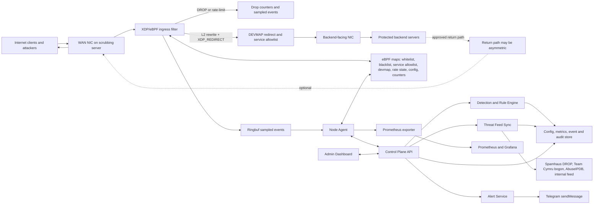
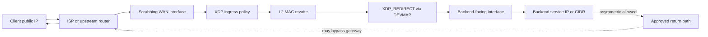
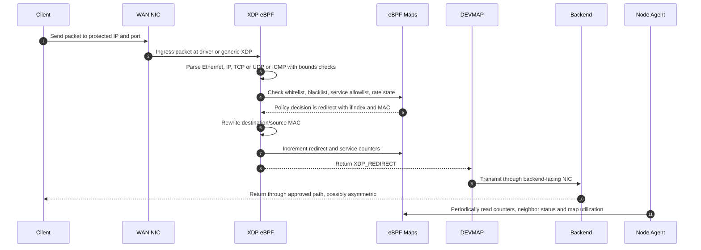
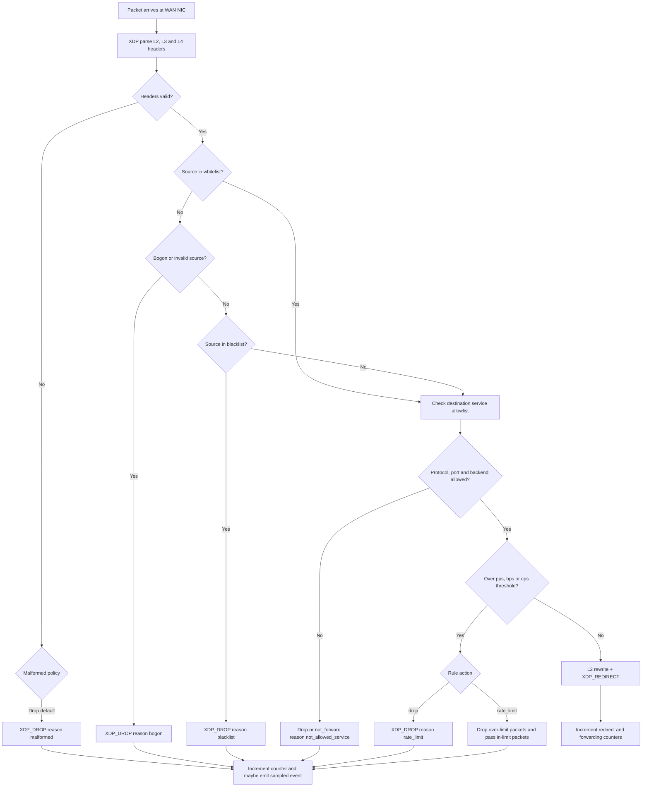
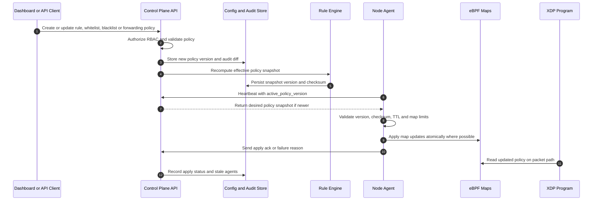
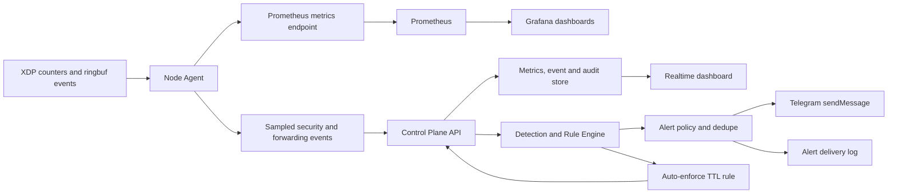

# System Architecture Design: Anti-DDoS Scrubbing Gateway eBPF/XDP

**Phiên bản:** 1.0
**Ngày:** 2026-05-27
**Nguồn yêu cầu:** `docs/PRD-Anti-DDoS.md` v1.2
**Trạng thái:** Draft
**Phạm vi:** MVP single-node XDP DEVMAP redirect scrubbing gateway, có ghi chú extension cho P2/P3

---

## 1. Tóm tắt kiến trúc

Hệ thống Anti-DDoS hoạt động như một scrubbing gateway đặt trước backend. Mọi traffic từ Internet đi vào WAN NIC của scrubbing server, được lọc sớm bằng XDP/eBPF ở ingress, sau đó chỉ traffic sạch và đúng backend/service allowlist mới được L2 MAC rewrite và `XDP_REDIRECT` qua DEVMAP tới protected backend servers.

MVP không terminate TLS, không proxy HTTP, không xử lý L7/DPI và không thay thế WAF hiện hữu. WAF tiếp tục chịu trách nhiệm HTTP/HTTPS L7, bot fingerprinting, challenge/CAPTCHA và payload inspection.

Các plane chính:

| Plane | Thành phần | Vai trò |
|---|---|---|
| Data Plane | XDP/eBPF program, eBPF maps | Parse packet, drop/pass/rate-limit, ghi counters và sampled events |
| Forwarding Plane | XDP DEVMAP redirect, L2 MAC rewrite, service allowlist | Redirect traffic sạch tới backend hợp lệ, chặn traffic ngoài allowlist |
| Node Plane | Node Agent | Attach/rollback eBPF, sync policy snapshot, cập nhật maps, đọc counters/events |
| Control Plane | API, Rule Engine, Feed Sync, RBAC, Audit | Quản lý policy/rule/feed/user, detection, auto-enforce TTL, rollback |
| Management Plane | Dashboard, Prometheus/Grafana, Telegram | Hiển thị realtime, metrics, cảnh báo và runbook vận hành |
| Storage Plane | Config store, metrics store, audit/event store | Lưu policy versions, audit, events, metrics aggregation và feed metadata |

### 1.1 Ranh giới MVP

- Single active scrubbing server trên Ubuntu 24.04.
- Native XDP là mục tiêu hiệu năng; generic XDP/TC chỉ là fallback có cảnh báo.
- IPv4 bắt buộc trong MVP; IPv6 được thiết kế sẵn trong data model nhưng có thể bật sau.
- Không tự động BGP/RTBH/FlowSpec trong MVP; chỉ có cảnh báo và runbook escalation thủ công tới ISP.
- HA active-passive, incident workflow đầy đủ và upstream automation là extension points sau MVP.

---

## 2. Component Architecture

### 2.1 Thành phần runtime

| Thành phần | Trách nhiệm chính | Contract quan trọng |
|---|---|---|
| XDP/eBPF ingress filter | Lọc packet trước kernel network stack | Không allocation động, bounds check đầy đủ, map lookup/update bounded, return `XDP_DROP` hoặc `XDP_REDIRECT` cho đường chính |
| eBPF maps | Chia sẻ policy/state giữa kernel và userspace | Có max entries, version/config rõ, counters per-CPU cho đường nóng |
| DEVMAP forwarding | Rewrite L2 và redirect packet sạch tới backend | Chỉ redirect service đã khai báo; expose lỗi output interface/neighbor/DEVMAP |
| Node Agent | Quản lý lifecycle data plane | Attach native XDP, fallback theo policy, rollback program, apply policy snapshot, heartbeat |
| Control Plane API | API quản trị và policy source of truth | RBAC, audit, versioning, validation, rollback |
| Detection and Rule Engine | Baseline, anomaly, auto-enforce | Rule có TTL, evidence, confidence, affected service |
| Threat Feed Sync | Đồng bộ IP/CIDR reputation mỗi 1 giờ | Normalize, dedupe, aggregate an toàn, giữ snapshot cũ khi lỗi |
| Dashboard | Vận hành realtime | Viewer read-only, Admin/Operator thao tác có audit |
| Prometheus/Grafana | Metrics và dashboard vận hành | Scrape agent/control/feed/forwarding metrics |
| Telegram Alerting | Cảnh báo bắt buộc trong MVP | Dedupe, rate-limit, retry backoff, delivery log |

---

## 3. Network And Redirect Model

MVP dùng XDP DEVMAP redirect, không NAT/proxy và giữ nguyên địa chỉ IP. User chọn output interface khi tạo protected service; Agent tự resolve ifindex và next-hop/backend MAC từ routing/ARP/neighbor table trước khi publish policy xuống XDP. Backend response path được phép asymmetric trong MVP.

Redirect requirements:

- WAN interface nhận Internet traffic cần bảo vệ.
- Backend-facing output interface phải tới được protected backend subnet.
- Agent phải resolve output ifindex và next-hop/backend MAC trước khi apply service policy.
- Không NAT/DNAT trong MVP; packet redirect giữ nguyên source/destination IP.
- Nếu output interface, DEVMAP target hoặc neighbor resolution lỗi thì fail-closed bằng drop + alert.
- Redirect/neighbor health phải được export qua Prometheus và cảnh báo Telegram khi lỗi.

---

## 4. Request And Response Data Flow

### 4.1 Allowed traffic flow

### 4.2 Drop and rate-limit flow

Decision order in XDP:

1. Parse Ethernet/IP/TCP/UDP/ICMP safely with bounds checks.
2. Apply whitelist precedence.
3. Apply malformed, bogon or invalid-source policy.
4. Apply blacklist IP/CIDR.
5. Validate backend/service allowlist by protocol, destination port, target and resolved redirect state.
6. Apply per-source, per-subnet or per-service rate limit.
7. Rewrite L2 headers, redirect through DEVMAP, increment counters and emit sampled event only when sampling policy allows.

---

## 5. Policy And Rule Sync Flow

Control Plane là source of truth cho policy. Data plane vẫn tiếp tục chạy snapshot hợp lệ gần nhất khi Control Plane hoặc Agent sync gặp lỗi.

### 5.1 Policy snapshot contract

Policy snapshot là đơn vị sync từ Control Plane xuống Agent. Snapshot phải immutable theo version để rollback an toàn.

| Field | Mục đích |
|---|---|
| `version` | Monotonic policy version dùng cho sync, audit và rollback |
| `checksum` | Kiểm tra toàn vẹn trước khi apply vào maps |
| `created_at` | Thời điểm Control Plane tạo snapshot |
| `expires_at` | Optional expiry cho snapshot hoặc emergency policy |
| `rules` | Drop/rate-limit/observe/sample rules có priority, TTL, evidence |
| `whitelist` | IP/CIDR có precedence, owner, reason, expiry |
| `blacklist` | IP/CIDR đã normalize/dedupe/aggregate, source metadata, TTL |
| `service_allowlist` | Backend/service/protocol/port/output-interface/ifindex/MAC được phép redirect |
| `xdp_config` | Mode, thresholds, sampling rate, malformed policy, map size hints |
| `rollback_from` | Version trước đó nếu snapshot sinh ra từ thao tác rollback |

Apply rules:

- Agent không apply snapshot sai checksum hoặc vượt map capacity.
- Nếu apply thất bại, Agent giữ policy đang chạy và báo failure reason về Control Plane.
- Khi Control Plane mất kết nối, Agent giữ snapshot hợp lệ gần nhất.
- Khi Agent restart, Agent load local snapshot hợp lệ gần nhất trước khi nhận snapshot mới.
- Rule TTL hết hạn phải disable rule, ghi audit và cập nhật effective snapshot.

---

## 6. Observability And Alert Flow

### 6.1 Prometheus metric groups

| Group | Examples | Mục đích |
|---|---|---|
| Agent health | `agent_up`, `agent_last_seen_seconds`, `agent_policy_stale` | Theo dõi Agent online, stale policy, active version |
| XDP runtime | `xdp_mode`, `xdp_attach_errors_total`, `xdp_program_version` | Theo dõi attach mode, load/rollback và version |
| Traffic | `traffic_pps`, `traffic_bps`, `traffic_cps`, `traffic_protocol_packets_total` | Realtime bps/pps/cps/protocol distribution |
| Packet decisions | `xdp_pass_total`, `xdp_drop_total`, `xdp_rate_limited_total` | Đo pass/drop/rate-limit theo reason/rule |
| Forwarding | `redirected_packets_total`, `not_allowed_service_total`, `redirect_errors_total`, `neighbor_unresolved_total` | Đảm bảo chỉ service hợp lệ được redirect |
| Maps | `ebpf_map_entries`, `ebpf_map_capacity`, `ebpf_map_utilization_ratio` | Phát hiện map đầy hoặc gần đầy |
| Feeds | `feed_sync_success_total`, `feed_sync_errors_total`, `feed_entries_active` | Theo dõi source reputation và update mỗi 1 giờ |
| Alerts | `alerts_created_total`, `alerts_sent_total`, `alerts_failed_total`, `alerts_deduped_total` | Theo dõi Telegram alert lifecycle |

### 6.2 Alert event contract

| Field | Mục đích |
|---|---|
| `id` | Alert event id |
| `severity` | `info`, `warning`, `critical` hoặc policy-defined severity |
| `type` | `anomaly`, `auto_enforce`, `feed_failure`, `redirect_failure`, `neighbor_unresolved`, `isp_escalation_needed`, `agent_stale` |
| `dedupe_key` | Khóa gom trùng theo rule, service, vector và time window |
| `affected_service` | Backend service hoặc route bị ảnh hưởng |
| `vector` | UDP flood, SYN flood, ICMP flood, blacklist hit, not_allowed_service spike |
| `evidence` | Peak bps/pps/cps, sampled top sources, top ports, rule counters |
| `action` | `observe`, `drop`, `rate_limit`, `notify`, `escalate_isp` |
| `delivery_status` | `created`, `sent`, `failed`, `deduped`, `resolved` |

Telegram delivery rules:

- Alert Service gửi Telegram bằng `sendMessage`.
- Alert cùng `dedupe_key` phải được dedupe/rate-limit theo policy.
- Telegram API lỗi phải retry với backoff và ghi delivery failure.
- Test alert phải hiển thị kết quả rõ trên Dashboard.

---

## 7. eBPF Map Contracts

| Map | Type đề xuất | Key | Value | Producer | Consumer |
|---|---|---|---|---|---|
| `whitelist_lpm` | `BPF_MAP_TYPE_LPM_TRIE` | IP/CIDR prefix | metadata, priority, expiry | Agent | XDP |
| `blacklist_lpm` | `BPF_MAP_TYPE_LPM_TRIE` | IP/CIDR prefix | source, score, expiry, action | Agent | XDP |
| `service_allowlist` | `BPF_MAP_TYPE_HASH` hoặc LPM trie | protocol, dst port, backend/service id | action, output ifindex, resolved MAC, priority | Agent | XDP redirect checks |
| `tx_devmap` | `BPF_MAP_TYPE_DEVMAP` | ifindex hoặc slot id | output interface fd | Agent | XDP redirect |
| `rate_state` | `BPF_MAP_TYPE_LRU_HASH` hoặc `BPF_MAP_TYPE_PERCPU_HASH` | source/service/rule dimension | token bucket or sliding counter state | XDP | XDP, Agent |
| `rule_config` | `BPF_MAP_TYPE_ARRAY` | config index | thresholds, mode, sampling rate, flags | Agent | XDP |
| `drop_counters` | `BPF_MAP_TYPE_PERCPU_ARRAY` hoặc per-CPU hash | reason/rule/service | packets, bytes | XDP | Agent |
| `events` | `BPF_MAP_TYPE_RINGBUF` | ring buffer record | sampled packet metadata and rule event | XDP | Agent |
| `prog_array` | `BPF_MAP_TYPE_PROG_ARRAY` | pipeline stage | tail-call target | Agent | XDP |

Map safety requirements:

- Tất cả maps phải có max entries và memory budget rõ trước khi load.
- Map update từ Agent phải validate capacity để tránh apply snapshot không hoàn chỉnh.
- High-frequency counters nên dùng per-CPU maps để giảm contention.
- Ringbuf phải có sampling/backpressure để event path không ảnh hưởng packet path.
- Rate state phải có eviction hoặc aggregation strategy để attack không làm phình kernel memory.

---

## 8. Control Plane Interfaces

### 8.1 Agent to Control Plane

| Operation | Direction | Payload chính | Kết quả |
|---|---|---|---|
| Register agent | Agent -> Control | hostname, interfaces, kernel, Ubuntu version, XDP capabilities | agent id and desired config |
| Heartbeat | Agent -> Control | status, active policy version, XDP mode, uptime, map utilization | desired policy version or no-op |
| Fetch snapshot | Agent -> Control | agent id, active version | policy snapshot and checksum |
| Apply ack | Agent -> Control | snapshot version, status, errors | audit/apply status update |
| Report metrics | Agent -> Control or Prometheus | counters, health, redirect and neighbor status | dashboard and detection input |
| Report events | Agent -> Control | sampled packet/rule events | event store and detection input |

### 8.2 Admin/API operations

| Operation | Role | Audit required | Notes |
|---|---|---|---|
| Manage users/RBAC | Admin | Yes | Local RBAC only in MVP |
| Manage whitelist | Admin, Operator | Yes | Reason and owner required; expiry policy-dependent |
| Manage blacklist/feed settings | Admin, Operator | Yes | Feed metadata and conflict report required |
| Manage backend service allowlist | Admin, Operator | Yes | Validate output interface, neighbor resolution and port conflicts |
| Rollback policy/rule | Admin, Operator | Yes | Target rollback time <= 30 seconds |
| View dashboard | Admin, Operator, Viewer | No mutation audit | Viewer is read-only |
| Test Telegram | Admin, Operator | Yes | Records delivery result |

---

## 9. Storage And Retention

| Data | Retention mặc định | Ghi chú |
|---|---:|---|
| Raw/security events | 30 ngày | Sampled packet metadata, rule events, drop events |
| Aggregated metrics | 90 ngày | bps/pps/cps, protocol/port/service aggregations |
| Audit log | 365 ngày | Policy, feed, user, rule, rollback, alert config changes |
| Policy snapshots | Theo audit retention hoặc cấu hình | Cần đủ để rollback và điều tra incident |
| Feed metadata | Theo feed policy | Source, license/quota/update interval, last sync status |

Storage phải mã hóa hoặc bảo vệ secrets at rest, bao gồm Telegram bot token, AbuseIPDB key và feed credentials. Logs phải redact secrets.

---

## 10. Failure Modes And Resilience

| Scenario | Expected behavior | User/operator visibility |
|---|---|---|
| eBPF program load fail | Agent giữ program hiện tại hoặc rollback program trước | Dashboard hiển thị load failure, Telegram nếu severity đủ cao |
| Native XDP attach fail | Agent fallback theo configured policy hoặc giữ trạng thái hiện tại | Cảnh báo performance limitation |
| Control Plane down | Data plane tiếp tục chạy snapshot gần nhất | Agent stale policy metric, Dashboard stale status, Telegram khi quá ngưỡng |
| Agent restart | Load local valid snapshot trước khi sync policy mới | Agent restart event và active policy version |
| Feed sync failure | Giữ feed snapshot gần nhất, không xóa blacklist đang enforce | Feed status error, alert nếu kéo dài |
| Map capacity exceeded | Reject snapshot hoặc apply partial-safe strategy đã định nghĩa | Apply failure reason, map utilization alert |
| Redirect target/neighbor failure | Không silently forward sai path; drop fail-closed | Prometheus redirect/neighbor metrics, Dashboard warning, Telegram |
| Telegram API failure | Retry backoff và ghi delivery failure | Alert delivery log |
| Link saturation | XDP có thể không đủ nếu link vào đã đầy | Alert `ISP escalation needed` và runbook data |

---

## 11. Scenario Walkthroughs

### 11.1 Allowed client traffic reaches backend

1. Client gửi TCP/UDP packet tới protected IP/port.
2. XDP parse header hợp lệ và không match blacklist/bogon.
3. Source whitelist nếu có sẽ được ưu tiên.
4. Destination protocol/port/backend match `service_allowlist` and resolved redirect target.
5. Rate state không vượt ngưỡng, XDP rewrite L2 MAC.
6. XDP trả `XDP_REDIRECT` qua DEVMAP tới backend-facing NIC.
7. Backend response đi theo approved return path, có thể asymmetric.

### 11.2 Blacklisted source is dropped at XDP

1. Packet từ source IP/CIDR thuộc `blacklist_lpm` đi vào WAN.
2. XDP match blacklist sau whitelist precedence.
3. XDP trả `XDP_DROP`, tăng `blacklist` counter.
4. XDP emit sampled event nếu sampling policy cho phép.
5. Agent đọc counter/event để Dashboard, Prometheus và Detection Engine sử dụng.

### 11.3 Non-allowlisted service is not forwarded

1. Packet không match backend/service allowlist về protocol, destination port hoặc backend target.
2. XDP hoặc forwarding policy đánh dấu `not_allowed_service`.
3. Packet không được redirect tới backend.
4. Counter `not_allowed_service` tăng và có thể trigger alert nếu spike bất thường.

### 11.4 Auto-enforce TTL rule lifecycle

1. Detection Engine phát hiện pps/bps/cps hoặc protocol distribution vượt baseline.
2. Rule Engine tạo rule `drop` hoặc `rate_limit` có TTL, evidence, confidence và affected service.
3. Control Plane tạo policy snapshot mới, ghi audit và expose desired version.
4. Agent fetch snapshot, validate checksum/capacity/TTL/DEVMAP target và update eBPF maps.
5. XDP áp dụng rule mới trên packet path.
6. Khi TTL hết hạn hoặc Operator rollback, Control Plane tạo snapshot mới để disable rule và ghi audit.

### 11.5 Control Plane outage keeps last policy running

1. Agent mất kết nối Control Plane.
2. XDP vẫn đọc maps hiện tại và tiếp tục drop/pass/rate-limit theo snapshot gần nhất.
3. Agent expose stale policy status qua Prometheus.
4. Khi outage vượt ngưỡng, Telegram alert báo stale control-plane sync.
5. Khi Control Plane quay lại, Agent heartbeat và reconcile version.

### 11.6 Feed blacklist conflicts with whitelist

1. Feed Sync fetch blacklist mới từ Spamhaus, Team Cymru, AbuseIPDB và feed nội bộ HTTP JSON.
2. Feed Service normalize, dedupe và aggregate CIDR.
3. Entry trùng whitelist được đưa vào conflict report.
4. Effective policy giữ whitelist precedence theo mặc định.
5. Dashboard hiển thị conflict để Admin/Operator xử lý.

### 11.7 Link saturation requires ISP escalation

1. Inbound bps/pps hoặc packet loss cho thấy link vào scrubbing server bị saturate.
2. Detection Engine tạo alert `isp_escalation_needed`.
3. Alert chứa peak bps/pps, target backend/service, top vectors, start time và top source summary.
4. Telegram gửi cảnh báo và Dashboard mở runbook thông tin cần gửi ISP.

---

## 12. PRD Traceability

| PRD ID | Kiến trúc đáp ứng |
|---|---|
| PRD-001 Baseline profiling L3/L4 | Detection Engine dùng traffic metrics từ Agent/Prometheus, theo interface/service/protocol/port/time window |
| PRD-002 Monitor realtime và Prometheus/Grafana | Observability flow, metric groups, Dashboard và Prometheus/Grafana |
| PRD-003 XDP/eBPF packet filtering | XDP decision order, eBPF map contracts, load/attach fallback và rollback behavior |
| PRD-004 Rate limiting và auto-enforce TTL | Rate state map, Detection/Rule Engine, policy snapshot TTL lifecycle |
| PRD-005 Reputation/blacklist hourly aggregation | Feed Sync, blacklist map, conflict report và snapshot retention khi feed lỗi |
| PRD-006 Whitelist management | Whitelist precedence, whitelist map, Admin/API operations và audit |
| PRD-007 XDP DEVMAP forwarding và backend service allowlist | Network/redirect model, service allowlist, forwarding metrics và redirect failure alerts |
| PRD-008 Telegram alerting | Alert event contract, dedupe/rate-limit/retry và delivery log |
| PRD-009 Local RBAC, audit log và rollback | Control Plane operations, role permissions, policy snapshot versioning |
| PRD-010 Agent/control-plane fail-safe | Last-valid snapshot, Agent restart behavior, stale policy metrics |
| PRD-011 Manual ISP escalation runbook | Link saturation failure mode và `isp_escalation_needed` walkthrough |

---

## 13. Future Architecture Extension Points

### 13.1 P2 Incident workflow

Incident workflow có thể được thêm trên Alert/Event Store mà không thay đổi XDP packet path. Detection Engine sẽ group nhiều alerts theo target service, vector và time window để tạo incident timeline, summary và action history.

### 13.2 P2/P3 Active-passive HA

HA cần thiết kế riêng cho routing failover, state sync và policy consistency. Extension point hiện tại:

- Policy snapshot immutable có thể được sync cho standby node.
- Agent heartbeat và active policy version đã hỗ trợ nhiều agent.
- Metrics và redirect/traffic-steering health có thể dùng cho failover decision sau này.

Không bật HA trong MVP nếu chưa có kiểm thử failover route/IP và runbook rollback.

### 13.3 P3 Upstream automation

BGP/RTBH/FlowSpec integration chỉ nên thêm sau khi có quyền routing/upstream và kế hoạch kiểm thử riêng. MVP chỉ tạo alert và runbook escalation thủ công. Future integration nên nhận input từ Detection Engine và Alert Policy, nhưng phải có approval/guardrail riêng để tránh blackhole nhầm traffic hợp lệ.

---

## 14. Acceptance Checklist

- Tài liệu mô tả rõ các thành phần giao tiếp với nhau qua Data Plane, Node Plane, Control Plane và Management Plane.
- Có sơ đồ Mermaid cho component architecture, request/response data flow, policy sync và observability/alert flow.
- Luồng client request tới backend được mô tả rõ theo XDP DEVMAP redirect, gồm L2 rewrite và return path asymmetric được phép.
- Contract eBPF maps, Agent-Control sync, policy snapshot, metrics và alert event được định nghĩa.
- Failure mode chính của MVP được ghi rõ, gồm control plane outage, feed failure, redirect/neighbor failure và link saturation.
- Ranh giới MVP/P2/P3 được phân tách rõ để tránh scope creep.
- PRD-001 đến PRD-011 có traceability trong tài liệu.
