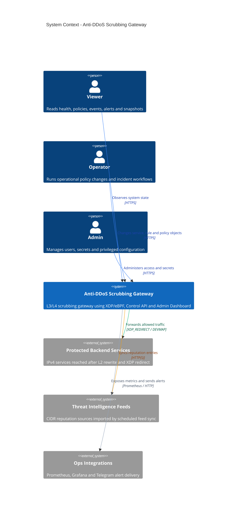
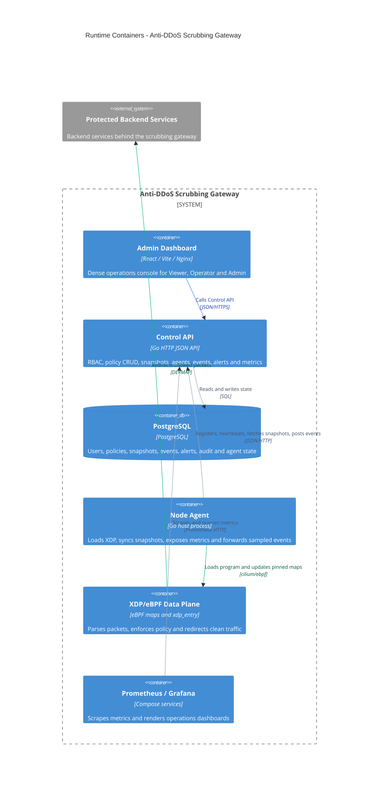
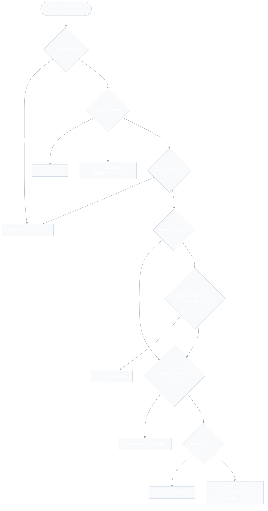
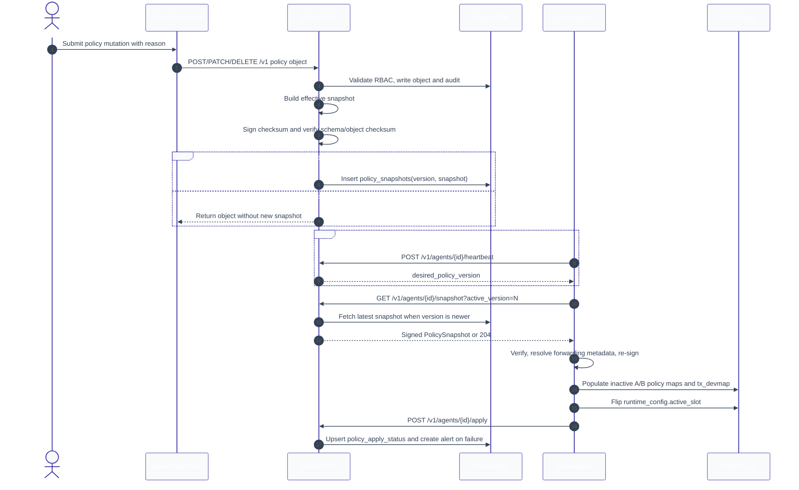
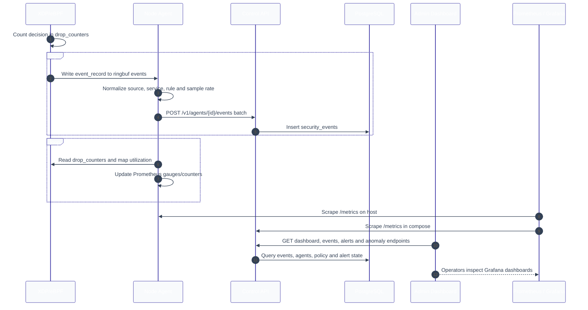
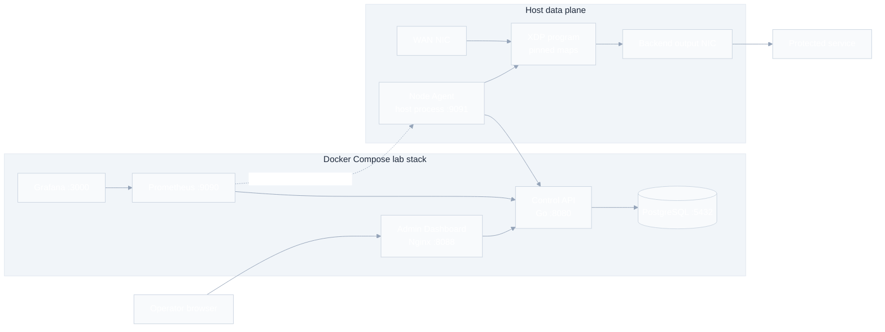

# System Architecture Design - Anti-DDoS Scrubbing Gateway

Trang thai: tai lieu kien truc he thong duoc lap tu source, README va docs hien co trong working tree ngay 2026-06-03.

Tai lieu nay mo ta Anti-DDoS Scrubbing Gateway hien huu: mot scrubbing gateway L3/L4 dung XDP/eBPF de xu ly packet som tren WAN NIC, Control API/PostgreSQL de quan ly policy snapshot, Node Agent tren host de load/apply XDP, va Admin Dashboard/Prometheus/Grafana cho van hanh. He thong khong ket thuc TLS, khong proxy HTTP, khong xu ly L7/DPI va khong thay the WAF.

## 1. Muc Tieu Va Pham Vi

Muc tieu chinh:

- Loc va chuyen tiep luu luong L3/L4 toi cac protected backend service da khai bao.
- Drop/rate-limit/observe/sample theo whitelist, blacklist, UDP source-port block, service allowlist va rule runtime.
- Dam bao policy runtime duoc dong bo bang signed snapshot co checksum va version.
- Cho phep Viewer, Operator va Admin quan sat, dieu tra, thay doi policy, rollback snapshot va audit hanh dong.
- Expose metrics/events cho dashboard, Prometheus va Grafana.

Pham vi hien tai:

- Mot node Ubuntu 24.04, IPv4, native XDP la duong chay chinh.
- Docker Compose khoi dong management/control lab stack: PostgreSQL, Control API, Prometheus, Grafana, Admin Dashboard.
- Node Agent chay tren host vi can quyen eBPF/XDP va interface that/lab.

Ngoai pham vi:

- L7 inspection, HTTP reverse proxy, TLS termination, WAF, BGP/RTBH/FlowSpec automation.
- Multi-node HA production deployment va tenant/group model.
- Attach XDP tren NIC production neu chua co phe duyet interface role va rollback plan.

Success criteria:

- Packet khong thuoc service allowlist bi fail-closed.
- Policy snapshot moi chi duoc apply khi schema, checksum, object checksum, capacity va forwarding metadata hop le.
- Moi mutation quan trong co reason va audit trail.
- Agent apply failure duoc ghi vao `policy_apply_status` va co the tao alert.
- Dashboard/Grafana phan anh duoc health, traffic decision, events, alerts, snapshot va agent state.

## 2. System Context

System boundary gom Control API, PostgreSQL, Admin Dashboard, Node Agent va eBPF/XDP data plane. Ben ngoai la nguoi van hanh, protected services, threat intelligence feeds va ops integrations.

SVG rendered: [system-context-c4.svg](diagrams/system-architecture/system-context-c4.svg)  
Mermaid source: [system-context-c4.mmd](diagrams/system-architecture/system-context-c4.mmd)

```mermaid
C4Context
    title System Context - Anti-DDoS Scrubbing Gateway

    Person(viewer, "Viewer", "Reads health, policies, events, alerts and snapshots")
    Person(operator, "Operator", "Runs operational policy changes and incident workflows")
    Person(admin, "Admin", "Manages users, secrets and privileged configuration")

    System(gateway, "Anti-DDoS Scrubbing Gateway", "L3/L4 scrubbing gateway using XDP/eBPF, Control API and Admin Dashboard")
    System_Ext(protected, "Protected Backend Services", "IPv4 services reached after L2 rewrite and XDP redirect")
    System_Ext(threatIntel, "Threat Intelligence Feeds", "CIDR reputation sources imported by scheduled feed sync")
    System_Ext(opsTools, "Ops Integrations", "Prometheus, Grafana and Telegram alert delivery")

    Rel(viewer, gateway, "Observes system state", "HTTPS")
    Rel(operator, gateway, "Changes service, rule and policy objects", "HTTPS")
    Rel(admin, gateway, "Administers access and secrets", "HTTPS")
    Rel(gateway, protected, "Forwards allowed traffic", "XDP_REDIRECT / DEVMAP")
    Rel(gateway, threatIntel, "Syncs reputation entries", "HTTP(S)")
    Rel(gateway, opsTools, "Exposes metrics and sends alerts", "Prometheus / HTTP")

    UpdateRelStyle(viewer, gateway, $textColor="#1e40af", $lineColor="#3b82f6")
    UpdateRelStyle(operator, gateway, $textColor="#1e40af", $lineColor="#3b82f6")
    UpdateRelStyle(admin, gateway, $textColor="#1e40af", $lineColor="#3b82f6")
    UpdateRelStyle(gateway, protected, $textColor="#065f46", $lineColor="#10b981")
    UpdateRelStyle(gateway, threatIntel, $textColor="#92400e", $lineColor="#f59e0b")
    UpdateRelStyle(gateway, opsTools, $textColor="#475569", $lineColor="#94a3b8")

    UpdateLayoutConfig($c4ShapeInRow="3", $c4BoundaryInRow="1")
```

Personas:

- Viewer: doc dashboard, services, policy, events, alerts, feeds va snapshots; khong mutation.
- Operator: thay doi service/rule/whitelist/blacklist/feed operational state, rollback snapshot, test alert.
- Admin: bao gom Operator; them user management, password reset, session revoke va secret/credential config.

## 3. Runtime Containers

Runtime tach thanh management/control plane trong Docker Compose va data plane tren host. Control API la JSON API chinh cho dashboard va agent. PostgreSQL la source of truth cho users, sessions, policy objects, snapshots, events, alerts va audit. Agent load BPF object, attach `xdp_entry`, sync snapshot va expose metrics tren host.

SVG rendered: [runtime-containers-c4.svg](diagrams/system-architecture/runtime-containers-c4.svg)  
Mermaid source: [runtime-containers-c4.mmd](diagrams/system-architecture/runtime-containers-c4.mmd)

```mermaid
C4Container
    title Runtime Containers - Anti-DDoS Scrubbing Gateway

    System_Boundary(system, "Anti-DDoS Scrubbing Gateway") {
        Container(dashboard, "Admin Dashboard", "React / Vite / Nginx", "Dense operations console for Viewer, Operator and Admin")
        Container(api, "Control API", "Go HTTP JSON API", "RBAC, policy CRUD, snapshots, agents, events, alerts and metrics")
        ContainerDb(db, "PostgreSQL", "PostgreSQL", "Users, policies, snapshots, events, alerts, audit and agent state")
        Container(agent, "Node Agent", "Go host process", "Loads XDP, syncs snapshots, exposes metrics and forwards sampled events")
        Container(xdp, "XDP/eBPF Data Plane", "eBPF maps and xdp_entry", "Parses packets, enforces policy and redirects clean traffic")
        Container(monitoring, "Prometheus / Grafana", "Compose services", "Scrapes metrics and renders operations dashboards")
    }

    System_Ext(protected, "Protected Backend Services", "Backend services behind the scrubbing gateway")

    Rel(dashboard, api, "Calls Control API", "JSON/HTTPS")
    Rel(api, db, "Reads and writes state", "SQL")
    Rel(agent, api, "Registers, heartbeats, fetches snapshots, posts events", "JSON/HTTP")
    Rel(agent, xdp, "Loads program and updates pinned maps", "cilium/ebpf")
    Rel(xdp, protected, "Redirects allowed packets", "DEVMAP")
    Rel(monitoring, api, "Scrapes and queries metrics", "Prometheus HTTP")

    UpdateRelStyle(dashboard, api, $textColor="#1e40af", $lineColor="#3b82f6")
    UpdateRelStyle(api, db, $textColor="#475569", $lineColor="#94a3b8")
    UpdateRelStyle(agent, api, $textColor="#475569", $lineColor="#94a3b8")
    UpdateRelStyle(agent, xdp, $textColor="#065f46", $lineColor="#10b981")
    UpdateRelStyle(xdp, protected, $textColor="#065f46", $lineColor="#10b981")
    UpdateRelStyle(monitoring, api, $textColor="#475569", $lineColor="#94a3b8")

    UpdateLayoutConfig($c4ShapeInRow="3", $c4BoundaryInRow="1")
```

Thanh phan runtime:

| Thanh phan | Source chinh | Trach nhiem |
|---|---|---|
| Control API | `cmd/control-api/main.go`, `internal/control` | Migrations, HTTP API, RBAC, policy CRUD, snapshot, agent control, observability, alerts |
| Control Admin CLI | `cmd/control-admin/main.go` | Bootstrap admin dau tien qua PostgreSQL |
| Node Agent | `cmd/agent/main.go`, `internal/agent` | Load/attach XDP, expose metrics, sync snapshot, consume ringbuf, forward events |
| XDP/eBPF | `bpf/xdp_data_plane.bpf.c`, `include/anti_ddos/bpf_contract.h` | Packet decision path, counters, ringbuf, DEVMAP redirect |
| Admin Dashboard | `web/dashboard/src` | Ops console cho API surface |
| PostgreSQL | `internal/control/migrations.go` | Persistent state va audit |
| Prometheus/Grafana | `deploy/prometheus`, `deploy/grafana` | Metrics scrape, recording rules, dashboard |

## 4. Data Plane Design

Data plane nam trong `xdp_entry`. Packet IPv4 hop le duoc map vao service allowlist bang destination IP, destination port va protocol. Neu service khong ton tai, packet bi drop voi reason `REASON_NOT_ALLOWED_SERVICE`. Whitelist co the override blacklist va UDP source-port block. Khi can forward, XDP rewrite Ethernet destination/source MAC va redirect qua `tx_devmap`.

SVG rendered: [xdp-packet-decision-flow.svg](diagrams/system-architecture/xdp-packet-decision-flow.svg)  
Mermaid source: [xdp-packet-decision-flow.mmd](diagrams/system-architecture/xdp-packet-decision-flow.mmd)

```mermaid
%%{init: {'theme':'base','themeVariables': {'primaryColor':'#4f46e5','primaryTextColor':'#ffffff','primaryBorderColor':'#3730a3','lineColor':'#94a3b8','secondaryColor':'#10b981','tertiaryColor':'#f59e0b','background':'#ffffff','mainBkg':'#f8fafc','nodeBorder':'#cbd5e1','clusterBkg':'#f1f5f9','clusterBorder':'#e2e8f0','titleColor':'#1e293b','edgeLabelBackground':'#ffffff','textColor':'#334155'}}}%%
flowchart TD
    packet([WAN packet enters xdp_entry])
    runtime{runtime_config valid?}
    parse{IPv4 packet parses?}
    nonIpv4[Pass non-IPv4]
    malformed[Drop malformed or fragmented IPv4]
    service{Service allowlist hit?}
    serviceMiss[Drop not allowed service]
    whitelist{Source whitelisted?}
    threat{Blacklist or UDP source-port block?}
    threatDrop[Drop threat match]
    neighbor{Neighbor metadata resolved?}
    neighborDrop[Drop unresolved neighbor]
    rule{Default rule drops?}
    ruleDrop[Drop rule or rate-limit]
    redirect[Rewrite MAC and XDP_REDIRECT via tx_devmap]

    packet --> runtime
    runtime -- No --> serviceMiss
    runtime -- Yes --> parse
    parse -- Non-IPv4 --> nonIpv4
    parse -- Malformed or fragment --> malformed
    parse -- Valid IPv4 --> service
    service -- No --> serviceMiss
    service -- Yes --> whitelist
    whitelist -- Yes --> neighbor
    whitelist -- No --> threat
    threat -- Yes --> threatDrop
    threat -- No --> neighbor
    neighbor -- No --> neighborDrop
    neighbor -- Yes --> rule
    rule -- Yes --> ruleDrop
    rule -- No --> redirect
```

eBPF maps quan trong:

| Map | Kieu | Vai tro |
|---|---|---|
| `runtime_config` | ARRAY | Active A/B slot, policy version, malformed action, sample denominator |
| `whitelist_v4_a/b` | LPM_TRIE | Global/service-scoped source allowlist |
| `blacklist_v4_a/b` | LPM_TRIE | Manual va reputation source blacklist |
| `udp_src_port_blocks_a/b` | HASH | UDP reflection/amplification source-port blocklist |
| `service_allowlist_a/b` | HASH | Destination service match va forwarding metadata |
| `rule_config_a/b` | ARRAY | Rule action/mode/threshold config |
| `rate_state` | LRU_HASH | Token bucket state theo source/service/rule dimension |
| `drop_counters` | PERCPU_HASH | Aggregated packet/byte counters theo reason/action/service/rule/proto |
| `events` | RINGBUF | Sampled security events |
| `tx_devmap` | DEVMAP | Output ifindex targets cho `XDP_REDIRECT` |

## 5. Policy Snapshot Lifecycle

Control Plane khong ghi truc tiep vao eBPF maps. Moi mutation policy co reason se cap nhat PostgreSQL, rebuild effective snapshot, ky checksum canonical va luu version moi neu noi dung thay doi. Agent lay desired version qua heartbeat, fetch snapshot moi, verify lai, resolve forwarding metadata neu Control Plane de unresolved, populate inactive slot, update `tx_devmap`, roi flip `runtime_config.active_slot`.

SVG rendered: [policy-snapshot-sequence.svg](diagrams/system-architecture/policy-snapshot-sequence.svg)  
Mermaid source: [policy-snapshot-sequence.mmd](diagrams/system-architecture/policy-snapshot-sequence.mmd)

```mermaid
%%{init: {'theme':'base','themeVariables': {'primaryColor':'#4f46e5','primaryTextColor':'#ffffff','primaryBorderColor':'#3730a3','lineColor':'#94a3b8','secondaryColor':'#10b981','tertiaryColor':'#f59e0b','background':'#ffffff','mainBkg':'#f8fafc','nodeBorder':'#cbd5e1','clusterBkg':'#f1f5f9','clusterBorder':'#e2e8f0','titleColor':'#1e293b','edgeLabelBackground':'#ffffff','textColor':'#334155'}}}%%
sequenceDiagram
    autonumber
    actor Operator
    participant Dashboard as Admin Dashboard
    participant API as Control API
    participant DB as PostgreSQL
    participant Agent as Node Agent
    participant XDP as eBPF maps

    Operator->>Dashboard: Submit policy mutation with reason
    Dashboard->>API: POST/PATCH/DELETE /v1 policy object
    API->>DB: Validate RBAC, write object and audit
    API->>API: Build effective snapshot
    API->>API: Sign checksum and verify schema/object checksum
    alt Snapshot content changed
        API->>DB: Insert policy_snapshots(version, snapshot)
    else No content change
        API-->>Dashboard: Return object without new snapshot
    end
    loop Every 5 seconds
        Agent->>API: POST /v1/agents/{id}/heartbeat
        API-->>Agent: desired_policy_version
    end
    Agent->>API: GET /v1/agents/{id}/snapshot?active_version=N
    API->>DB: Fetch latest snapshot when version is newer
    API-->>Agent: Signed PolicySnapshot or 204
    Agent->>Agent: Verify, resolve forwarding metadata, re-sign
    Agent->>XDP: Populate inactive A/B policy maps and tx_devmap
    Agent->>XDP: Flip runtime_config.active_slot
    Agent->>API: POST /v1/agents/{id}/apply
    API->>DB: Upsert policy_apply_status and create alert on failure
```

Snapshot content gom:

- `schema_version`, `version`, `checksum`, `object_checksum`, `feature_flags`.
- `runtime`: malformed policy action va event sample denominator.
- `whitelist_v4`, `blacklist_v4`, `udp_source_port_blocks`.
- `services`: service target, protocol, port, action redirect, output interface/ifindex, devmap key, MAC metadata, neighbor status.
- `rules`: action, mode, thresholds, dimension, burst, sample denominator va expiry.

Quan trong:

- Control Plane cho phep unresolved service snapshot de dashboard khong can nhap next-hop MAC thu cong.
- Agent resolve output ifindex/source MAC/next-hop MAC bang host networking truoc khi apply.
- Neu resolve/apply fail, Agent khong flip runtime slot va Control API ghi failure stage nhu `resolve_forwarding`, `populate_tx_devmap` hoac `runtime_flip`.
- `object_checksum` rang buoc snapshot voi BPF object hien tai de tranh apply sai ABI/map contract.

## 6. Observability Va Event Flow

XDP cap nhat `drop_counters` cho moi decision va chi ghi `events` ringbuf khi sampling duoc bat. Agent doc counters moi giay, expose `/metrics`, consume ringbuf va forward event batch ve Control API. Control API normalize IPv4/source /24 va luu `security_events` vao PostgreSQL. Dashboard doc events/summary/investigation; Prometheus scrape Control API va Agent metrics.

SVG rendered: [observability-events-sequence.svg](diagrams/system-architecture/observability-events-sequence.svg)  
Mermaid source: [observability-events-sequence.mmd](diagrams/system-architecture/observability-events-sequence.mmd)

```mermaid
%%{init: {'theme':'base','themeVariables': {'primaryColor':'#4f46e5','primaryTextColor':'#ffffff','primaryBorderColor':'#3730a3','lineColor':'#94a3b8','secondaryColor':'#10b981','tertiaryColor':'#f59e0b','background':'#ffffff','mainBkg':'#f8fafc','nodeBorder':'#cbd5e1','clusterBkg':'#f1f5f9','clusterBorder':'#e2e8f0','titleColor':'#1e293b','edgeLabelBackground':'#ffffff','textColor':'#334155'}}}%%
sequenceDiagram
    autonumber
    participant XDP as XDP/eBPF
    participant Agent as Node Agent
    participant API as Control API
    participant DB as PostgreSQL
    participant UI as Admin Dashboard
    participant Metrics as Prometheus / Grafana

    XDP->>XDP: Count decision in drop_counters
    opt Sampling enabled
        XDP->>Agent: Write event_record to ringbuf events
        Agent->>Agent: Normalize source, service, rule and sample rate
        Agent->>API: POST /v1/agents/{id}/events batch
        API->>DB: Insert security_events
    end
    loop Every second
        Agent->>XDP: Read drop_counters and map utilization
        Agent->>Agent: Update Prometheus gauges/counters
    end
    Metrics->>Agent: Scrape /metrics on host
    Metrics->>API: Scrape /metrics in compose
    UI->>API: GET dashboard, events, alerts and anomaly endpoints
    API->>DB: Query events, agents, policy and alert state
    UI-->>Metrics: Operators inspect Grafana dashboards
```

Observability surfaces:

- Control API `/metrics`: HTTP metrics, control metrics, refreshed DB-backed gauges.
- Agent `/metrics`: XDP attach mode, loaded object checksum, snapshot version, counters, forwarding counters, map stats, event forwarding metrics.
- Dashboard endpoints: overview, agents, services, rules, recent events, baselines, anomalies, feeds, alerts, snapshots.
- Grafana: provisioned dashboard backed by Prometheus datasource.

## 7. Core Data Model

PostgreSQL schema duoc khai bao trong Go migrations. Day la overview cac bang loi co anh huong den kien truc runtime, khong phai day du tat ca column.

SVG rendered: [core-data-model-erd.svg](diagrams/system-architecture/core-data-model-erd.svg)  
Mermaid source: [core-data-model-erd.mmd](diagrams/system-architecture/core-data-model-erd.mmd)

```mermaid
%%{init: {'theme':'base','themeVariables': {'primaryColor':'#4f46e5','primaryTextColor':'#ffffff','primaryBorderColor':'#3730a3','lineColor':'#94a3b8','secondaryColor':'#10b981','tertiaryColor':'#f59e0b','background':'#ffffff','mainBkg':'#f8fafc','nodeBorder':'#cbd5e1','clusterBkg':'#f1f5f9','clusterBorder':'#e2e8f0','titleColor':'#1e293b','edgeLabelBackground':'#ffffff','textColor':'#334155'}}}%%
erDiagram
    APP_USERS ||--|| POLICY_SNAPSHOTS : creates
    APP_USERS ||--|| AUDIT_EVENTS : performs
    APP_USERS ||--|| ALERTS : creates
    AGENTS ||--|| AGENT_INTERFACES : reports
    AGENTS ||--|| POLICY_APPLY_STATUS : reports
    AGENTS ||--|| SECURITY_EVENTS : forwards
    BACKEND_SERVICES ||--|| FORWARDING_POLICIES : has
    BACKEND_SERVICES ||--|| RULES : scopes
    BACKEND_SERVICES ||--|| WHITELIST_ENTRIES : scopes
    BACKEND_SERVICES ||--|| ALERTS : affects
    RULES ||--|| MANUAL_BLACKLIST_ENTRIES : explains
    FEED_SOURCES ||--|| REPUTATION_ENTRIES : imports

    APP_USERS {
        uuid id PK
        text username UK
        text role
        text status
        timestamptz created_at
    }
    AGENTS {
        uuid id PK
        text hostname UK
        text status
        bigint active_policy_version
        timestamptz last_seen_at
    }
    AGENT_INTERFACES {
        uuid id PK
        uuid agent_id FK
        text name
        integer ifindex
        text mac
    }
    BACKEND_SERVICES {
        uuid id PK
        bigint ebpf_id UK
        inet backend_cidr
        text protocol
        boolean enabled
    }
    FORWARDING_POLICIES {
        uuid id PK
        uuid service_id FK
        inet backend_target
        text output_interface
        integer devmap_key
    }
    RULES {
        uuid id PK
        uuid service_id FK
        bigint ebpf_id UK
        text action
        text mode
    }
    WHITELIST_ENTRIES {
        uuid id PK
        uuid service_id FK
        inet ip_or_cidr
        text scope
        boolean enabled
    }
    MANUAL_BLACKLIST_ENTRIES {
        uuid id PK
        uuid rule_id FK
        inet ip_or_cidr
        integer score
        boolean enabled
    }
    FEED_SOURCES {
        uuid id PK
        text name UK
        text status
        boolean enabled
        integer interval_seconds
    }
    REPUTATION_ENTRIES {
        uuid id PK
        uuid source_id FK
        inet ip_or_cidr
        integer score
        text status
    }
    POLICY_SNAPSHOTS {
        bigint version PK
        text checksum
        text object_checksum
        bigint rollback_from FK
        uuid created_by FK
    }
    POLICY_APPLY_STATUS {
        uuid id PK
        uuid agent_id FK
        bigint policy_version
        text status
        text error_stage
    }
    SECURITY_EVENTS {
        uuid id PK
        uuid agent_id FK
        bigint policy_version
        inet src_ip
        integer action
    }
    ALERTS {
        uuid id PK
        uuid service_id FK
        uuid created_by FK
        text severity
        text status
    }
    AUDIT_EVENTS {
        uuid id PK
        uuid actor_id FK
        text action
        text entity_type
        timestamptz created_at
    }
```

Design notes:

- `policy_snapshots` la immutable version history; rollback tao snapshot version moi voi `rollback_from`.
- `policy_apply_status` ghi ket qua apply theo agent va version, bao gom map/devmap stats.
- Soft-disable duoc dung cho rules, whitelist, blacklist, feeds va UDP source-port blocks de giu history/audit.
- Reputation entries tu feeds duoc merge vao blacklist snapshot; manual blacklist uu tien khi cung CIDR.
- `audit_events` partition by time va luu actor/action/entity/before/after/reason.

## 8. Deployment Topology

Compose chi khoi dong management/control lab stack. No khong attach XDP va khong tac dong truc tiep toi production traffic. Node Agent chay tren host de truy cap BPF filesystem, host NIC, netlink neighbor/route va metrics bind `:9091`.

SVG rendered: [lab-deployment-flow.svg](diagrams/system-architecture/lab-deployment-flow.svg)  
Mermaid source: [lab-deployment-flow.mmd](diagrams/system-architecture/lab-deployment-flow.mmd)

```mermaid
%%{init: {'theme':'base','themeVariables': {'primaryColor':'#4f46e5','primaryTextColor':'#ffffff','primaryBorderColor':'#3730a3','lineColor':'#94a3b8','secondaryColor':'#10b981','tertiaryColor':'#f59e0b','background':'#ffffff','mainBkg':'#f8fafc','nodeBorder':'#cbd5e1','clusterBkg':'#f1f5f9','clusterBorder':'#e2e8f0','titleColor':'#1e293b','edgeLabelBackground':'#ffffff','textColor':'#334155'}}}%%
flowchart LR
    browser[Operator browser]

    subgraph compose["Docker Compose lab stack"]
        direction LR
        dashboard[Admin Dashboard<br/>Nginx :8088]
        api[Control API<br/>Go :8080]
        db[(PostgreSQL :5432)]
        prometheus[Prometheus :9090]
        grafana[Grafana :3000]
    end

    subgraph host["Host data plane"]
        direction LR
        agent[Node Agent<br/>host process :9091]
        xdp[XDP program<br/>pinned maps]
        wan[WAN NIC]
        output[Backend output NIC]
    end

    service[Protected service]

    browser --> dashboard
    dashboard --> api
    api --> db
    grafana --> prometheus
    prometheus --> api
    prometheus -. scrape host docker internal .-> agent
    agent --> api
    agent --> xdp
    wan --> xdp
    xdp --> output
    output --> service
```

Default lab ports:

| Service | URL |
|---|---|
| Admin Dashboard | `http://127.0.0.1:8088` |
| Control API | `http://127.0.0.1:8080` |
| Prometheus | `http://127.0.0.1:9090` |
| Grafana | `http://127.0.0.1:3000` |
| PostgreSQL | `127.0.0.1:5432` |
| Node Agent metrics | `host:9091` |

Operational safety:

- Dung `make env-init`, `make compose-config`, `make deploy`, `make dev-health` cho lab stack.
- Chi chay `make agent-start` khi `AGENT_WAN_IFACE` va output interfaces da duoc phe duyet.
- Tren mot so driver native XDP nhu `ixgbe`, output NIC can pass-through XDP program `xdp_pass` de co XDP TX queues cho DEVMAP redirect.
- Khong replace XDP program san co tren output NIC neu chua co phe duyet van hanh.

## 9. Security, RBAC Va Audit

Auth:

- User auth dung bearer session token hoac cookie `anti_ddos_session`.
- Agent auth dung bearer shared token khi `AgentSharedToken` duoc cau hinh.
- Password raw, credential raw va token khong duoc tra ve trong response/audit.

RBAC:

- Viewer: authenticated read.
- Operator: operational mutations cho services, policies, whitelist, rules, blacklist, UDP source-port blocks, feeds, snapshots, anomaly/alert actions.
- Admin: user management, password reset, session revoke va write-only secret/credential operations.

Audit va safety:

- Mutation reason lay tu body `reason` hoac header `X-Audit-Reason`.
- Backend la enforcement chinh cho RBAC; UI chi an mutation controls theo role.
- Last active admin duoc bao ve khoi revoke/downgrade vo tinh.
- Delete policy object trong UI/API la soft-disable o nhieu domain de giu rollback/history.
- Forwarding metadata fail-close: neu neighbor/output metadata khong resolve duoc, packet khong duoc redirect.

## 10. Source References

Nguon chinh da doi chieu khi lap tai lieu:

- `README.md`
- `docs/Control-Api.md`
- `docs/Admin-Dashboard-v2.md`
- `docs/deployment/docker-compose.md`
- `cmd/control-api/main.go`
- `cmd/control-admin/main.go`
- `cmd/agent/main.go`
- `internal/control/server.go`
- `internal/control/snapshot.go`
- `internal/control/agent_store.go`
- `internal/control/migrations.go`
- `internal/agent/agent.go`
- `internal/agent/control_client.go`
- `internal/agent/loader.go`
- `internal/agent/policy_apply.go`
- `internal/agent/policy_snapshot.go`
- `internal/agent/event_forwarder.go`
- `include/anti_ddos/bpf_contract.h`
- `bpf/xdp_data_plane.bpf.c`
- `docker-compose.yml`
- `web/dashboard/src/api.ts`
