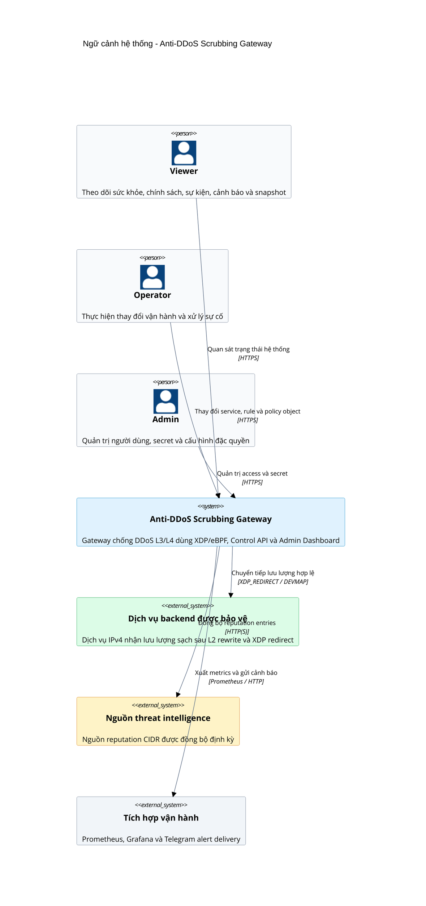
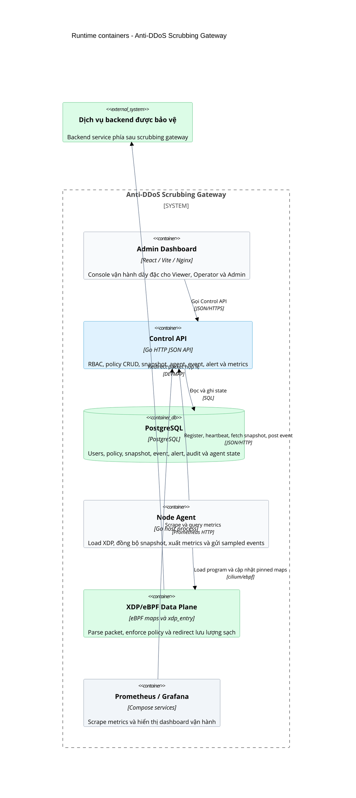
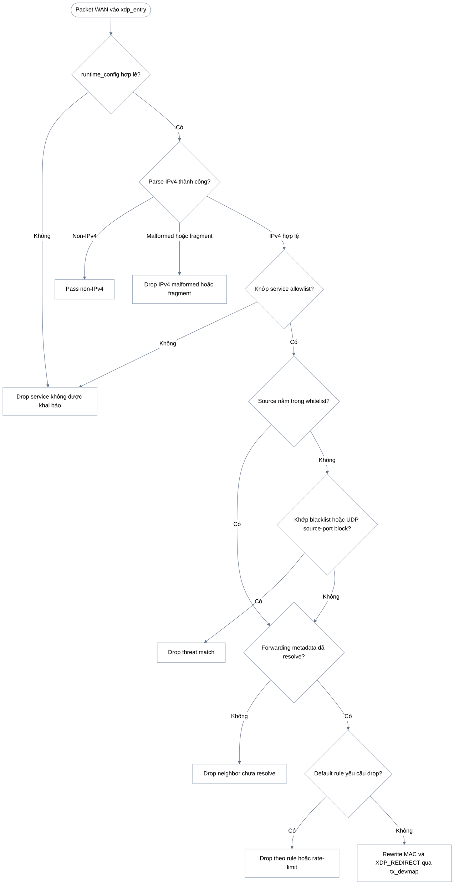
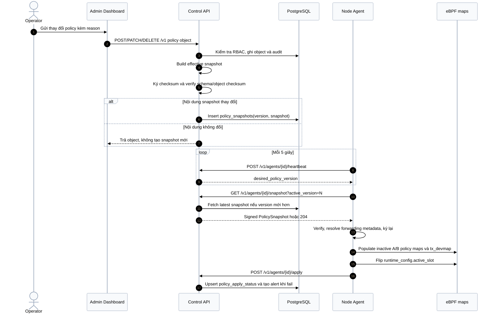
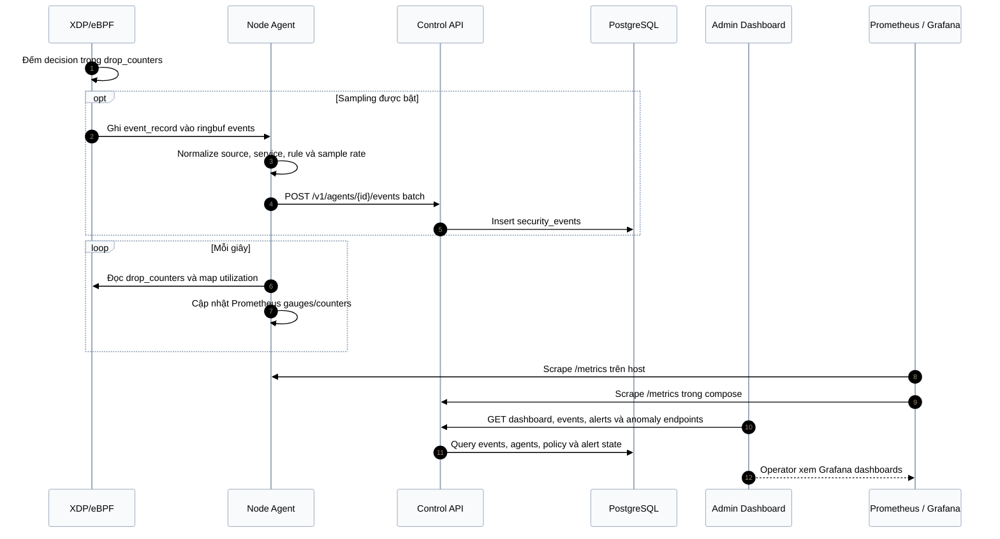
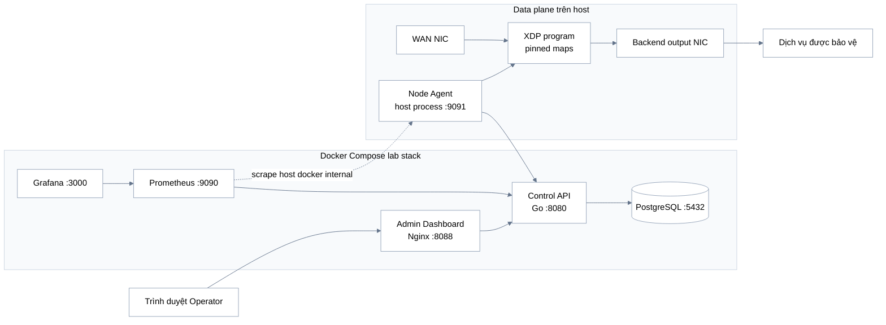

# Thiết Kế Kiến Trúc Hệ Thống - Anti-DDoS Scrubbing Gateway

Trạng thái: tài liệu kiến trúc hệ thống được lập từ source, README và các tài liệu hiện có trong working tree ngày 2026-06-03.

Tài liệu này mô tả Anti-DDoS Scrubbing Gateway hiện hữu: một scrubbing gateway L3/L4 dùng XDP/eBPF để xử lý packet sớm trên WAN NIC, Control API/PostgreSQL để quản lý policy snapshot, Node Agent trên host để load/apply XDP, và Admin Dashboard/Prometheus/Grafana cho vận hành. Hệ thống không kết thúc TLS, không proxy HTTP, không xử lý L7/DPI và không thay thế WAF.

## 1. Mục Tiêu Và Phạm Vi

Mục tiêu chính:

- Lọc và chuyển tiếp lưu lượng L3/L4 tới các protected backend service đã khai báo.
- Drop, rate-limit, observe hoặc sample theo whitelist, blacklist, UDP source-port block, service allowlist và rule runtime.
- Đồng bộ policy runtime bằng signed snapshot có checksum và version.
- Cho phép Viewer, Operator và Admin quan sát, điều tra, thay đổi policy, rollback snapshot và audit hành động.
- Xuất metrics/events cho Dashboard, Prometheus và Grafana.

Phạm vi hiện tại:

- Một node Ubuntu 24.04, IPv4, native XDP là đường chạy chính.
- Docker Compose khởi động management/control lab stack: PostgreSQL, Control API, Prometheus, Grafana và Admin Dashboard.
- Node Agent chạy trên host vì cần quyền eBPF/XDP và host interfaces.

Ngoài phạm vi:

- L7 inspection, HTTP reverse proxy, TLS termination, WAF, BGP/RTBH/FlowSpec automation.
- Multi-node HA production deployment và tenant/group model.
- Attach XDP trên NIC production nếu chưa có phê duyệt interface role và rollback plan.

Success criteria:

- Packet không thuộc service allowlist bị fail-closed.
- Policy snapshot mới chỉ được apply khi schema, checksum, object checksum, capacity và forwarding metadata hợp lệ.
- Mọi mutation quan trọng có reason và audit trail.
- Agent apply failure được ghi vào `policy_apply_status` và có thể tạo alert.
- Dashboard/Grafana phản ánh được health, traffic decision, events, alerts, snapshot và agent state.

## 2. System Context

System boundary gồm Control API, PostgreSQL, Admin Dashboard, Node Agent và eBPF/XDP data plane. Bên ngoài là người vận hành, protected services, threat intelligence feeds và ops integrations.

SVG rendered: [system-context-c4.svg](diagrams/system-architecture/system-context-c4.svg)  
Mermaid source: [system-context-c4.mmd](diagrams/system-architecture/system-context-c4.mmd)

```mermaid
%%{init: {'theme':'base','themeVariables': {'textColor':'#000000','titleColor':'#000000'}}}%%
C4Context
    title Ngữ cảnh hệ thống - Anti-DDoS Scrubbing Gateway

    Person(viewer, "Viewer", "Theo dõi sức khỏe, chính sách, sự kiện, cảnh báo và snapshot")
    Person(operator, "Operator", "Thực hiện thay đổi vận hành và xử lý sự cố")
    Person(admin, "Admin", "Quản trị người dùng, secret và cấu hình đặc quyền")

    System(gateway, "Anti-DDoS Scrubbing Gateway", "Gateway chống DDoS L3/L4 dùng XDP/eBPF, Control API và Admin Dashboard")
    System_Ext(protected, "Dịch vụ backend được bảo vệ", "Dịch vụ IPv4 nhận lưu lượng sạch sau L2 rewrite và XDP redirect")
    System_Ext(threatIntel, "Nguồn threat intelligence", "Nguồn reputation CIDR được đồng bộ định kỳ")
    System_Ext(opsTools, "Tích hợp vận hành", "Prometheus, Grafana và Telegram alert delivery")

    Rel(viewer, gateway, "Quan sát trạng thái hệ thống", "HTTPS")
    Rel(operator, gateway, "Thay đổi service, rule và policy object", "HTTPS")
    Rel(admin, gateway, "Quản trị access và secret", "HTTPS")
    Rel(gateway, protected, "Chuyển tiếp lưu lượng hợp lệ", "XDP_REDIRECT / DEVMAP")
    Rel(gateway, threatIntel, "Đồng bộ reputation entries", "HTTP(S)")
    Rel(gateway, opsTools, "Xuất metrics và gửi cảnh báo", "Prometheus / HTTP")

    UpdateElementStyle(viewer, $fontColor="#000000", $bgColor="#f8fafc", $borderColor="#64748b")
    UpdateElementStyle(operator, $fontColor="#000000", $bgColor="#f8fafc", $borderColor="#64748b")
    UpdateElementStyle(admin, $fontColor="#000000", $bgColor="#f8fafc", $borderColor="#64748b")
    UpdateElementStyle(gateway, $fontColor="#000000", $bgColor="#e0f2fe", $borderColor="#0284c7")
    UpdateElementStyle(protected, $fontColor="#000000", $bgColor="#dcfce7", $borderColor="#16a34a")
    UpdateElementStyle(threatIntel, $fontColor="#000000", $bgColor="#fef3c7", $borderColor="#d97706")
    UpdateElementStyle(opsTools, $fontColor="#000000", $bgColor="#f1f5f9", $borderColor="#64748b")

    UpdateRelStyle(viewer, gateway, $textColor="#000000", $lineColor="#64748b")
    UpdateRelStyle(operator, gateway, $textColor="#000000", $lineColor="#64748b")
    UpdateRelStyle(admin, gateway, $textColor="#000000", $lineColor="#64748b")
    UpdateRelStyle(gateway, protected, $textColor="#000000", $lineColor="#64748b")
    UpdateRelStyle(gateway, threatIntel, $textColor="#000000", $lineColor="#64748b")
    UpdateRelStyle(gateway, opsTools, $textColor="#000000", $lineColor="#64748b")

    UpdateLayoutConfig($c4ShapeInRow="3", $c4BoundaryInRow="1")
```

Personas:

- Viewer: đọc dashboard, services, policy, events, alerts, feeds và snapshots; không thực hiện mutation.
- Operator: thay đổi operational state của service, rule, whitelist, blacklist, feed; rollback snapshot và test alert.
- Admin: bao gồm quyền Operator; thêm user management, password reset, session revoke và secret/credential config.

## 3. Runtime Containers

Runtime tách thành management/control plane trong Docker Compose và data plane trên host. Control API là JSON API chính cho dashboard và agent. PostgreSQL là source of truth cho users, sessions, policy objects, snapshots, events, alerts và audit. Agent load BPF object, attach `xdp_entry`, sync snapshot và expose metrics trên host.

SVG rendered: [runtime-containers-c4.svg](diagrams/system-architecture/runtime-containers-c4.svg)  
Mermaid source: [runtime-containers-c4.mmd](diagrams/system-architecture/runtime-containers-c4.mmd)

```mermaid
%%{init: {'theme':'base','themeVariables': {'textColor':'#000000','titleColor':'#000000'}}}%%
C4Container
    title Runtime containers - Anti-DDoS Scrubbing Gateway

    System_Boundary(system, "Anti-DDoS Scrubbing Gateway") {
        Container(dashboard, "Admin Dashboard", "React / Vite / Nginx", "Console vận hành dày đặc cho Viewer, Operator và Admin")
        Container(api, "Control API", "Go HTTP JSON API", "RBAC, policy CRUD, snapshot, agent, event, alert và metrics")
        ContainerDb(db, "PostgreSQL", "PostgreSQL", "Users, policy, snapshot, event, alert, audit và agent state")
        Container(agent, "Node Agent", "Go host process", "Load XDP, đồng bộ snapshot, xuất metrics và gửi sampled events")
        Container(xdp, "XDP/eBPF Data Plane", "eBPF maps và xdp_entry", "Parse packet, enforce policy và redirect lưu lượng sạch")
        Container(monitoring, "Prometheus / Grafana", "Compose services", "Scrape metrics và hiển thị dashboard vận hành")
    }

    System_Ext(protected, "Dịch vụ backend được bảo vệ", "Backend service phía sau scrubbing gateway")

    Rel(dashboard, api, "Gọi Control API", "JSON/HTTPS")
    Rel(api, db, "Đọc và ghi state", "SQL")
    Rel(agent, api, "Register, heartbeat, fetch snapshot, post event", "JSON/HTTP")
    Rel(agent, xdp, "Load program và cập nhật pinned maps", "cilium/ebpf")
    Rel(xdp, protected, "Redirect packet hợp lệ", "DEVMAP")
    Rel(monitoring, api, "Scrape và query metrics", "Prometheus HTTP")

    UpdateElementStyle(dashboard, $fontColor="#000000", $bgColor="#f8fafc", $borderColor="#64748b")
    UpdateElementStyle(api, $fontColor="#000000", $bgColor="#e0f2fe", $borderColor="#0284c7")
    UpdateElementStyle(db, $fontColor="#000000", $bgColor="#dcfce7", $borderColor="#16a34a")
    UpdateElementStyle(agent, $fontColor="#000000", $bgColor="#f8fafc", $borderColor="#64748b")
    UpdateElementStyle(xdp, $fontColor="#000000", $bgColor="#dcfce7", $borderColor="#16a34a")
    UpdateElementStyle(monitoring, $fontColor="#000000", $bgColor="#f1f5f9", $borderColor="#64748b")
    UpdateElementStyle(protected, $fontColor="#000000", $bgColor="#dcfce7", $borderColor="#16a34a")

    UpdateRelStyle(dashboard, api, $textColor="#000000", $lineColor="#64748b")
    UpdateRelStyle(api, db, $textColor="#000000", $lineColor="#64748b")
    UpdateRelStyle(agent, api, $textColor="#000000", $lineColor="#64748b")
    UpdateRelStyle(agent, xdp, $textColor="#000000", $lineColor="#64748b")
    UpdateRelStyle(xdp, protected, $textColor="#000000", $lineColor="#64748b")
    UpdateRelStyle(monitoring, api, $textColor="#000000", $lineColor="#64748b")

    UpdateLayoutConfig($c4ShapeInRow="3", $c4BoundaryInRow="1")
```

Thành phần runtime:

| Thành phần | Source chính | Trách nhiệm |
|---|---|---|
| Control API | `cmd/control-api/main.go`, `internal/control` | Migrations, HTTP API, RBAC, policy CRUD, snapshot, agent control, observability, alerts |
| Control Admin CLI | `cmd/control-admin/main.go` | Bootstrap admin đầu tiên qua PostgreSQL |
| Node Agent | `cmd/agent/main.go`, `internal/agent` | Load/attach XDP, expose metrics, sync snapshot, consume ringbuf, forward events |
| XDP/eBPF | `bpf/xdp_data_plane.bpf.c`, `include/anti_ddos/bpf_contract.h` | Packet decision path, counters, ringbuf, DEVMAP redirect |
| Admin Dashboard | `web/dashboard/src` | Ops console cho API surface |
| PostgreSQL | `internal/control/migrations.go` | Persistent state và audit |
| Prometheus/Grafana | `deploy/prometheus`, `deploy/grafana` | Metrics scrape, recording rules, dashboard |

## 4. Data Plane Design

Data plane nằm trong `xdp_entry`. Packet IPv4 hợp lệ được map vào service allowlist bằng destination IP, destination port và protocol. Nếu service không tồn tại, packet bị drop với reason `REASON_NOT_ALLOWED_SERVICE`. Whitelist có thể override blacklist và UDP source-port block. Khi cần forward, XDP rewrite Ethernet destination/source MAC và redirect qua `tx_devmap`.

SVG rendered: [xdp-packet-decision-flow.svg](diagrams/system-architecture/xdp-packet-decision-flow.svg)  
Mermaid source: [xdp-packet-decision-flow.mmd](diagrams/system-architecture/xdp-packet-decision-flow.mmd)

```mermaid
%%{init: {'theme':'base','themeVariables': {'primaryColor':'#f8fafc','primaryTextColor':'#000000','primaryBorderColor':'#94a3b8','lineColor':'#64748b','secondaryColor':'#e0f2fe','tertiaryColor':'#fef3c7','background':'#ffffff','mainBkg':'#ffffff','nodeBorder':'#94a3b8','clusterBkg':'#f8fafc','clusterBorder':'#cbd5e1','titleColor':'#000000','edgeLabelBackground':'#ffffff','textColor':'#000000','nodeTextColor':'#000000','labelTextColor':'#000000'}}}%%
flowchart TD
    packet([Packet WAN vào xdp_entry])
    runtime{runtime_config hợp lệ?}
    parse{Parse IPv4 thành công?}
    nonIpv4[Pass non-IPv4]
    malformed[Drop IPv4 malformed hoặc fragment]
    service{Khớp service allowlist?}
    serviceMiss[Drop service không được khai báo]
    whitelist{Source nằm trong whitelist?}
    threat{Khớp blacklist hoặc UDP source-port block?}
    threatDrop[Drop threat match]
    neighbor{Forwarding metadata đã resolve?}
    neighborDrop[Drop neighbor chưa resolve]
    rule{Default rule yêu cầu drop?}
    ruleDrop[Drop theo rule hoặc rate-limit]
    redirect[Rewrite MAC và XDP_REDIRECT qua tx_devmap]

    packet --> runtime
    runtime -- Không --> serviceMiss
    runtime -- Có --> parse
    parse -- Non-IPv4 --> nonIpv4
    parse -- Malformed hoặc fragment --> malformed
    parse -- IPv4 hợp lệ --> service
    service -- Không --> serviceMiss
    service -- Có --> whitelist
    whitelist -- Có --> neighbor
    whitelist -- Không --> threat
    threat -- Có --> threatDrop
    threat -- Không --> neighbor
    neighbor -- Không --> neighborDrop
    neighbor -- Có --> rule
    rule -- Có --> ruleDrop
    rule -- Không --> redirect
```

eBPF maps quan trọng:

| Map | Kiểu | Vai trò |
|---|---|---|
| `runtime_config` | ARRAY | Active A/B slot, policy version, malformed action, sample denominator |
| `whitelist_v4_a/b` | LPM_TRIE | Global/service-scoped source allowlist |
| `blacklist_v4_a/b` | LPM_TRIE | Manual và reputation source blacklist |
| `udp_src_port_blocks_a/b` | HASH | UDP reflection/amplification source-port blocklist |
| `service_allowlist_a/b` | HASH | Destination service match và forwarding metadata |
| `rule_config_a/b` | ARRAY | Rule action/mode/threshold config |
| `rate_state` | LRU_HASH | Token bucket state theo source/service/rule dimension |
| `drop_counters` | PERCPU_HASH | Aggregated packet/byte counters theo reason/action/service/rule/proto |
| `events` | RINGBUF | Sampled security events |
| `tx_devmap` | DEVMAP | Output ifindex targets cho `XDP_REDIRECT` |

## 5. Policy Snapshot Lifecycle

Control Plane không ghi trực tiếp vào eBPF maps. Mỗi mutation policy có reason sẽ cập nhật PostgreSQL, rebuild effective snapshot, ký checksum canonical và lưu version mới nếu nội dung thay đổi. Agent lấy desired version qua heartbeat, fetch snapshot mới, verify lại, resolve forwarding metadata nếu Control Plane để unresolved, populate inactive slot, update `tx_devmap`, rồi flip `runtime_config.active_slot`.

SVG rendered: [policy-snapshot-sequence.svg](diagrams/system-architecture/policy-snapshot-sequence.svg)  
Mermaid source: [policy-snapshot-sequence.mmd](diagrams/system-architecture/policy-snapshot-sequence.mmd)

```mermaid
%%{init: {'theme':'base','themeVariables': {'primaryColor':'#f8fafc','primaryTextColor':'#000000','primaryBorderColor':'#94a3b8','lineColor':'#64748b','secondaryColor':'#e0f2fe','tertiaryColor':'#fef3c7','background':'#ffffff','mainBkg':'#ffffff','nodeBorder':'#94a3b8','clusterBkg':'#f8fafc','clusterBorder':'#cbd5e1','titleColor':'#000000','edgeLabelBackground':'#ffffff','textColor':'#000000','actorTextColor':'#000000','actorBkg':'#f8fafc','actorBorder':'#94a3b8','participantTextColor':'#000000','participantBkg':'#f8fafc','participantBorder':'#94a3b8','labelTextColor':'#000000','loopTextColor':'#000000','noteTextColor':'#000000'}}}%%
sequenceDiagram
    autonumber
    actor Operator
    participant Dashboard as Admin Dashboard
    participant API as Control API
    participant DB as PostgreSQL
    participant Agent as Node Agent
    participant XDP as eBPF maps

    Operator->>Dashboard: Gửi thay đổi policy kèm reason
    Dashboard->>API: POST/PATCH/DELETE /v1 policy object
    API->>DB: Kiểm tra RBAC, ghi object và audit
    API->>API: Build effective snapshot
    API->>API: Ký checksum và verify schema/object checksum
    alt Nội dung snapshot thay đổi
        API->>DB: Insert policy_snapshots(version, snapshot)
    else Nội dung không đổi
        API-->>Dashboard: Trả object, không tạo snapshot mới
    end
    loop Mỗi 5 giây
        Agent->>API: POST /v1/agents/{id}/heartbeat
        API-->>Agent: desired_policy_version
    end
    Agent->>API: GET /v1/agents/{id}/snapshot?active_version=N
    API->>DB: Fetch latest snapshot nếu version mới hơn
    API-->>Agent: Signed PolicySnapshot hoặc 204
    Agent->>Agent: Verify, resolve forwarding metadata, ký lại
    Agent->>XDP: Populate inactive A/B policy maps và tx_devmap
    Agent->>XDP: Flip runtime_config.active_slot
    Agent->>API: POST /v1/agents/{id}/apply
    API->>DB: Upsert policy_apply_status và tạo alert khi fail
```

Snapshot content gồm:

- `schema_version`, `version`, `checksum`, `object_checksum`, `feature_flags`.
- `runtime`: malformed policy action và event sample denominator.
- `whitelist_v4`, `blacklist_v4`, `udp_source_port_blocks`.
- `services`: service target, protocol, port, action redirect, output interface/ifindex, devmap key, MAC metadata, neighbor status.
- `rules`: action, mode, thresholds, dimension, burst, sample denominator và expiry.

Quan trọng:

- Control Plane cho phép unresolved service snapshot để dashboard không cần nhập next-hop MAC thủ công.
- Agent resolve output ifindex/source MAC/next-hop MAC bằng host networking trước khi apply.
- Nếu resolve/apply fail, Agent không flip runtime slot và Control API ghi failure stage như `resolve_forwarding`, `populate_tx_devmap` hoặc `runtime_flip`.
- `object_checksum` ràng buộc snapshot với BPF object hiện tại để tránh apply sai ABI/map contract.

## 6. Observability Và Event Flow

XDP cập nhật `drop_counters` cho mỗi decision và chỉ ghi `events` ringbuf khi sampling được bật. Agent đọc counters mỗi giây, expose `/metrics`, consume ringbuf và forward event batch về Control API. Control API normalize IPv4/source /24 và lưu `security_events` vào PostgreSQL. Dashboard đọc events/summary/investigation; Prometheus scrape Control API và Agent metrics.

SVG rendered: [observability-events-sequence.svg](diagrams/system-architecture/observability-events-sequence.svg)  
Mermaid source: [observability-events-sequence.mmd](diagrams/system-architecture/observability-events-sequence.mmd)

```mermaid
%%{init: {'theme':'base','themeVariables': {'primaryColor':'#f8fafc','primaryTextColor':'#000000','primaryBorderColor':'#94a3b8','lineColor':'#64748b','secondaryColor':'#e0f2fe','tertiaryColor':'#fef3c7','background':'#ffffff','mainBkg':'#ffffff','nodeBorder':'#94a3b8','clusterBkg':'#f8fafc','clusterBorder':'#cbd5e1','titleColor':'#000000','edgeLabelBackground':'#ffffff','textColor':'#000000','actorTextColor':'#000000','actorBkg':'#f8fafc','actorBorder':'#94a3b8','participantTextColor':'#000000','participantBkg':'#f8fafc','participantBorder':'#94a3b8','labelTextColor':'#000000','loopTextColor':'#000000','noteTextColor':'#000000'}}}%%
sequenceDiagram
    autonumber
    participant XDP as XDP/eBPF
    participant Agent as Node Agent
    participant API as Control API
    participant DB as PostgreSQL
    participant UI as Admin Dashboard
    participant Metrics as Prometheus / Grafana

    XDP->>XDP: Đếm decision trong drop_counters
    opt Sampling được bật
        XDP->>Agent: Ghi event_record vào ringbuf events
        Agent->>Agent: Normalize source, service, rule và sample rate
        Agent->>API: POST /v1/agents/{id}/events batch
        API->>DB: Insert security_events
    end
    loop Mỗi giây
        Agent->>XDP: Đọc drop_counters và map utilization
        Agent->>Agent: Cập nhật Prometheus gauges/counters
    end
    Metrics->>Agent: Scrape /metrics trên host
    Metrics->>API: Scrape /metrics trong compose
    UI->>API: GET dashboard, events, alerts và anomaly endpoints
    API->>DB: Query events, agents, policy và alert state
    UI-->>Metrics: Operator xem Grafana dashboards
```

Observability surfaces:

- Control API `/metrics`: HTTP metrics, control metrics, refreshed DB-backed gauges.
- Agent `/metrics`: XDP attach mode, loaded object checksum, snapshot version, counters, forwarding counters, map stats và event forwarding metrics.
- Dashboard endpoints: overview, agents, services, rules, recent events, baselines, anomalies, feeds, alerts và snapshots.
- Grafana: provisioned dashboard backed by Prometheus datasource.

## 7. Core Data Model

PostgreSQL schema được khai báo trong Go migrations. Đây là overview các bảng lõi có ảnh hưởng đến kiến trúc runtime, không phải danh sách đầy đủ mọi column.

SVG rendered: [core-data-model-erd.svg](diagrams/system-architecture/core-data-model-erd.svg)  
Mermaid source: [core-data-model-erd.mmd](diagrams/system-architecture/core-data-model-erd.mmd)

```mermaid
%%{init: {'theme':'base','themeVariables': {'primaryColor':'#f8fafc','primaryTextColor':'#000000','primaryBorderColor':'#94a3b8','lineColor':'#64748b','secondaryColor':'#e0f2fe','tertiaryColor':'#fef3c7','background':'#ffffff','mainBkg':'#ffffff','nodeBorder':'#94a3b8','clusterBkg':'#f8fafc','clusterBorder':'#cbd5e1','titleColor':'#000000','edgeLabelBackground':'#ffffff','textColor':'#000000','entityTextColor':'#000000','entityBkg':'#f8fafc','attributeBkg':'#ffffff','attributeTextColor':'#000000','relationshipLabelColor':'#000000'}}}%%
erDiagram
    APP_USERS ||--|| POLICY_SNAPSHOTS : "tạo"
    APP_USERS ||--|| AUDIT_EVENTS : "thực hiện"
    APP_USERS ||--|| ALERTS : "tạo"
    AGENTS ||--|| AGENT_INTERFACES : "báo cáo"
    AGENTS ||--|| POLICY_APPLY_STATUS : "báo cáo"
    AGENTS ||--|| SECURITY_EVENTS : "gửi"
    BACKEND_SERVICES ||--|| FORWARDING_POLICIES : "có"
    BACKEND_SERVICES ||--|| RULES : "scope"
    BACKEND_SERVICES ||--|| WHITELIST_ENTRIES : "scope"
    BACKEND_SERVICES ||--|| ALERTS : "ảnh hưởng"
    RULES ||--|| MANUAL_BLACKLIST_ENTRIES : "giải thích"
    FEED_SOURCES ||--|| REPUTATION_ENTRIES : "import"

    APP_USERS {
        uuid id PK
        text username UK
        text role
        text status
        timestamptz created_at
    }
    AGENTS {
        uuid id PK
        text hostname UK
        text status
        bigint active_policy_version
        timestamptz last_seen_at
    }
    AGENT_INTERFACES {
        uuid id PK
        uuid agent_id FK
        text name
        integer ifindex
        text mac
    }
    BACKEND_SERVICES {
        uuid id PK
        bigint ebpf_id UK
        inet backend_cidr
        text protocol
        boolean enabled
    }
    FORWARDING_POLICIES {
        uuid id PK
        uuid service_id FK
        inet backend_target
        text output_interface
        integer devmap_key
    }
    RULES {
        uuid id PK
        uuid service_id FK
        bigint ebpf_id UK
        text action
        text mode
    }
    WHITELIST_ENTRIES {
        uuid id PK
        uuid service_id FK
        inet ip_or_cidr
        text scope
        boolean enabled
    }
    MANUAL_BLACKLIST_ENTRIES {
        uuid id PK
        uuid rule_id FK
        inet ip_or_cidr
        integer score
        boolean enabled
    }
    FEED_SOURCES {
        uuid id PK
        text name UK
        text status
        boolean enabled
        integer interval_seconds
    }
    REPUTATION_ENTRIES {
        uuid id PK
        uuid source_id FK
        inet ip_or_cidr
        integer score
        text status
    }
    POLICY_SNAPSHOTS {
        bigint version PK
        text checksum
        text object_checksum
        bigint rollback_from FK
        uuid created_by FK
    }
    POLICY_APPLY_STATUS {
        uuid id PK
        uuid agent_id FK
        bigint policy_version
        text status
        text error_stage
    }
    SECURITY_EVENTS {
        uuid id PK
        uuid agent_id FK
        bigint policy_version
        inet src_ip
        integer action
    }
    ALERTS {
        uuid id PK
        uuid service_id FK
        uuid created_by FK
        text severity
        text status
    }
    AUDIT_EVENTS {
        uuid id PK
        uuid actor_id FK
        text action
        text entity_type
        timestamptz created_at
    }
```

Design notes:

- `policy_snapshots` là immutable version history; rollback tạo snapshot version mới với `rollback_from`.
- `policy_apply_status` ghi kết quả apply theo agent và version, bao gồm map/devmap stats.
- Soft-disable được dùng cho rules, whitelist, blacklist, feeds và UDP source-port blocks để giữ history/audit.
- Reputation entries từ feeds được merge vào blacklist snapshot; manual blacklist ưu tiên khi cùng CIDR.
- `audit_events` partition theo thời gian và lưu actor/action/entity/before/after/reason.

## 8. Deployment Topology

Compose chỉ khởi động management/control lab stack. Nó không attach XDP và không tác động trực tiếp tới production traffic. Node Agent chạy trên host để truy cập BPF filesystem, host NIC, netlink neighbor/route và metrics bind `:9091`.

SVG rendered: [lab-deployment-flow.svg](diagrams/system-architecture/lab-deployment-flow.svg)  
Mermaid source: [lab-deployment-flow.mmd](diagrams/system-architecture/lab-deployment-flow.mmd)

```mermaid
%%{init: {'theme':'base','themeVariables': {'primaryColor':'#f8fafc','primaryTextColor':'#000000','primaryBorderColor':'#94a3b8','lineColor':'#64748b','secondaryColor':'#e0f2fe','tertiaryColor':'#fef3c7','background':'#ffffff','mainBkg':'#ffffff','nodeBorder':'#94a3b8','clusterBkg':'#f8fafc','clusterBorder':'#cbd5e1','titleColor':'#000000','edgeLabelBackground':'#ffffff','textColor':'#000000','nodeTextColor':'#000000','labelTextColor':'#000000'}}}%%
flowchart LR
    browser[Trình duyệt Operator]

    subgraph compose["Docker Compose lab stack"]
        direction LR
        dashboard[Admin Dashboard<br/>Nginx :8088]
        api[Control API<br/>Go :8080]
        db[(PostgreSQL :5432)]
        prometheus[Prometheus :9090]
        grafana[Grafana :3000]
    end

    subgraph host["Data plane trên host"]
        direction LR
        agent[Node Agent<br/>host process :9091]
        xdp[XDP program<br/>pinned maps]
        wan[WAN NIC]
        output[Backend output NIC]
    end

    service[Dịch vụ được bảo vệ]

    browser --> dashboard
    dashboard --> api
    api --> db
    grafana --> prometheus
    prometheus --> api
    prometheus -. scrape host docker internal .-> agent
    agent --> api
    agent --> xdp
    wan --> xdp
    xdp --> output
    output --> service
```

Default lab ports:

| Service | URL |
|---|---|
| Admin Dashboard | `http://127.0.0.1:8088` |
| Control API | `http://127.0.0.1:8080` |
| Prometheus | `http://127.0.0.1:9090` |
| Grafana | `http://127.0.0.1:3000` |
| PostgreSQL | `127.0.0.1:5432` |
| Node Agent metrics | `host:9091` |

Operational safety:

- Dùng `make env-init`, `make compose-config`, `make deploy`, `make dev-health` cho lab stack.
- Chỉ chạy `make agent-start` khi `AGENT_WAN_IFACE` và output interfaces đã được phê duyệt.
- Trên một số driver native XDP như `ixgbe`, output NIC cần pass-through XDP program `xdp_pass` để có XDP TX queues cho DEVMAP redirect.
- Không replace XDP program sẵn có trên output NIC nếu chưa có phê duyệt vận hành.

## 9. Security, RBAC Và Audit

Auth:

- User auth dùng bearer session token hoặc cookie `anti_ddos_session`.
- Agent auth dùng bearer shared token khi `AgentSharedToken` được cấu hình.
- Raw password, raw credential và token không được trả về trong response/audit.

RBAC:

- Viewer: authenticated read.
- Operator: operational mutations cho services, policies, whitelist, rules, blacklist, UDP source-port blocks, feeds, snapshots, anomaly/alert actions.
- Admin: user management, password reset, session revoke và write-only secret/credential operations.

Audit và safety:

- Mutation reason lấy từ body `reason` hoặc header `X-Audit-Reason`.
- Backend là enforcement chính cho RBAC; UI chỉ ẩn mutation controls theo role.
- Last active admin được bảo vệ khỏi revoke/downgrade vô tình.
- Delete policy object trong UI/API là soft-disable ở nhiều domain để giữ rollback/history.
- Forwarding metadata fail-closed: nếu neighbor/output metadata không resolve được, packet không được redirect.

## 10. Source References

Nguồn chính đã đối chiếu khi lập tài liệu:

- `README.md`
- `docs/Control-Api.md`
- `docs/Admin-Dashboard-v2.md`
- `docs/deployment/docker-compose.md`
- `cmd/control-api/main.go`
- `cmd/control-admin/main.go`
- `cmd/agent/main.go`
- `internal/control/server.go`
- `internal/control/snapshot.go`
- `internal/control/agent_store.go`
- `internal/control/migrations.go`
- `internal/agent/agent.go`
- `internal/agent/control_client.go`
- `internal/agent/loader.go`
- `internal/agent/policy_apply.go`
- `internal/agent/policy_snapshot.go`
- `internal/agent/event_forwarder.go`
- `include/anti_ddos/bpf_contract.h`
- `bpf/xdp_data_plane.bpf.c`
- `docker-compose.yml`
- `web/dashboard/src/api.ts`
