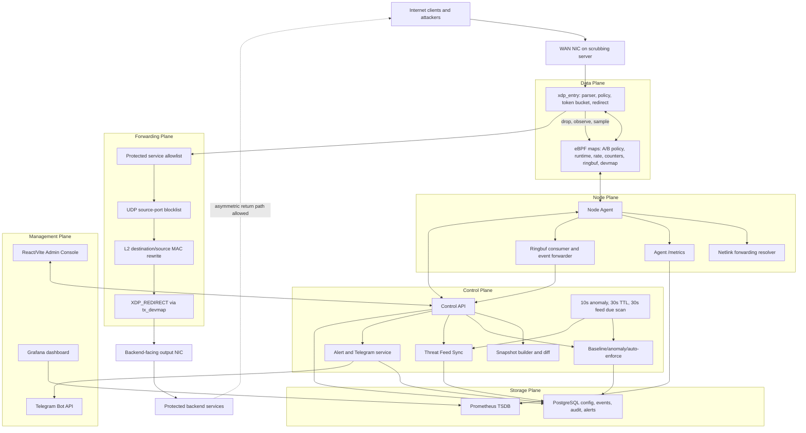
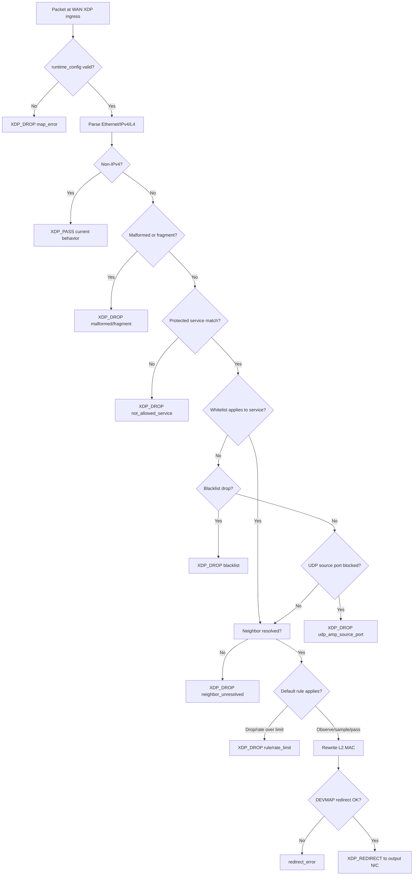
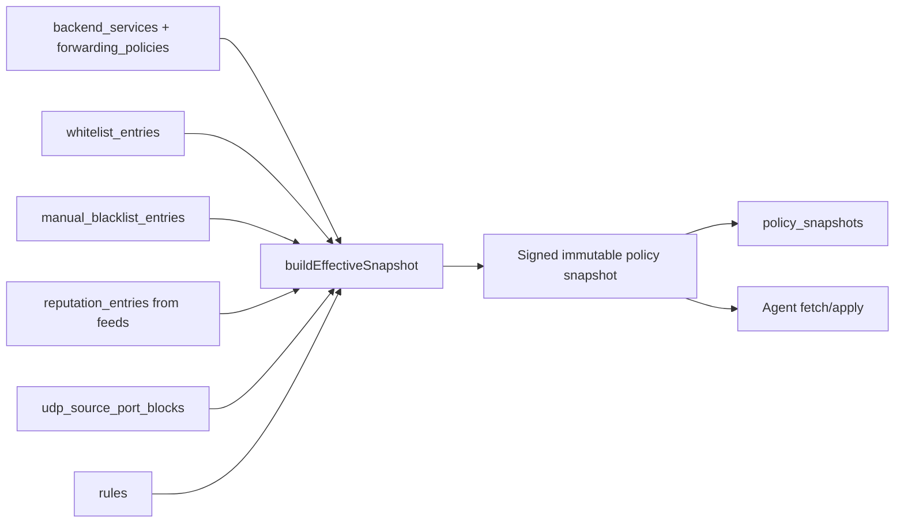
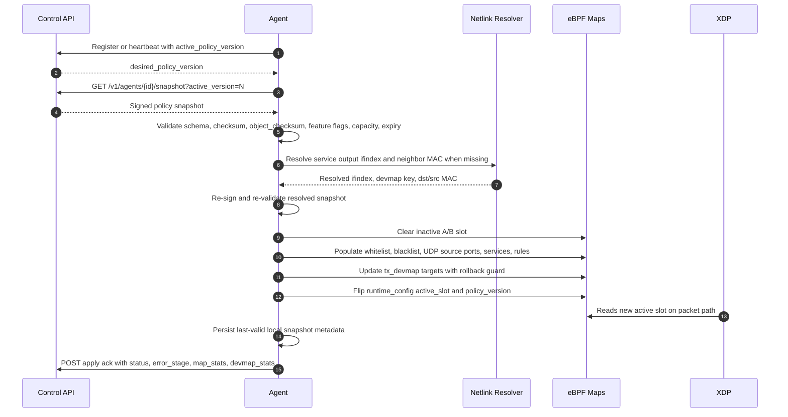
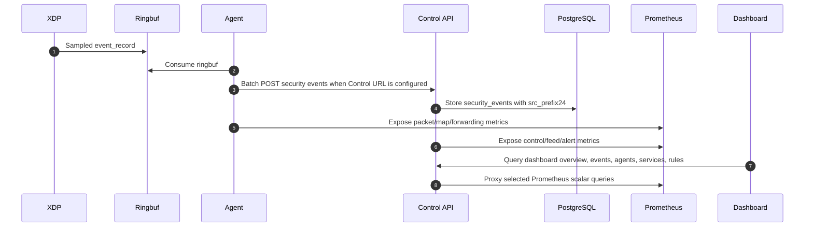

# System Architecture Design: Anti-DDoS Scrubbing Gateway eBPF/XDP

**Phiên bản:** 1.1
**Ngày:** 2026-06-03
**Nguồn yêu cầu:** `docs/PRD-Anti-DDoS.md` v1.2, `docs/HLD.md`, `docs/LLD.md`, `.specs/project/STATE.md`, README và source hiện tại
**Trạng thái:** Draft cập nhật theo implementation hiện có trong working tree
**Phạm vi:** P1 single-node XDP DEVMAP redirect scrubbing gateway. Phase 01-08 đã triển khai; Telegram/ISP runbook có contract và endpoint, Phase 09/P10 còn là phần hardening/UAT planned.

---

## 1. Executive Summary

Anti-DDoS Scrubbing Gateway là hệ thống lọc DDoS L3/L4 đặt trước backend. Traffic đi vào WAN NIC của scrubbing server được xử lý sớm bằng XDP/eBPF. Chỉ packet IPv4 sạch, đúng protected service allowlist và đúng trạng thái forwarding mới được rewrite L2 MAC và redirect qua `BPF_MAP_TYPE_DEVMAP` tới output interface hướng backend.

Hệ thống không terminate TLS, không proxy HTTP, không inspect payload L7, không thay WAF và không tự động BGP/RTBH/FlowSpec trong MVP. Khi link Internet vào scrubbing node đã saturate, hệ thống chỉ tạo evidence và alert để Network/SRE escalate thủ công tới ISP.

### 1.1 Business Context

| Persona | Mục tiêu vận hành | Kiến trúc hỗ trợ |
|---|---|---|
| Network/SRE Engineer | Giữ backend online, quản lý service cần bảo vệ, rollback nhanh khi rule sai | Protected service registry, DEVMAP forwarding, snapshot rollback, Agent apply ack |
| Security Analyst/SOC | Điều tra vector, nguồn attack, rule evidence, feed conflict | Sampled security events, anomaly evaluations, feed runs/conflicts, alert evidence |
| System Administrator | Cài đặt lab stack, quản trị user, secret, feed và Telegram | Local RBAC, audit log, masked credential/token handling, Docker Compose management stack |
| Product/Business Owner | Giảm downtime và có số liệu SLA/incident | Prometheus/Grafana metrics, dashboard overview, ISP escalation evidence |

Success criteria chính vẫn theo PRD:

- 10 Gbps MVP gate trên hardware mục tiêu, 40 Gbps benchmark report trước khi cam kết SLA.
- MTTD L3/L4 anomaly <= 10 giây khi Prometheus được cấu hình.
- Apply rule/protected service vào eBPF maps <= 1 giây khi Agent online và forwarding metadata resolve được.
- Dashboard freshness <= 3 giây cho tín hiệu chính.
- Rollback policy/rule <= 30 giây từ UI/API.
- Data plane tiếp tục dùng last-valid snapshot khi Control Plane hoặc sync lỗi.

---

## 2. Scope And Current Status

### 2.1 MVP Boundaries

- Single active scrubbing server trên Ubuntu 24.04.
- Native XDP là target mode; generic XDP chỉ là fallback có cảnh báo hiệu năng và phải được cấu hình.
- IPv4 là enforcement path hiện tại. XDP program hiện tại `XDP_PASS` packet non-IPv4; IPv6 enforcement chưa bật và cần quyết định hardening riêng nếu production ingress không muốn pass IPv6.
- Không NAT/DNAT. Packet redirect giữ nguyên source/destination IP.
- Backend response path có thể asymmetric.
- Không L7/DPI, WAF replacement, SSO/multi-tenant, HA active-passive, active-active hoặc upstream automation trong P1.

### 2.2 Implementation Status

| Area | Trạng thái | Evidence chính |
|---|---|---|
| Phase 01 XDP data plane skeleton | Done | `bpf/xdp_data_plane.bpf.c`, `include/anti_ddos/bpf_contract.h`, `make phase1-verify` trong project state |
| Phase 02 Agent lifecycle | Done | `internal/agent`, pinned maps/link, metrics, last-valid snapshot |
| Phase 03 Policy snapshot map sync | Done | A/B policy maps, checksum/object checksum, capacity validation |
| Phase 04 DEVMAP forwarding/service allowlist | Done | L2 rewrite, netlink forwarding resolver, VETH DEVMAP lab |
| Phase 05 Control Plane core | Done | Go Control API, PostgreSQL migrations, RBAC, audit, snapshots, rollback, Agent endpoints |
| Phase 06 Observability dashboard | Done | Security event ingest/query, dashboard APIs, React/Vite admin dashboard, Grafana JSON |
| Phase 07 Baseline anomaly auto-enforce | Done | Prometheus-driven anomaly evaluation, TTL rules, scheduler |
| Phase 08 Threat feed sync | Done | Feed source/run/conflict tables, parsers, safe aggregation, snapshot blacklist inclusion |
| Manual blacklist CRUD | Done | `/v1/blacklist`, `/v1/blacklist/entries`, dashboard Blacklist view |
| UDP reflection source-port blocking | Done | `/v1/udp-source-port-blocks`, `udp_src_port_blocks_a/b`, reason `REASON_UDP_AMP_SOURCE_PORT` |
| Phase 09 Telegram ISP runbook | Planned for final hardening | Tables/endpoints/client exist, but roadmap marks Phase 09 as next |
| Phase 10 Hardening Benchmark UAT | Planned | Production interface roles, backend inventory, real-NIC native attach and benchmark still open |

### 2.3 Open Operational Blockers

- Production protected backend service inventory is missing: service name, backend IP/CIDR, protocol, allowed ports, owner, criticality, output interface and return path.
- WAN/LAN/output interface roles are not formally assigned for the current lab NICs.
- Native XDP attach on real NICs has not been validated; current verification is VETH/lab only.
- 10 Gbps/40 Gbps benchmark results are not available yet.
- PostgreSQL and Prometheus binaries are missing on the lab host, although Docker Compose can run the management stack.

---

## 3. High-Level Component Architecture

```mermaid
flowchart TB
    Internet["Internet clients and attackers"] --> Wan["WAN NIC on scrubbing server"]

    subgraph DataPlane["Data Plane"]
        XDP["xdp_entry: parser, policy, token bucket, redirect"]
        Maps["eBPF maps: A/B policy, runtime, rate, counters, ringbuf, devmap"]
        XDP <--> Maps
    end

    subgraph ForwardingPlane["Forwarding Plane"]
        ServiceGuard["Protected service allowlist"]
        UDPBlock["UDP source-port blocklist"]
        L2Rewrite["L2 destination/source MAC rewrite"]
        Devmap["XDP_REDIRECT via tx_devmap"]
        ServiceGuard --> UDPBlock --> L2Rewrite --> Devmap
    end

    subgraph NodePlane["Node Plane"]
        Agent["Node Agent"]
        Resolver["Netlink forwarding resolver"]
        AgentMetrics["Agent /metrics"]
        RingConsumer["Ringbuf consumer and event forwarder"]
        Agent --> Resolver
        Agent --> AgentMetrics
        Agent --> RingConsumer
    end

    subgraph ControlPlane["Control Plane"]
        API["Control API"]
        Snapshot["Snapshot builder and diff"]
        Detection["Baseline/anomaly/auto-enforce"]
        FeedSync["Threat Feed Sync"]
        AlertSvc["Alert and Telegram service"]
        Schedulers["10s anomaly, 30s TTL, 30s feed due scan"]
        API --> Snapshot
        API --> Detection
        API --> FeedSync
        API --> AlertSvc
        Schedulers --> Detection
        Schedulers --> FeedSync
    end

    subgraph StoragePlane["Storage Plane"]
        PG["PostgreSQL config, events, audit, alerts"]
        Prom["Prometheus TSDB"]
    end

    subgraph ManagementPlane["Management Plane"]
        Dashboard["React/Vite Admin Console"]
        Grafana["Grafana dashboard"]
        Telegram["Telegram Bot API"]
    end

    Wan --> XDP
    XDP -->|drop, observe, sample| Maps
    XDP --> ServiceGuard
    Devmap --> Out["Backend-facing output NIC"]
    Out --> Backend["Protected backend services"]
    Backend -. asymmetric return path allowed .-> Internet

    Maps <--> Agent
    RingConsumer --> API
    Agent <--> API
    AgentMetrics --> Prom
    API --> PG
    Detection --> PG
    FeedSync --> PG
    AlertSvc --> PG
    AlertSvc --> Telegram
    Dashboard <--> API
    Grafana --> Prom
```

### 3.1 Source Package Map

| Area | Source path | Responsibility |
|---|---|---|
| BPF ABI | `include/anti_ddos/bpf_contract.h` | Shared constants, structs, map capacity limits |
| XDP program | `bpf/xdp_data_plane.bpf.c` | Packet parse, service guard, blacklist/whitelist, UDP source-port block, token bucket, L2 rewrite, redirect |
| Output XDP helper | `bpf/xdp_pass.bpf.c` | Minimal pass-through program for output NICs that require XDP queues for native DEVMAP TX |
| Agent | `internal/agent` | Load/attach/rollback, map apply, netlink resolution, metrics, ringbuf/event forwarding, Control sync |
| Control API | `internal/control` | HTTP API, PostgreSQL store, migrations, snapshots, RBAC, audit, feeds, anomalies, alerts |
| CLI | `cmd/control-admin`, `cmd/control-api`, `cmd/agent`, `cmd/policygen` | Admin bootstrap, API server, host Agent, bootstrap policy generation |
| Dashboard | `web/dashboard` | React/Vite admin console with RBAC-aware views |
| Deploy/observability | `docker-compose.yml`, `deploy/prometheus`, `deploy/grafana` | Local management stack, scrape config, Grafana dashboard |
| Lab tests | `scripts/lab`, `tests/xdp`, `tests/automation_test` | VETH XDP lifecycle/forwarding, PostgreSQL integration, UI automation |

---

## 4. Data Plane Decision Model

Current XDP decision order is source-code driven and must be treated as the architecture contract:

1. Load `runtime_config[0]`; missing config or invalid active slot fails closed with `REASON_MAP_ERROR`.
2. Parse Ethernet/IPv4/TCP/UDP/ICMP with bounds checks.
3. Non-IPv4 currently returns `XDP_PASS` and is sampled/counted. This is an explicit hardening gap for production if IPv6 should not pass.
4. Malformed packets drop with `REASON_MALFORMED`.
5. IPv4 fragments drop with `REASON_FRAGMENT`.
6. Lookup service by exact `dst_v4`, `dst_port`, `proto` in active `service_allowlist` slot. Service miss drops with `REASON_NOT_ALLOWED_SERVICE`.
7. Evaluate whitelist after service match. A global whitelist or service-scoped whitelist for the matched service bypasses blacklist, UDP source-port block and default rate/drop rule, but it does not bypass service allowlist.
8. Blacklist LPM drop applies when whitelist does not apply.
9. UDP source-port block applies for UDP packets when whitelist does not apply.
10. Unresolved service neighbor state drops with `REASON_NEIGHBOR_UNRESOLVED`.
11. Default service rule applies when whitelist does not apply. Rule actions are `drop`, `rate_limit`, `observe` or `sample`; enforce mode can drop, observe mode only counts/samples.
12. Service action must be `ACTION_REDIRECT`; XDP rewrites L2 destination/source MAC.
13. `bpf_redirect_map(&tx_devmap, devmap_key, XDP_DROP)` returns the final redirect decision. Redirect failures increment `REASON_REDIRECT_ERROR`.
14. Redirected packets increment counters and can emit sampled ringbuf events according to runtime or rule sampling policy.

```mermaid
flowchart TD
    Packet["Packet at WAN XDP ingress"] --> Runtime{"runtime_config valid?"}
    Runtime -->|No| DropMap["XDP_DROP map_error"]
    Runtime -->|Yes| Parse["Parse Ethernet/IPv4/L4"]
    Parse --> NonIPv4{"Non-IPv4?"}
    NonIPv4 -->|Yes| PassNonIPv4["XDP_PASS current behavior"]
    NonIPv4 -->|No| Valid{"Malformed or fragment?"}
    Valid -->|Yes| DropInvalid["XDP_DROP malformed/fragment"]
    Valid -->|No| Service{"Protected service match?"}
    Service -->|No| DropService["XDP_DROP not_allowed_service"]
    Service -->|Yes| Whitelist{"Whitelist applies to service?"}
    Whitelist -->|Yes| Neighbor["Neighbor resolved?"]
    Whitelist -->|No| Blacklist{"Blacklist drop?"}
    Blacklist -->|Yes| DropBlacklist["XDP_DROP blacklist"]
    Blacklist -->|No| UDPBlock{"UDP source port blocked?"}
    UDPBlock -->|Yes| DropUDP["XDP_DROP udp_amp_source_port"]
    UDPBlock -->|No| Neighbor
    Neighbor -->|No| DropNeighbor["XDP_DROP neighbor_unresolved"]
    Neighbor -->|Yes| Rule{"Default rule applies?"}
    Rule -->|Drop/rate over limit| DropRule["XDP_DROP rule/rate_limit"]
    Rule -->|Observe/sample/pass| Rewrite["Rewrite L2 MAC"]
    Rewrite --> Redirect{"DEVMAP redirect OK?"}
    Redirect -->|No| DropRedirect["redirect_error"]
    Redirect -->|Yes| Clean["XDP_REDIRECT to output NIC"]
```

### 4.1 Packet Actions And Drop Reasons

| Constant | Value | Meaning |
|---|---:|---|
| `ACTION_PASS` | 0 | Diagnostic/pass path, currently used for non-IPv4 |
| `ACTION_DROP` | 1 | Drop at XDP |
| `ACTION_RATE_LIMIT` | 2 | Rate-limit rule action |
| `ACTION_OBSERVE` | 3 | Count/sample without enforcement |
| `ACTION_SAMPLE` | 4 | Sample event action |
| `ACTION_NOT_FORWARD` | 5 | Reserved logical action |
| `ACTION_REDIRECT` | 6 | Clean packet redirected via DEVMAP |

| Drop reason | Value | Meaning |
|---|---:|---|
| `REASON_MALFORMED` | 1 | Header bounds/format invalid |
| `REASON_BOGON` | 2 | Reserved for invalid-source/bogon policy |
| `REASON_BLACKLIST` | 3 | Manual or feed blacklist hit |
| `REASON_NOT_ALLOWED_SERVICE` | 4 | No protected service tuple matched |
| `REASON_RATE_LIMIT` | 5 | Token bucket over limit |
| `REASON_RULE_DROP` | 6 | Enforced drop rule |
| `REASON_MAP_ERROR` | 7 | Runtime/map/event path error |
| `REASON_REDIRECT_ERROR` | 8 | L2 rewrite or devmap redirect error |
| `REASON_NEIGHBOR_UNRESOLVED` | 9 | Service forwarding metadata unresolved |
| `REASON_FRAGMENT` | 10 | IPv4 fragment dropped |
| `REASON_UDP_AMP_SOURCE_PORT` | 11 | UDP reflection/amplification source port blocked |

---

## 5. eBPF Map Contracts

The current implementation uses A/B double-buffering for immutable policy maps and a single `runtime_config` map to flip the active slot.

| Logical map | Physical map(s) | Type | Max entries | Producer | Consumer |
|---|---|---|---:|---|---|
| `whitelist_lpm` | `whitelist_v4_a`, `whitelist_v4_b` | `BPF_MAP_TYPE_LPM_TRIE` | 65,536 | Agent | XDP |
| `blacklist_lpm` | `blacklist_v4_a`, `blacklist_v4_b` | `BPF_MAP_TYPE_LPM_TRIE` | 1,000,000 | Agent | XDP |
| `udp_src_port_blocks` | `udp_src_port_blocks_a`, `udp_src_port_blocks_b` | `BPF_MAP_TYPE_HASH` | 4,096 | Agent | XDP |
| `service_allowlist` | `service_allowlist_a`, `service_allowlist_b` | `BPF_MAP_TYPE_HASH` | 16,384 | Agent | XDP |
| `rule_config` | `rule_config_a`, `rule_config_b` | `BPF_MAP_TYPE_ARRAY` | 4,096 | Agent | XDP |
| `runtime_config` | `runtime_config` | `BPF_MAP_TYPE_ARRAY` | 1 | Agent | XDP |
| `tx_devmap` | `tx_devmap` | `BPF_MAP_TYPE_DEVMAP` | 128 | Agent | XDP redirect |
| `rate_state` | `rate_state` | `BPF_MAP_TYPE_LRU_HASH` | 2,000,000 | XDP | XDP, Agent metrics |
| `drop_counters` | `drop_counters` | `BPF_MAP_TYPE_PERCPU_HASH` | 262,144 | XDP | Agent metrics |
| `events` | `events` | `BPF_MAP_TYPE_RINGBUF` | 64 MiB | XDP | Agent ringbuf consumer |
| `prog_array` | `prog_array` | `BPF_MAP_TYPE_PROG_ARRAY` | 16 | Agent | Optional tail-call expansion |

Map safety requirements:

- All maps have compile-time max entries in `anti_ddos/bpf_contract.h`.
- Snapshot validation rejects duplicate keys, expired entries, map capacity overflow, unsupported feature flags and memory budget overflow.
- Hot counters use per-CPU hash to reduce contention.
- Ringbuf sampling has bounded denominator with max `1,000,000`; ringbuf reserve failure increments a sample/drop counter instead of blocking packet processing.
- `rate_state` is LRU bounded. Small pass through excess under concurrency is accepted and bounded by conservative thresholds.
- `tx_devmap` updates refuse conflicting key to ifindex changes while policy is active; rollback restores touched keys when update fails.

---

## 6. Policy Snapshot Architecture

Control Plane is the source of truth for durable configuration. Agent is the source of truth for whether a signed snapshot is currently applied to BPF maps.

### 6.1 Snapshot Payload

Current snapshot schema:

| Field | Purpose |
|---|---|
| `schema_version` | Currently `1`; reject unknown versions |
| `version` | Monotonic PostgreSQL policy snapshot version |
| `checksum` | SHA-256 over canonical snapshot content excluding checksum |
| `object_checksum` | BPF object compatibility checksum; Agent rejects mismatch |
| `feature_flags` | Supported flags include `policy_snapshot_v1`, `ipv4`, `ab_policy_maps`, `tx_devmap`, `udp_src_port_block` |
| `runtime` | `malformed_policy`, `sample_denom` |
| `whitelist_v4` | Active non-expired whitelist CIDR entries |
| `blacklist_v4` | Active non-expired manual and feed blacklist entries |
| `udp_source_port_blocks` | Active non-expired UDP source-port blocks |
| `services` | Exact protected service tuples with forwarding metadata or output interface to resolve |
| `rules` | Active non-expired rules with action, mode, dimension, thresholds, burst and TTL metadata |

### 6.2 Snapshot Build Inputs

```mermaid
flowchart LR
    Services["backend_services + forwarding_policies"] --> Builder["buildEffectiveSnapshot"]
    Whitelist["whitelist_entries"] --> Builder
    ManualBlacklist["manual_blacklist_entries"] --> Builder
    Reputation["reputation_entries from feeds"] --> Builder
    UDPPorts["udp_source_port_blocks"] --> Builder
    Rules["rules"] --> Builder
    Builder --> Snapshot["Signed immutable policy snapshot"]
    Snapshot --> PG["policy_snapshots"]
    Snapshot --> Agent["Agent fetch/apply"]
```

Rules:

- Manual blacklist and feed reputation both flow into `blacklist_v4`.
- Effective blacklist de-duplicates exact CIDR keys. Enabled manual blacklist entries take precedence over feed reputation for the same exact CIDR; same-source ties use score then `ebpf_id`.
- Whitelist conflicts suppress feed reputation entries and create feed conflict records.
- UDP source-port block feature flag is emitted only when active entries exist.
- Backend service fallback can produce service entries from `backend_services`; explicit `forwarding_policies` can also feed snapshot services.
- Control Plane validates snapshot with unresolved services allowed because Agent may resolve forwarding metadata during apply.

### 6.3 Agent Apply Flow

```mermaid
sequenceDiagram
    autonumber
    participant C as Control API
    participant A as Agent
    participant R as Netlink Resolver
    participant M as eBPF Maps
    participant X as XDP

    A->>C: Register or heartbeat with active_policy_version
    C-->>A: desired_policy_version
    A->>C: GET /v1/agents/{id}/snapshot?active_version=N
    C-->>A: Signed policy snapshot
    A->>A: Validate schema, checksum, object_checksum, feature flags, capacity, expiry
    A->>R: Resolve service output ifindex and neighbor MAC when missing
    R-->>A: Resolved ifindex, devmap key, dst/src MAC
    A->>A: Re-sign and re-validate resolved snapshot
    A->>M: Clear inactive A/B slot
    A->>M: Populate whitelist, blacklist, UDP source ports, services, rules
    A->>M: Update tx_devmap targets with rollback guard
    A->>M: Flip runtime_config active_slot and policy_version
    X->>M: Reads new active slot on packet path
    A->>A: Persist last-valid local snapshot metadata
    A->>C: POST apply ack with status, error_stage, map_stats, devmap_stats
```

Failure behavior:

- Checksum/object checksum/capacity/feature mismatch fails before map mutation.
- Forwarding resolution failure fails at `resolve_forwarding` and keeps current data plane unchanged.
- Inactive slot population failure clears the inactive slot and keeps current active slot.
- Devmap update failure rolls back touched devmap keys and clears inactive policy slot.
- Runtime flip failure rolls back devmap changes and clears inactive policy slot.
- Last-valid persistence failure restores previous runtime config.

---

## 7. Forwarding And Neighbor Resolution

MVP forwarding is L2 MAC rewrite plus DEVMAP redirect. The dashboard and Control API manage protected service identity and output interface, but next-hop MAC is not manually typed in the dashboard vNext workflow. Agent resolves forwarding metadata during snapshot apply.

Resolution contract:

1. Service snapshot contains `dst_v4`, `dst_port`, `proto`, `output_interface`, `devmap_key`, `service_id`, `forwarding_policy_id`.
2. Agent validates output interface exists, is up and has a source MAC.
3. Agent runs route lookup for backend destination and selects the route through the declared output interface.
4. If route gateway exists, neighbor target is gateway; otherwise target is backend IP.
5. Agent checks neighbor cache. If unresolved, it probes with netlink `NTF_USE` and waits up to the configured timeout.
6. Agent writes resolved `output_ifindex`, `dst_mac`, `src_mac`, `neighbor_status=resolved` into the snapshot service entry before map apply.
7. XDP fails closed if `neighbor_status != resolved`, service action is not redirect, L2 rewrite fails or DEVMAP redirect fails.

Driver note:

- Some native XDP drivers, including the observed `ixgbe` case, require the output interface to have XDP TX queues before receiving DEVMAP frames.
- The project includes `xdp_pass.bpf.c` and Makefile support to attach a pass-through XDP program on output NICs.
- Agent start/remove logic must not replace a non-`xdp_pass` program on output interfaces without explicit operational approval.

---

## 8. Control Plane And API Architecture

The Control API is a Go JSON API under `/v1`, with `/healthz` and `/metrics` outside the versioned business API.

### 8.1 Roles And Mutation Policy

| Role | Capabilities |
|---|---|
| `viewer` | Read dashboard, policies, events, alerts, feeds and snapshots |
| `operator` | Viewer plus operational mutations: services, forwarding policies, rules, whitelist, blacklist, UDP ports, feed sync, snapshot rollback, Telegram test |
| `admin` | Operator plus users, password reset/session revoke and secret/credential changes |

Mutation rules:

- Mutations require `reason` in body or `X-Audit-Reason`.
- Backend enforces RBAC; dashboard only hides controls as a first UI guard.
- Last active admin cannot be revoked/downgraded.
- Raw passwords, feed credentials and Telegram token values are not returned and must not be written raw to audit/logs.

### 8.2 API Surface

| Group | Key endpoints |
|---|---|
| Auth/users | `/v1/auth/login`, `/v1/auth/logout`, `/v1/me`, `/v1/me/password`, `/v1/users`, `/v1/users/{id}/password-reset`, `/v1/users/{id}/sessions/revoke` |
| Protected services | `/v1/services`, `/v1/services/{id}`, `/v1/forwarding-policies` |
| Policy objects | `/v1/whitelist`, `/v1/rules`, `/v1/blacklist`, `/v1/blacklist/entries`, `/v1/udp-source-port-blocks` |
| Threat feeds | `/v1/feed-sources`, `/v1/feed-sources/{id}/sync`, `/v1/feed-runs`, `/v1/feed-conflicts` |
| Snapshots | `/v1/snapshots`, `/v1/snapshots/{version}`, `/v1/snapshots/build`, `/v1/snapshots/diff`, `/v1/snapshots/rollback` |
| Agent sync | `/v1/agents/register`, `/v1/agents/{id}/heartbeat`, `/v1/agents/{id}/snapshot`, `/v1/agents/{id}/apply` |
| Observability | `/v1/security-events`, `/v1/security-events/summary`, `/v1/security-events/investigate`, `/v1/dashboard/overview`, `/v1/dashboard/agents`, `/v1/dashboard/services`, `/v1/dashboard/rules` |
| Detection | `/v1/baselines`, `/v1/baselines/{id}`, `/v1/anomalies`, `/v1/anomalies/evaluate` |
| Alerting/ISP | `/v1/telegram/config`, `/v1/telegram/test`, `/v1/alerts`, `/v1/alerts/{id}/deliveries`, `/v1/alerts/evaluate-isp-escalation` |
| Audit/metrics | `/v1/audit`, `/metrics`, `/healthz` |

### 8.3 Background Schedulers

| Scheduler | Interval | Responsibility |
|---|---:|---|
| Anomaly evaluation | 10 seconds | Query Prometheus per enabled service and create anomaly/auto-enforce outputs |
| TTL rule expiry | 30 seconds | Disable expired rules, audit, rebuild snapshot |
| Feed due scan | 30 seconds | Run enabled feeds whose `next_run_at` is due; source interval defaults to 3600 seconds |

---

## 9. Storage Architecture

PostgreSQL stores durable state; Prometheus stores time-series metrics.

### 9.1 PostgreSQL Domains

| Domain | Tables |
|---|---|
| Access | `app_users`, `user_sessions` |
| Agent/fleet | `agents`, `agent_interfaces`, `policy_apply_status` |
| Service and forwarding | `backend_services`, `forwarding_policies` |
| Policy objects | `rules`, `whitelist_entries`, `manual_blacklist_entries`, `udp_source_port_blocks` |
| Threat feeds | `feed_sources`, `feed_runs`, `reputation_entries`, `feed_conflicts` |
| Snapshots | `policy_snapshots` |
| Observability | `security_events` |
| Detection | `baseline_profiles`, `anomaly_evaluations` |
| Alerting | `telegram_configs`, `alert_policies`, `alerts`, `alert_deliveries` |
| Audit | `audit_events` partitioned by `created_at` |

### 9.2 Retention Targets

| Data | Target retention |
|---|---:|
| Raw/security events | 30 days |
| Aggregated metrics | 90 days |
| Audit log | 365 days |
| Policy snapshots | At least audit retention or configured rollback window |
| Feed metadata/runs/conflicts | Per operational policy, enough for incident investigation |

Secrets at rest:

- Feed credential references use `env://VAR_NAME` or `secret://anti-ddos/name` conventions.
- Telegram bot token may be stored as raw DB value or legacy credential reference, but API/UI mask it as `*****`.
- Logs and audit entries must redact raw secret values.

---

## 10. Detection, Feed Sync And Alerting

### 10.1 Baseline And Auto-Enforce

Detection uses Prometheus queries for each enabled service:

- `pps`: packet rate by `service_id`.
- `bps`: byte rate by `service_id` multiplied by 8.
- `cps`: TCP SYN-without-ACK packet rate.
- `drop_ratio`: drop rate divided by service pps.

Auto-enforce posture is conservative:

- Minimum confidence: `0.90`.
- Minimum score: `85`.
- Minimum evidence signals: `2`.
- Default auto action: `rate_limit`.
- Default TTL: `15m`, clamped by implementation constants to `5m..60m`.
- Low-confidence or unapproved baselines are observe-only.
- Whitelist source conflict blocks auto-enforce and records observe posture.
- System-created auto rules rebuild snapshots and expire through the TTL scheduler.

### 10.2 Threat Feed Sync

Feed sync supports plain text feeds and internal JSON payloads, including Spamhaus/Team Cymru style lists, AbuseIPDB plaintext and internal HTTP JSON.

Feed flow:

1. Fetch enabled due source with credential resolution.
2. Parse entries to normalized IPv4 CIDR, action `drop`, score, TTL, reason and metadata.
3. Dedupe exact compatible entries.
4. Safely aggregate sibling CIDRs only when action, score, TTL and reason match and the parent does not contain a whitelist prefix.
5. Suppress entries overlapping active whitelist and record `feed_conflicts`.
6. Replace source reputation entries in a transaction and rebuild snapshot.
7. On fetch/parse/store error, keep last valid reputation entries and create a `feed_failure` alert.

### 10.3 Alert And Telegram Delivery

Alerting implementation includes:

- Alert types such as `anomaly`, `auto_enforce`, `feed_failure`, `test_alert` and `isp_escalation_needed`.
- Alert policy per type/severity/channel with default dedupe window of 300 seconds and max 3 attempts.
- Telegram `sendMessage` delivery with response logging, retryable handling for 429/5xx/transport errors and exponential backoff.
- Delivery records in `alert_deliveries` with status `sent`, `failed`, `retrying` or `deduped`.
- `/v1/alerts/evaluate-isp-escalation` can enrich missing peak pps/bps from Prometheus before creating an ISP escalation alert.

Roadmap note:

- Although tables/endpoints/client exist, `.specs/project/ROADMAP.md` still marks Phase 09 Telegram ISP Runbook as planned. Production readiness should validate delivery policy, runbook content, dedupe windows, evidence completeness and failure handling before final acceptance.

---

## 11. Observability Architecture

### 11.1 Agent Metrics

| Metric group | Examples |
|---|---|
| Agent health | `anti_ddos_agent_up`, `anti_ddos_agent_last_valid_snapshot_version` |
| XDP lifecycle | `anti_ddos_xdp_mode`, `anti_ddos_xdp_attach_errors_total`, `anti_ddos_xdp_program_info` |
| Packet counters | `anti_ddos_xdp_packets_total`, `anti_ddos_xdp_bytes_total` |
| Map utilization | `anti_ddos_ebpf_map_entries`, `anti_ddos_ebpf_map_capacity`, `anti_ddos_ebpf_map_utilization_ratio` |
| Ringbuf | `anti_ddos_ringbuf_events_consumed_total`, `anti_ddos_ringbuf_consume_errors_total` |
| Forwarding | `anti_ddos_redirected_packets_total`, `anti_ddos_redirect_errors_total`, `anti_ddos_not_allowed_service_total`, `anti_ddos_neighbor_unresolved_total`, `anti_ddos_neighbor_resolution_status` |
| Control event forwarding | `anti_ddos_agent_control_events_forwarded_total`, `anti_ddos_agent_control_events_dropped_total`, `anti_ddos_agent_control_event_forward_errors_total` |

### 11.2 Control Metrics

| Metric group | Examples |
|---|---|
| API | `anti_ddos_control_http_requests_total`, `anti_ddos_control_http_request_duration_seconds` |
| DB/snapshot/apply | `anti_ddos_control_db_up`, `anti_ddos_control_policy_snapshot_version`, `anti_ddos_control_policy_apply_status` |
| Agents | `anti_ddos_control_agents`, `anti_ddos_control_agent_stale` |
| Events | `anti_ddos_control_security_events_ingested_total`, `anti_ddos_control_security_events_rejected_total` |
| Prometheus proxy | `anti_ddos_control_prometheus_queries_total` |
| Feeds | `anti_ddos_feed_sync_success_total`, `anti_ddos_feed_sync_errors_total`, `anti_ddos_feed_entries_active`, `anti_ddos_feed_conflicts_active` |
| Alerts | `anti_ddos_alerts_created_total`, `anti_ddos_alerts_sent_total`, `anti_ddos_alerts_failed_total` |

### 11.3 Event Flow

```mermaid
sequenceDiagram
    autonumber
    participant X as XDP
    participant E as Ringbuf
    participant A as Agent
    participant C as Control API
    participant DB as PostgreSQL
    participant P as Prometheus
    participant UI as Dashboard

    X->>E: Sampled event_record
    A->>E: Consume ringbuf
    A->>C: Batch POST security events when Control URL is configured
    C->>DB: Store security_events with src_prefix24
    A->>P: Expose packet/map/forwarding metrics
    C->>P: Expose control/feed/alert metrics
    UI->>C: Query dashboard overview, events, agents, services, rules
    C->>P: Proxy selected Prometheus scalar queries
```

Raw source IP/CIDR remains in PostgreSQL `security_events`, not in high-cardinality Prometheus labels.

---

## 12. Admin Console Architecture

The dashboard is an ops console, not a landing page. It is implemented with React/Vite TypeScript under `web/dashboard`.

Views currently covered by `docs/Admin-Dashboard-v2.md`:

| View | Purpose |
|---|---|
| Dashboard | Control/data plane signal, traffic shape, snapshot/apply status |
| Incidents | Alerts, Telegram status, ISP escalation workflow |
| Detections | Anomalies, baselines, active-rule posture |
| Events | Sampled security event search/investigation |
| Services | Protected service registry and forwarding metadata visibility |
| Rules | Rule CRUD and soft-disable |
| Whitelist | Whitelist CRUD and API-backed filters |
| Blacklist | Manual/feed blacklist visibility and manual CRUD |
| UDP Ports | UDP reflection/amplification source-port blocklist |
| Reputation | Feed sources, sync, run history and conflicts |
| Snapshots | Snapshot list, semantic diff and rollback |
| Accounts | Local users and session/password operations |
| Nodes | Agent status, interfaces, XDP mode and map utilization |

UI constraints:

- Viewer is read-only; Operator/Admin can perform operational mutation; Admin handles access and secret changes.
- Important mutations require a reason and create audit events.
- Dashboard must not ask users to type next-hop MAC; Agent resolves it.
- Prometheus unconfigured is shown as a state, not a fatal dashboard failure.

---

## 13. Failure Modes And Resilience

| Scenario | Expected behavior | Visibility |
|---|---|---|
| Missing/invalid runtime config | XDP drops with map error | Agent packet counters |
| eBPF load fail | Agent fails startup or keeps previous safe state depending lifecycle stage | Agent log, attach error metric |
| Native XDP attach fail | Fallback only if configured, otherwise fail with warning | XDP mode metric, logs |
| Non-IPv4 traffic | Current XDP program passes it | Packet counters; production hardening decision needed |
| Malformed or fragmented IPv4 packet | XDP drop | `malformed` or `fragment` counters/events |
| Service miss | XDP drop fail-closed | `not_allowed_service` metrics |
| Blacklist hit | XDP drop unless whitelist applies | Counters/events, dashboard investigation |
| UDP reflection source port hit | XDP drop unless whitelist applies | Reason `udp_amp_source_port`, counters/events |
| Neighbor unresolved | XDP drop fail-closed | `neighbor_unresolved` metrics, Agent apply failure if resolution fails |
| DEVMAP key conflict | Agent rejects snapshot apply or devmap update | Apply ack error stage/reason |
| Control Plane down | Data plane continues current maps and Agent keeps local last-valid snapshot | Agent stale/control sync warning, dashboard when API returns |
| Agent restart | Agent loads last-valid local snapshot before Control sync when configured | Agent metrics and apply status |
| Snapshot validation failure | Reject snapshot before active map flip | Apply ack with `validate` or related error stage |
| Feed sync failure | Keep last valid feed entries and snapshot; record feed run error | Feed status, alert `feed_failure` |
| Prometheus unconfigured | Dashboard/API reports unconfigured and anomaly scheduler skips | Prometheus status in dashboard |
| Telegram delivery failure | Retry/backoff, record delivery failure | Alert delivery log and alert metrics |
| Link saturation before gateway | XDP cannot protect saturated inbound link | `isp_escalation_needed` runbook alert and evidence |

---

## 14. Deployment And Verification Model

### 14.1 Deployment Split

- Docker Compose starts the management/control stack: PostgreSQL, Control API, Prometheus, Grafana and Admin Dashboard.
- Host Agent is a separate process because it needs host networking, bpffs, XDP attach permissions and direct interface access.
- `agent-start` can attach XDP; it must only be used with approved WAN/output interfaces.
- `agent-remove` stops Agent, removes pinned BPF link and detaches only the expected Agent/output pass-through programs.

### 14.2 Main Test Gates

| Gate | Purpose |
|---|---|
| `make bpf-test` | Build BPF object and run XDP fixture tests |
| `make go-test` | Go unit/integration-safe tests |
| `make ui-test` / `make ui-build` | Dashboard unit tests and production build |
| `make test` | Fast local gate: BPF, Go, UI |
| `make test-all` | Full gate with lint/race/integration groups |
| `make phase2-veth-test` | Agent lifecycle on temporary VETH/netns |
| `make phase4-veth-test` | DEVMAP forwarding on temporary VETH/netns |
| `make control-core-postgres-test` | Control Plane core PostgreSQL integration |
| `make observability-postgres-test` | Security events/dashboard/Prometheus API integration |
| `make anomaly-auto-enforce-postgres-test` | Baseline/anomaly/TTL auto-enforce integration |
| `make threat-feed-postgres-test` | Threat feed sync and conflict integration |
| `make alerting-postgres-test` | Telegram/alerting PostgreSQL integration |
| `make dashboard-postgres-test` | Dashboard backend integration |
| `make admin-dashboard-test` | Dashboard backend/UI verification bundle |

Real NIC attach and throughput benchmark are not part of the default verification gates and require explicit operational approval.

---

## 15. PRD Traceability

| PRD ID | Architecture response | Status |
|---|---|---|
| PRD-001 Baseline profiling L3/L4 | Baseline profiles, Prometheus queries, anomaly scheduler, confidence gates | Implemented through Phase 07 |
| PRD-002 Realtime monitoring and Prometheus/Grafana | Agent/control metrics, security events, dashboard APIs, Grafana assets | Implemented through Phase 06 |
| PRD-003 XDP/eBPF packet filtering | Verifier-safe XDP parser, A/B maps, drop reasons, last-valid behavior | Implemented through Phase 01-04, with non-IPv4 hardening decision open |
| PRD-004 Rate limiting and auto-enforce TTL | Token bucket in XDP, `rate_state`, anomaly auto rule creation, TTL scheduler | Implemented through Phase 07 |
| PRD-005 Reputation/blacklist hourly aggregation | Feed sources/runs/conflicts, safe aggregation, blacklist snapshot inclusion | Implemented through Phase 08 |
| PRD-006 Whitelist management | Whitelist CRUD, global/service scopes, precedence after service match | Implemented |
| PRD-007 DEVMAP forwarding and backend service allowlist | Service registry, forwarding policies, netlink resolver, DEVMAP redirect, fail-closed neighbor state | Implemented through Phase 04-05 |
| PRD-008 Telegram alerting | Telegram config/test, alert policies, delivery logs, retry/dedupe | Contract implemented, Phase 09 production hardening planned |
| PRD-009 Local RBAC, audit and rollback | Users/sessions, roles, audit events, snapshot build/diff/rollback | Implemented through Phase 05 and dashboard vNext |
| PRD-010 Agent/control-plane fail-safe | Last-valid local snapshot, apply ack, stale agent/control sync visibility | Implemented |
| PRD-011 Manual ISP escalation runbook | ISP escalation endpoint, Prometheus evidence enrichment, alert creation | Contract implemented, runbook/UAT still planned |
| Post-PRD manual blacklist CRUD | Manual blacklist APIs/dashboard and snapshot de-dupe | Implemented |
| Post-PRD UDP source-port blocking | UDP Ports admin, BPF maps/reason, snapshot feature flag | Implemented |

---

## 16. Future Architecture Extension Points

### 16.1 Phase 09 Telegram ISP Runbook

Phase 09 should validate:

- Telegram token/reference storage and redaction in production-like config.
- Alert policy templates, dedupe windows and retry settings.
- ISP escalation payload completeness: target, vector, peak bps/pps, packet loss, route/link evidence, top source summary, start time.
- Dashboard runbook copy and operator workflow.
- Failure handling when Telegram is disabled, rate-limited or unavailable.

### 16.2 Phase 10 Hardening Benchmark UAT

Phase 10 should validate:

- Approved WAN/output interface roles and backend service inventory.
- Native XDP attach on real NICs and driver-specific output XDP requirements.
- 10 Gbps gate and 40 Gbps benchmark report.
- Retention cleanup jobs and audit/event partition strategy.
- Security hardening for secrets, cookies, DB connectivity and deployment defaults.
- Production rollback runbooks for Agent, BPF object, snapshot and service policy.

### 16.3 P2 Active-Passive HA

Extension points already present:

- Immutable snapshots can be synced to multiple agents.
- Agent heartbeat and active policy version support fleet visibility.
- Dashboard Nodes/Fleet view can expose active/standby posture.

Missing design:

- Routing failover.
- Service IP ownership.
- State consistency between active and standby.
- Failure detection thresholds and rollback plan.

### 16.4 P3 Upstream Automation

BGP/RTBH/FlowSpec must remain disabled until upstream authority, route guardrails, approval workflow and lab tests exist. The current architecture can provide evidence from Detection/Alerting, but automatic upstream action needs a separate design and UAT plan.

---

## 17. Acceptance Checklist

- Architecture identifies the current implementation status, not only target MVP assumptions.
- Data Plane, Forwarding Plane, Node Plane, Control Plane, Storage Plane and Management Plane are separated with clear contracts.
- XDP decision order matches `bpf/xdp_data_plane.bpf.c`, including service-first matching, whitelist semantics, UDP source-port block and non-IPv4 pass behavior.
- eBPF map contracts reflect physical A/B maps and capacities from `anti_ddos/bpf_contract.h`.
- Policy snapshot fields, feature flags, validation and Agent apply/rollback behavior are documented.
- Control API, PostgreSQL domains, background schedulers and dashboard views are documented at the architecture level.
- Failure modes include control outage, snapshot apply failure, feed failure, redirect/neighbor failure, Telegram failure and link saturation.
- PRD traceability includes PRD-001 through PRD-011 plus post-PRD manual blacklist and UDP source-port blocking increments.
- MVP/P2/P3 boundaries remain explicit to avoid scope creep.
