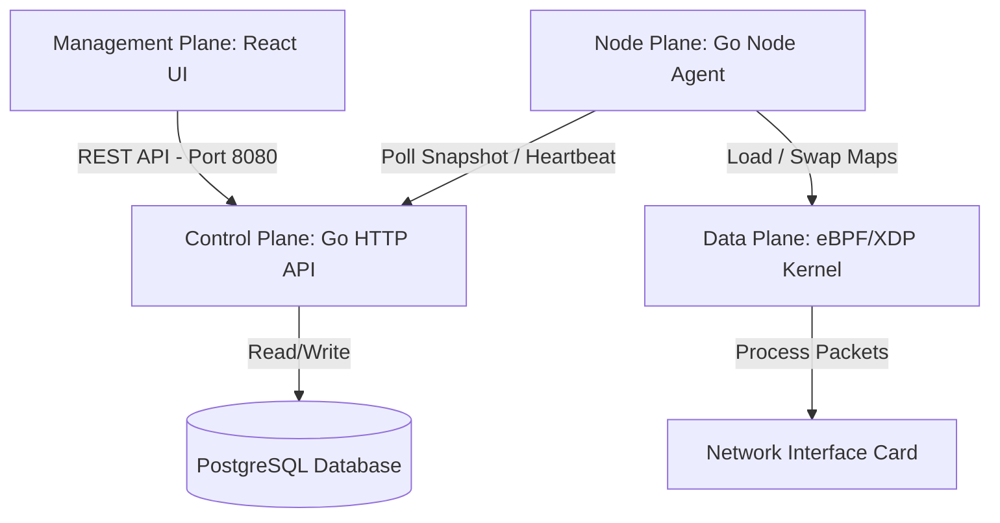
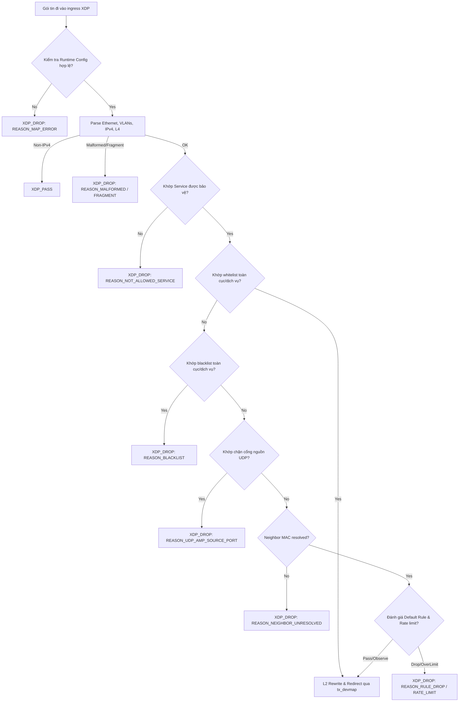

# Tài liệu Thiết kế Kỹ thuật (TDD) - Cổng giảm thiểu Anti-DDoS (Anti-DDoS Scrubbing Gateway)

| Trường thông tin | Giá trị |
| :--- | :--- |
| **Tech Lead** | @Antigravity |
| **Đội ngũ phát triển**| SRE, Network & Security Team |
| **Trạng thái** | Draft / In Review |
| **Ngày tạo** | 2026-06-30 |
| **Cập nhật lần cuối**| 2026-06-30 |

---

## 1. Bối cảnh (Context)

Cổng giảm thiểu DDoS (Anti-DDoS Scrubbing Gateway) là một hệ thống lọc và giảm thiểu lưu lượng tấn công mạng ở lớp L3/L4 với hiệu năng cao, được thiết kế để bảo vệ hạ tầng máy chủ khỏi các cuộc tấn công DDoS dạng volumetric (ngập băng thông) và protocol-based (tấn công giao thức) như UDP floods, UDP reflection, ICMP floods, TCP SYN floods, và quét cổng (port scans). 

Hệ thống hoạt động như một điểm làm sạch lưu lượng (scrub-point) trực tiếp tại biên mạng (ingress), kết hợp công nghệ lọc gói tin tầng nhân eBPF/XDP của Linux để đạt hiệu năng tối đa, kết hợp với tầng điều khiển (control plane) bằng Go và giao diện quản trị React.

---

## 2. Định nghĩa vấn đề & Động lực (Problem Statement & Motivation)

### Vấn đề cần giải quyết
1. **Trễ và quá tải do ngăn xếp mạng của nhân (Kernel Network Stack Overhead):** Lưu lượng volumetric DDoS quy mô lớn dễ dàng làm nghẽn CPU nếu xử lý bằng firewall thông thường (iptables/nftables) do chi phí ngắt (interrupts) và việc phân bổ tài nguyên bộ nhớ cho gói tin (`sk_buff`) trong Linux kernel.
2. **Cô lập cấu hình đa người dùng (Multi-tenant Data Isolation):** Hệ thống cần phục vụ nhiều khách hàng (tenant) khác nhau. Yêu cầu cô lập nghiêm ngặt cấu hình dịch vụ, whitelist/blacklist, và dữ liệu sự kiện bảo mật để tránh rò rỉ dữ liệu chéo.
3. **Cập nhật chính sách tức thời không gây mất gói:** Việc cập nhật các luật tường lửa và danh sách IP đen/trắng (từ quản trị viên hoặc threat intelligence feed tự động) không được phép làm gián đoạn hoặc rớt các kết nối sạch hiện tại.
4. **Cảnh báo thời gian thực:** SRE/Quản trị viên cần được thông báo ngay lập tức qua các kênh như Telegram khi có sự kiện tấn công lớn hoặc lỗi đồng bộ hóa dữ liệu danh tiếng (feed sync failure).

### Lý do thực hiện ngay bây giờ
Lượng tấn công volumetric DDoS ngày càng tăng về quy mô và tần suất. Việc trang bị một hệ thống scrubbing gateway tự động chạy tại biên hạ tầng phòng lab (`cyberrange02`) và sẵn sàng mở rộng ra môi trường sản xuất là cực kỳ cấp thiết để bảo vệ tính khả dụng của dịch vụ.

---

## 3. Phạm vi (Scope)

### ✅ Nằm trong phạm vi (In Scope - V1)
- **Data Plane (eBPF/XDP):** Trình lọc gói tin ở cấp độ driver card mạng (RX queue), hỗ trợ phân tích gói IPv4, whitelist, blacklist, chặn cổng nguồn UDP, các luật lọc TCP SYN flood.
- **Double-buffered A/B Maps:** Cơ chế thay đổi cấu hình runtime trong nhân kernel không gây mất gói bằng cách ghi lên map không hoạt động (inactive slot) rồi đảo index active.
- **L2 MAC Rewrite & Redirect:** Chuyển hướng lưu lượng sạch đến các máy chủ ứng dụng bảo vệ thông qua `tx_devmap` và Netlink ARP resolution.
- **Control Plane API:** Hệ thống REST API (Go) hỗ trợ xác thực JWT, RBAC tách biệt quyền giữa User và Admin, ghi log audit và quản lý cấu hình người dùng.
- **Threat Intelligence Sync:** Cơ chế tự động đồng bộ hóa danh sách IP độc hại từ các nguồn cấp feed (Cymru/AbuseIPDB) toàn cầu.
- **Hệ thống cảnh báo và Escalate:** Cảnh báo qua Telegram, hỗ trợ quy trình escalate thủ công cho nhà mạng (ISP Runbook Escalation).

### ❌ Ngoài phạm vi (Out of Scope)
- Lọc nội dung tầng ứng dụng L7 (WAF, SSL/TLS Decryption, kiểm tra payload HTTP).
- Tự động thay đổi định tuyến mạng BGP/FlowSpec ở môi trường production (quy trình escalate ISP được kích hoạt thủ công bởi người vận hành).

---

## 4. Giải pháp Kỹ thuật (Technical Solution)

### Sơ đồ Kiến trúc (Architecture Overview)

### Luồng Xử lý Gói tin (Packet Processing Order trong XDP)

### Danh sách các BPF Map Quan trọng (Kernel Space)
- `runtime_config` (`BPF_MAP_TYPE_ARRAY`): Lưu thông tin cấu hình runtime như `active_slot` (0 hoặc 1), snapshot version, mẫu sampling.
- `whitelist_v4_a/b` & `whitelist_service_v4_a/b` (`BPF_MAP_TYPE_LPM_TRIE`): Lưu dải IP/CIDR whitelist toàn cục và whitelist theo từng dịch vụ.
- `blacklist_v4_a/b` & `blacklist_service_v4_a/b` (`BPF_MAP_TYPE_LPM_TRIE`): Lưu danh sách IP đen do người dùng cấu hình hoặc được đồng bộ tự động từ threat feeds.
- `udp_src_port_blocks_a/b` & `udp_src_port_service_blocks_a/b` (`BPF_MAP_TYPE_HASH`): Chặn cổng nguồn UDP có nguy cơ khuếch đại tấn công.
- `service_allowlist_a/b` (`BPF_MAP_TYPE_HASH`): Key là `(dest_ip, dest_port, protocol)`, chứa thông tin forwarding của các backend được bảo vệ.
- `rule_config_a/b` (`BPF_MAP_TYPE_ARRAY`): Chứa cấu hình của luật lọc mặc định (các ngưỡng CPS, PPS, BPS và chế độ enforce/observe).
- `tx_devmap` (`BPF_MAP_TYPE_DEVMAP`): Chứa ánh xạ index interface đầu ra của nhân Linux để thực hiện chuyển hướng gói tin.
- `drop_counters` (`BPF_MAP_TYPE_PERCPU_HASH`): Đếm số lượng gói tin/byte xử lý theo các hành động (pass, drop, redirect) để xuất metric.

### Cơ sở Dữ liệu (Database Schema)
Các bảng dữ liệu chính trong PostgreSQL:
- **Xác thực & RBAC:**
  - `app_users`: Thông tin tài khoản, password hash (`bcrypt`), quyền (`admin`, `user`), trạng thái (`active`, `revoked`).
  - `user_sessions`: Lưu phiên đăng nhập, có chứa token và hỗ trợ `view_owner_user_id` dành cho cơ chế admin hỗ trợ kỹ thuật (impersonation).
- **Cấu hình của User/Tenant (phân vùng bởi `owner_user_id`):**
  - `backend_services`: Các dịch vụ IP ứng dụng cần bảo vệ, chứa dải IP, cổng mạng, card mạng đầu ra.
  - `allocated_cidrs`: Quản lý các dải IP được cấp phát riêng cho từng người dùng, ngăn chặn việc khai báo dịch vụ chéo dải.
  - `rules`, `whitelist_entries`, `manual_blacklist_entries`, `udp_source_port_blocks`: Luật cấu hình chi tiết lọc gói.
  - `policy_snapshots`: Lưu trữ lịch sử các phiên bản policy đã ký SHA-256 để Agent tải về.
- **Threat Feeds & Cảnh báo:**
  - `feed_sources`, `feed_runs`, `reputation_entries`: Quản lý việc tải danh tiếng IP và union vào snapshot.
  - `telegram_configs` & `alert_policies`: Cấu hình nhận cảnh báo qua Telegram.
  - `alerts` & `alert_deliveries`: Nhật ký sự kiện cảnh báo và trạng thái gửi tin nhắn đến Telegram.

---

## 5. Rủi ro & Biện pháp giảm thiểu (Risks & Mitigations)

| Rủi ro kỹ thuật | Mức độ tác động | Khả năng xảy ra | Biện pháp giảm thiểu |
| :--- | :--- | :--- | :--- |
| Trình xác thực nhân Linux (eBPF Verifier) từ chối load chương trình | Cao | Trung bình | - Kiểm tra tĩnh cấu trúc code BPF C bằng clang và bpftool. - Thực hiện các vòng lặp hữu hạn cố định (bounded loops). - Tránh phép toán con trỏ phức tạp, sử dụng các hàm kiểm tra biên an toàn. |
| Không phân giải được MAC của Gateway đầu ra (Neighbor Unresolved) | Cao | Thấp | - Agent chạy ngầm cơ chế phân giải ARP thông qua `vishvananda/netlink` trước khi cập nhật map. - Thiết lập cơ chế Fail-closed (drop gói tin) nếu không xác định được MAC để đảm bảo an toàn biên mạng. |
| Tấn công volumetric vượt quá băng thông card mạng vật lý | Chí mạng | Thấp | - Renders sẵn bảng thông tin ISP Escalation Runbook chứa các chỉ số PPS/BPS đỉnh để quản trị viên nhanh chóng chuyển cho nhà mạng thượng nguồn chặn lọc ở tầng router CORE. |
| Rò rỉ mã token bảo mật của Telegram hoặc API Feeds | Cao | Thấp | - Masking token (`*****`) trước khi trả về REST API hoặc ghi log audit. - Sử dụng cấu hình biến môi trường (`env://`) hoặc cơ chế secrets manager để nạp động khi chạy runtime. |

---

## 6. Kế hoạch triển khai (Implementation Plan)

Quá trình phát triển dự án được chia làm 10 giai đoạn (Phases):
- **Phần 1: Chuẩn bị lab & Driver XDP (Phase 0 -> Phase 2):** Thiết lập môi trường lab biên `cyberrange02`, tạo trình loader bằng Go (`cilium/ebpf`), và chạy thử nghiệm XDP cơ bản.
- **Phần 2: Chuyển tiếp & Quan sát (Phase 3 -> Phase 4):** Triển khai map chuyển hướng `tx_devmap` với MAC rewrite, phân giải ARP động, xuất counters qua Prometheus.
- **Phần 3: Tầng điều khiển & Web Dashboard (Phase 5 -> Phase 6):** Xây dựng REST API Server, PostgreSQL database, cơ chế tạo Snapshot chính sách dạng JSON mã hóa, và giao diện quản trị React.
- **Phần 4: Lọc thông minh & Feed dữ liệu (Phase 7 -> Phase 8):** Tích hợp thuật toán token bucket rate limit cho TCP SYN trong BPF, lập lịch baseline baselines profile, và viết cơ chế sync threat intelligence feeds.
- **Phần 5: Tính năng bổ sung & Vận hành (Phase 8+ & Phase 9):**
  - Chức năng CRUD Blacklist thủ công, whitelist filter, phân vùng Allocated CIDRs.
  - **Phase 9 (Hiện tại):** Tích hợp cảnh báo Telegram tự động và bảng điều khiển ISP Runbook Escalation.

---

## 7. Cân nhắc Bảo mật (Security Considerations)

### Xác thực & Phân quyền (RBAC)
- Khách hàng (`RoleUser`):
  - Bị giới hạn hoàn toàn trong phạm vi tài khoản của họ dựa trên `owner_user_id`.
  - Chỉ có quyền đọc/ghi các Services, Rules, Whitelist, Blacklist và Snapshots của chính họ.
  - Không được phép cấu hình/kiểm thử Telegram, truy cập Dashboard (Tổng quan hệ thống), xem Events (Nhật ký sự kiện bảo mật), hoặc xem nhật ký sự kiện Incidents của hệ thống (các API endpoints này sẽ trả về 403 Forbidden và UI sẽ ẩn đi).
- Quản trị viên (`RoleAdmin`):
  - Quyền truy cập toàn cục để quản lý tài khoản người dùng, cấu hình threat feeds toàn hệ thống, và xem toàn bộ Incidents/Telegram configurations.
  - Có chức năng "View Config" (impersonation): Tạo phiên JWT tạm thời với cờ `read_only = true` và `view_owner_user_id` của khách hàng để chẩn đoán lỗi cấu hình mà không làm lộ thông tin nhạy cảm của khách hàng. Tất cả API POST/PUT/DELETE sẽ trả về `403 Forbidden` trong phiên này.

### Mã hóa Dữ liệu (Data Protection)
- Lưu trữ mật khẩu người dùng sử dụng thuật toán hash `bcrypt`.
- Giao tiếp giữa Dashboard và API sử dụng giao thức HTTPS (TLS 1.2/1.3).
- Mã thông báo webhook Telegram và mật khẩu DB được che giấu trong tất cả các logs và API response payload.

---

## 8. Chiến lược Kiểm thử (Testing Strategy)

Hệ thống bắt buộc phải đi qua 4 tầng kiểm thử tự động trước khi triển khai:

1. **eBPF Kernel Fixture Verification:**
   - Mã nguồn: `tests/xdp/xdp_fixture_test.c`
   - Mục tiêu: Sử dụng `BPF_PROG_TEST_RUN` để chạy thử nghiệm các gói tin fixture (VLAN, Fragment, Whitelist bypass, Blacklist drop, UDP port block) trực tiếp trong nhân để verify tính đúng đắn trước khi nạp vào Agent.
2. **Go Unit & Integration Tests:**
   - Chạy lệnh: `go test ./...`
   - Sử dụng các container Docker PostgreSQL tạm thời để chạy tích hợp API, kiểm thử cơ chế RBAC, session, sinh snapshot.
3. **Frontend Tests:**
   - Chạy lệnh: `npm run build` và `npm test` trong thư mục `web/dashboard`.
   - Kiểm tra các UI component, API client, trạng thái hiển thị của User và Admin.
4. **E2E Automation Tests:**
   - Mã nguồn: `tests/automation_test/admin-dashboard/`
   - Sử dụng công cụ Python Playwright để mô phỏng hành vi đăng nhập, thay đổi cấu hình tường lửa, test alert Telegram, xem biểu đồ traffic trên trình duyệt thực tế.

---

## 9. Giám sát & Khả năng quan sát (Monitoring & Observability)

- **Thu thập Metrics:** Node Agent đọc thông tin thống kê từ `drop_counters` map của eBPF, định dạng lại và xuất ra cổng `/metrics` của Prometheus.
- **Sự kiện Bảo mật (Sampled Events):** Các sự kiện drop gói tin được đưa vào eBPF Ring Buffer (`events`). Node Agent lắng nghe buffer này và gửi hàng loạt (batching) về Control Plane thông qua `/v1/agents/{id}/events` để hiển thị trên Dashboard.
- **Cảnh báo (Alerts):** Tích hợp Telegram. Khi tần suất drop gói tin vượt ngưỡng rule cho phép, hệ thống sinh Alert và hàng đợi `alert_deliveries` sẽ đẩy tin nhắn cảnh báo dạng Markdown/HTML qua Telegram Bot API.

---

## 10. Kế hoạch Khôi phục (Rollback Plan)

### Khôi phục cấu hình chính sách (Policy Snapshot Rollback)
Nếu người dùng áp dụng một chính sách lọc mạng không chính xác dẫn đến rớt gói tin hợp lệ:
1. Truy cập tab **Snapshots** trên Dashboard.
2. Chọn một phiên bản snapshot hoạt động ổn định trước đó.
3. Nhấp vào nút **Rollback** để gọi tới endpoint `POST /v1/snapshots/rollback`.
4. Hệ thống sẽ sinh một snapshot rollback mới kế thừa từ phiên bản đã chọn, tăng version counter, và ký xác thực SHA-256.
5. Agent sẽ kéo snapshot mới này về, cập nhật vào inactive slot eBPF map và flip slot active ngay lập tức.

### Khôi phục phiên bản Node Agent / BPF Object
Nếu cập nhật phần mềm Agent hoặc mã nguồn BPF gặp lỗi:
1. Revert phiên bản nhị phân Go Agent và file ELF BPF (`xdp_data_plane.bpf.o`) về bản build ổn định trước đó.
2. Restart dịch vụ agent daemon.
3. Bản build cũ sẽ tự động dọn sạch các maps cũ và attach lại chương trình eBPF/XDP an toàn vào NIC.
