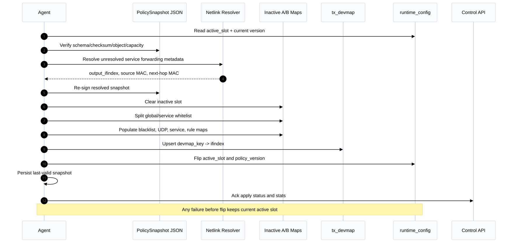

# XDP Data Plane

Tai lieu nay mo ta chi tiet chuong trinh XDP/eBPF `xdp_entry`, ABI map giua BPF va Agent, thu tu ap dung policy, co che observability va cac gate kiem thu lien quan. Nguon su that hien tai nam trong:

- `bpf/xdp_data_plane.bpf.c`
- `include/anti_ddos/bpf_contract.h`
- `internal/agent/contracts_bpf.go`
- `internal/agent/policy_snapshot.go`
- `internal/agent/policy_apply.go`
- `tests/xdp/xdp_fixture_test.c`

## 1. Scope

Data plane bao ve cac protected service L3/L4 tren scrubbing host bang XDP. Chuong trinh chay tren ingress WAN interface, parse packet som, drop fail-closed khi policy hoac forwarding metadata khong hop le, va redirect traffic hop le qua `tx_devmap` toi output/backend interface.

Hien tai data plane co nhung gioi han co chu y:

- IPv4 only.
- L4 duoc ho tro cho service/rule matching: TCP, UDP, ICMP.
- Non-IPv4 duoc `XDP_PASS`.
- IPv4 malformed va IPv4 fragments bi drop fail-closed.
- Khong terminate TLS, khong proxy HTTP, khong inspect payload L7.
- Expiry cua policy entries duoc Control/Agent xu ly truoc khi apply snapshot; XDP hot path khong doc wall-clock TTL.

## 2. Build And Load

Build target chinh:

```sh
make bpf-build
```

Ket qua:

- `build/bpf/vmlinux.h`: generated kernel type header.
- `build/bpf/xdp_data_plane.bpf.o`: object chua program `xdp_entry` va map specs.

Fixture verifier/runtime test:

```sh
make bpf-test
```

Agent load object qua `internal/agent/loader.go`, validate map/program contract bang `ValidateCollectionSpec`, enable pinning theo ten map, roi attach XDP theo cau hinh host. Compose stack khong attach XDP; host Agent moi thao tac voi NIC.

## 3. ABI Contract

`include/anti_ddos/bpf_contract.h` la ABI chung cho BPF C, userspace tests va Go Agent. Moi thay doi struct/map phai duoc cap nhat dong bo voi `internal/agent/contract.go` va `internal/agent/contracts_bpf.go`.

### Map Inventory

| Map | Type | Slot | Key | Value | Capacity | Writer | Reader |
|---|---|---:|---|---|---:|---|---|
| `runtime_config` | `ARRAY` | no | `u32` | `runtime_config_value` | 1 | Agent | XDP |
| `whitelist_v4_a/b` | `LPM_TRIE` | yes | `lpm_v4_key` | `cidr_policy_value` | 65536 | Agent | XDP |
| `whitelist_service_v4_a/b` | `LPM_TRIE` | yes | `service_lpm_v4_key` | `cidr_policy_value` | 65536 | Agent | XDP |
| `blacklist_v4_a/b` | `LPM_TRIE` | yes | `lpm_v4_key` | `cidr_policy_value` | 1000000 | Agent | XDP |
| `udp_src_port_blocks_a/b` | `HASH` | yes | `u32` source port | `udp_src_port_block_value` | 4096 | Agent | XDP |
| `service_allowlist_a/b` | `HASH` | yes | `service_key` | `service_value` | 16384 | Agent | XDP |
| `rule_config_a/b` | `ARRAY` | yes | `u32 rule_id` | `rule_value` | 4096 | Agent | XDP |
| `tx_devmap` | `DEVMAP` | no | `u32 devmap_key` | `u32 ifindex` | 128 | Agent | XDP redirect helper |
| `rate_state` | `LRU_HASH` | no | `rate_key` | `rate_value` | 2000000 | legacy | unused by current XDP |
| `rate_state_v2` | `HASH` | no | `rate_key` | `rate_value_v2` | 2000000 | XDP | XDP |
| `drop_counters` | `PERCPU_HASH` | no | `counter_key` | `counter_value` | 262144 | XDP | Agent |
| `events` | `RINGBUF` | no | none | `event_record` | 64 MiB | XDP | Agent |
| `prog_array` | `PROG_ARRAY` | no | `u32` | program fd | 16 | Agent | reserved |

Slot maps follow A/B rollout. XDP reads slot `runtime_config.active_slot`; Agent writes the inactive slot, updates `tx_devmap`, then flips `runtime_config`.


Source: [bpf-map-contract.mmd](diagrams/low-level-design/bpf-map-contract.mmd).

### Important Structs

`packet_meta` is internal hot-path metadata. It carries parsed source/destination, L4 ports, proto, TCP flags, packet length, service/rule ids, fragment/malformed flags, final action and reason.

`runtime_config_value` controls the active policy slot and snapshot version:

- `active_slot`: must be `0` or `1`.
- `policy_version`: zero means no valid policy; XDP drops fail-closed.
- `malformed_policy`: snapshot contract requires drop; current XDP drops malformed traffic directly.
- `sample_denom`: default event sampling denominator.

`service_key` matches traffic by destination IPv4, destination port and protocol. ICMP services use port `0`.

`service_value` contains forwarding metadata:

- `service_id`, `forwarding_policy_id`, `default_rule_id`
- `action`, currently expected to be `ACTION_REDIRECT`
- `output_ifindex`, `devmap_key`
- `neighbor_status`
- destination and source MAC addresses for L2 rewrite

`cidr_policy_value` is shared by whitelist/blacklist maps. The BPF program uses `action`, `scope`, `service_id` and `rule_id` on the hot path. Other fields are preserved for policy identity and userspace accounting.

## 4. Packet Processing Order

`xdp_entry` uses a fixed fail-closed order:

1. Lookup `runtime_config[0]`.
2. Reject missing config, zero `policy_version`, or invalid `active_slot`.
3. Parse Ethernet, optional VLAN tags, IPv4 and L4 metadata.
4. Pass non-IPv4.
5. Drop malformed IPv4.
6. Drop IPv4 fragments.
7. Lookup protected service in `service_allowlist_{active_slot}`.
8. Evaluate global and service-scoped whitelist.
9. If not whitelisted, apply blacklist.
10. If not whitelisted and UDP, apply UDP source-port block.
11. Require resolved forwarding metadata.
12. If not whitelisted, apply the service default rule.
13. Rewrite Ethernet destination/source MAC.
14. Redirect through `tx_devmap`.
15. Count every terminal action and optionally sample an event.



Source: [xdp-hot-path.mmd](diagrams/low-level-design/xdp-hot-path.mmd).

### Runtime Config Failure

If `runtime_config` is missing, policy version is zero, or active slot is outside `0..1`, XDP returns `XDP_DROP` with `REASON_MAP_ERROR`. This is intentional fail-closed behavior.

### Parser

Parser behavior:

- Ethernet header must fit in `data_end`.
- Up to two VLAN tags are parsed before checking EtherType.
- Supported VLAN EtherTypes are `802.1Q` and `802.1AD`.
- Non-IPv4 traffic returns `PARSE_NON_IPV4` and is passed.
- IPv4 version must be 4 and `ihl >= 5`.
- IPv4 header must fit inside packet bounds.
- IPv4 `tot_len` must be at least the IPv4 header length and no larger than the packet bytes remaining from the IPv4 header.
- L4 parsing is bounded by IPv4 payload length, not by Ethernet frame padding.
- TCP requires the base header to fit, `doff >= 5`, and TCP header length not exceeding IPv4 payload length.
- UDP requires the base header to fit, `len >= sizeof(udphdr)`, and UDP length not exceeding IPv4 payload length.
- ICMP requires the base ICMP header to fit.
- IPv4 fragments are parsed only far enough to identify source/destination/protocol, then dropped with `REASON_FRAGMENT`.

The parser intentionally avoids pointer arithmetic like `ip + tot_len` in the hot path because verifier range tracking can reject the program after endian conversion. It keeps `tot_len` checks scalar-based and passes `ip_payload_len` to L4 parsing.

## 5. Policy Semantics

### Service Allowlist

All IPv4 traffic must match `service_allowlist_a/b` before blacklist, rules, or forwarding. This prevents generic forwarding of traffic to undeclared backend services.

The lookup key is:

- destination IPv4
- destination port for TCP/UDP
- protocol

If no service matches, XDP drops with `REASON_NOT_ALLOWED_SERVICE`.

### Whitelist

Whitelist is split across two map families:

- `whitelist_v4_a/b`: global prefixes only.
- `whitelist_service_v4_a/b`: service-scoped prefixes.

Global whitelist lookup uses `lpm_v4_key`:

- lookup prefix length: `32`
- stored prefix length: CIDR prefix length
- `addr`: masked IPv4 address in ABI byte order

Service whitelist lookup uses `service_lpm_v4_key`:

- lookup prefix length: `64`
- stored prefix length: `32 + CIDR prefix length`
- `service_id`: exact service id segment
- `addr`: masked IPv4 address in ABI byte order

This split prevents a narrower service-scoped prefix from hiding a broader global whitelist prefix in one shared LPM trie. Agent validation allows the same CIDR across different services, but rejects duplicate keys within the same service and rejects service-scoped entries without `service_id`.

When whitelist applies:

- blacklist is skipped
- UDP source-port block is skipped
- default rule is skipped
- forwarding metadata is still required
- MAC rewrite and redirect still happen

Whitelisted traffic is not automatically passed to the kernel stack. It is still service-bound forwarding traffic.

### Blacklist

Blacklist uses `blacklist_v4_a/b`. It is checked only after service allowlist and only when whitelist does not apply. If the matched value has `ACTION_DROP`, XDP drops with `REASON_BLACKLIST` and copies the value `rule_id` into counters/events.

### UDP Source-Port Blocks

`udp_src_port_blocks_a/b` are keyed by UDP source port. They are evaluated only for non-whitelisted UDP traffic. A hit drops with `REASON_UDP_AMP_SOURCE_PORT`.

This catches common reflection/amplification source ports without requiring broad CIDR blacklist entries.

### Neighbor And Forwarding Metadata

Forwarding is allowed only when `service_value.neighbor_status == NEIGHBOR_RESOLVED`. If forwarding metadata is unresolved, XDP drops with `REASON_NEIGHBOR_UNRESOLVED`.

The Agent is responsible for resolving:

- output interface ifindex
- next-hop destination MAC
- source MAC
- `tx_devmap` entry for the `devmap_key`

This keeps the XDP program deterministic and fail-closed.

### Rules

The service `default_rule_id` points to `rule_config_a/b`. Rule id `0` means no rule. Out-of-range rule ids are treated as no rule.

Supported actions:

| Action | Enforce behavior | Observe behavior |
|---|---|---|
| `ACTION_DROP` | Drop with `REASON_RULE_DROP` | Count/sample as observe, continue |
| `ACTION_SAMPLE` | Count/sample, continue | Same |
| `ACTION_RATE_LIMIT` | Drop only when bucket is over limit and mode is enforce | Count/sample over-limit state, continue |
| `ACTION_OBSERVE` | Count/sample as observe, continue | Same |

Only non-whitelisted traffic reaches default rule evaluation.

## 6. Rate Limiting

Rate limiting uses `rate_state_v2`, not legacy `rate_state`.



Source: [rate-limit-token-bucket.mmd](diagrams/low-level-design/rate-limit-token-bucket.mmd).

`rate_state_v2` properties:

- `BPF_MAP_TYPE_HASH`
- `BPF_F_NO_PREALLOC`
- key: `rate_key`
- value: `rate_value_v2`
- top-level `bpf_spin_lock`

The old `rate_state` LRU hash remains in the object for rollout compatibility with pinned maps, but the current XDP code does not use it.

### Key Dimensions

`rule_value.dimension` controls the `rate_key`:

| Dimension | Key fields |
|---|---|
| `RATE_DIM_SOURCE` | `src_v4`, `rule_id`, `proto`, `dimension` |
| `RATE_DIM_SUBNET` | source `/24`, `rule_id`, `proto`, `dimension` |
| `RATE_DIM_SERVICE` | `service_id`, `rule_id`, `proto`, `dimension` |
| `RATE_DIM_SOURCE_SERVICE` | `src_v4`, `service_id`, `rule_id`, `proto`, `dimension` |

Any unrecognized dimension falls back to `RATE_DIM_SOURCE_SERVICE`.

### Buckets

The state stores independent token buckets for:

- packets per second: `threshold_pps`
- bytes per second: `threshold_bps`
- TCP SYNs per second: `threshold_cps`

Refill is based on `bpf_ktime_get_ns()`. Elapsed time is capped at one second per packet path, and remainder nanoseconds are retained per bucket so fractional refill is not lost.

For byte thresholds, BPS is converted to bytes/second with ceiling division:

```text
bytes_per_sec = (threshold_bps + 7) / 8
```

If byte burst is not configured, it defaults to at least one packet length. This prevents a nonzero low BPS threshold from creating a bucket that can never pass even one packet.

All refill, debit and counters for one key happen under `state->lock`. Helper calls and map lookups happen outside the locked section. If a state entry cannot be created or found, rate limiting returns over-limit and enforce mode drops fail-closed.

## 7. Redirect Path

Clean traffic requires:

- matching service
- no fail-closed parser/fragment/policy condition
- resolved neighbor metadata
- no enforcing rule drop/rate-limit
- service action `ACTION_REDIRECT`
- successful Ethernet rewrite

The XDP program rewrites:

- `eth->h_dest` to service destination MAC
- `eth->h_source` to service source MAC

Then it calls:

```text
bpf_redirect_map(&tx_devmap, service->devmap_key, XDP_DROP)
```

If redirect does not return `XDP_REDIRECT`, XDP records `REASON_REDIRECT_ERROR` and returns the helper result. The fallback flag is `XDP_DROP`.

Operational note: some native XDP drivers need an XDP program on the output interface to create XDP TX queues for DEVMAP forwarding. See `docs/deployment/docker-compose.md` and `.notebook/ixgbe-devmap-target-xdp-pass.md` for the `ixgbe` gotcha.

## 8. Observability

### Counters

`drop_counters` is a per-CPU hash keyed by:

- reason
- rule id
- service id
- L4 proto
- action
- TCP SYN indicator

Despite the map name, it records terminal packet actions broadly, including pass, observe, redirect and drop paths. Agent code reads and exports these counters as Prometheus metrics.

### Sampled Events

`events` is a ring buffer of `event_record`. XDP writes sampled events through `maybe_sample`.

Sampling sources:

- `runtime_config.sample_denom` for normal paths.
- `rule.sample_denom`, defaulting to `1`, for `ACTION_SAMPLE`.

If the ring buffer cannot reserve space, XDP records an additional `REASON_MAP_ERROR` counter with action `ACTION_SAMPLE`. The Agent consumes the ring buffer and forwards sampled security events to Control API.

## 9. Snapshot Apply And Rollout

Control builds a signed `PolicySnapshot` from owner-scoped configuration. Feature flags include:

- `policy_snapshot_v1`
- `ipv4`
- `ab_policy_maps`
- `tx_devmap`
- `udp_src_port_block` when UDP source-port blocks exist
- `service_scoped_whitelist_v4` when service-scoped whitelist entries exist

Agent apply flow:

1. Read current `runtime_config`.
2. Verify snapshot schema, checksum, object checksum, capacity and memory budget.
3. Resolve forwarding metadata for unresolved services.
4. Verify again after resolution.
5. Select inactive slot: `1 - active_slot`.
6. Clear inactive policy maps.
7. Populate whitelist maps, splitting global and service-scoped entries.
8. Populate blacklist, UDP source-port block, service allowlist and rule maps.
9. Update `tx_devmap`.
10. Flip `runtime_config.active_slot` and `policy_version`.
11. Persist last-valid snapshot.

If any populate or devmap update fails before the flip, Agent clears inactive maps and leaves the old active slot in place.



Source: [policy-apply-ab-slot.mmd](diagrams/low-level-design/policy-apply-ab-slot.mmd).

## 10. Failure Modes

| Condition | XDP action | Reason |
|---|---|---|
| Missing runtime config or zero policy version | Drop | `REASON_MAP_ERROR` |
| Invalid active slot | Drop | `REASON_MAP_ERROR` |
| Non-IPv4 | Pass | `REASON_NONE` |
| Malformed IPv4/L4 | Drop | `REASON_MALFORMED` |
| IPv4 fragment | Drop | `REASON_FRAGMENT` |
| No service match | Drop | `REASON_NOT_ALLOWED_SERVICE` |
| Blacklist match | Drop | `REASON_BLACKLIST` |
| UDP source-port block match | Drop | `REASON_UDP_AMP_SOURCE_PORT` |
| Neighbor unresolved | Drop | `REASON_NEIGHBOR_UNRESOLVED` |
| Enforcing drop rule | Drop | `REASON_RULE_DROP` |
| Enforcing rate limit over bucket | Drop | `REASON_RATE_LIMIT` |
| Bad service action, rewrite failure, redirect failure | Drop or helper fallback | `REASON_REDIRECT_ERROR` |
| Ring buffer reserve failure | Original action unchanged | extra `REASON_MAP_ERROR` sample counter |

## 11. Performance Notes

- Hot path uses direct map lookups and bounded parsing only.
- VLAN parsing is unrolled to two tags; no dynamic loop.
- Policy maps are A/B slotted so apply can update inactive maps without touching active traffic.
- Global and service whitelist maps avoid ambiguous LPM precedence and keep lookup semantics deterministic.
- Rate state updates use one spin lock per key to avoid lost updates on shared token buckets.
- Per-CPU counters avoid cross-CPU contention for packet counters.
- LPM trie and hash maps use `BPF_F_NO_PREALLOC` where large or sparse.
- The parser bounds L4 by IPv4 payload length so Ethernet padding cannot be interpreted as TCP/UDP header bytes.

## 12. Test Coverage

Run the data-plane gates:

```sh
make bpf-build
make bpf-test
go test ./internal/agent
```

Full local regression:

```sh
make test
```

`tests/xdp/xdp_fixture_test.c` loads the object through libbpf and validates:

- non-IPv4 pass
- double VLAN IPv4 parsing
- malformed IPv4 `tot_len`
- invalid UDP length
- invalid TCP data offset
- IPv4 fragments
- blacklist drop
- UDP source-port block
- unresolved neighbor drop
- global whitelist bypass of threat checks
- service-scoped whitelist bypass of threat checks
- service-scoped whitelist not masking global whitelist
- rate-limit enforce path
- rate-limit observe path
- redirect fallback counters

Agent tests validate:

- expected map inventory and map types
- additive contract layouts
- whitelist global/service split
- duplicate service-scoped CIDR behavior
- rollback of inactive maps
- snapshot feature flags and stats

## 13. Change Checklist

Use this checklist before changing `xdp_data_plane.bpf.c` or the BPF contract:

1. Update `include/anti_ddos/bpf_contract.h`.
2. Update Go mirror structs in `internal/agent/contract.go`.
3. Update `ExpectedMaps` in `internal/agent/contracts_bpf.go` for map additions or type/capacity changes.
4. Keep old pinned maps defined for one rollout when removing/replacing a map.
5. Update snapshot verify/apply logic when map semantics change.
6. Add or update XDP fixture cases for parser, policy order and counters.
7. Run `make bpf-build` and `make bpf-test` before Go tests.
8. Run `go test ./internal/agent`.
9. Run relevant Control snapshot/API tests when snapshot shape or feature flags change.
10. Avoid real NIC attach during unit/fixture verification unless an explicit lab task requires it.

## 14. Source Reference

| Topic | File |
|---|---|
| XDP maps and packet logic | `bpf/xdp_data_plane.bpf.c` |
| ABI constants and structs | `include/anti_ddos/bpf_contract.h` |
| Go ABI mirrors | `internal/agent/contract.go` |
| Expected BPF object contract | `internal/agent/contracts_bpf.go` |
| Snapshot validation and stats | `internal/agent/policy_snapshot.go` |
| Snapshot apply and A/B slot flip | `internal/agent/policy_apply.go` |
| Control snapshot feature flags | `internal/control/snapshot.go` |
| XDP fixture coverage | `tests/xdp/xdp_fixture_test.c` |
