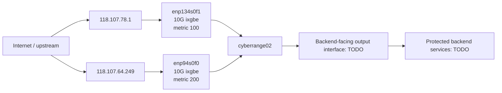

# Phase 00 Lab Readiness

Date: 2026-05-28

Target host: `cyberrange02`

Reference plan: `plans/phase-00-foundation-lab-readiness.md`

## Scope

This artifact records the current lab baseline for the P1 MVP Anti-DDoS eBPF/XDP scrubbing gateway. It captures host facts, network inventory, toolchain status, NIC/queue/link data, backend service placeholders, source tree conventions, readiness gaps, and risks.

This phase does not implement runtime packet filtering, attach XDP programs, create Agent/API/dashboard code, or infer protected backend services from route or neighbor data.

## Readiness Summary

| Area | Status | Notes |
|---|---|---|
| Ubuntu 24.04 target | Ready | Host reports Ubuntu 24.04.3 LTS. |
| Kernel and BTF | Ready | Kernel `6.8.0-106-generic`; `/sys/kernel/btf/vmlinux` exists. |
| eBPF build tools | Mostly ready | `clang`, `llvm-strip`, `bpftool`, and libbpf are present. `vmlinux.h` still needs to be generated in Phase 01. |
| Go toolchain | Ready | `go1.22.2 linux/amd64` is installed. |
| Dashboard toolchain | Partially ready | Node `v18.19.1` and npm `9.2.0` are installed. |
| PostgreSQL | Gap | `psql` command is missing. |
| Prometheus | Gap | `prometheus` command is missing. |
| 10G NIC candidates | Ready for planning | `enp94s0f0` and `enp134s0f1` are UP at 10G with `ixgbe`. |
| WAN/LAN assignment | Needs Network/SRE | Route data exists, but final WAN/LAN/output roles are not formally confirmed. |
| Backend service inventory | Needs Network/SRE | Placeholder table exists below; no backend is inferred from host data. |
| Benchmark evidence | Gap | No XDP attach, load, throughput, or DEVMAP redirect benchmark has been run in Phase 0. |

## Host And Kernel Inventory

| Item | Observed value |
|---|---|
| Hostname | `cyberrange02` |
| OS | Ubuntu 24.04.3 LTS (`noble`) |
| Kernel | `Linux cyberrange02 6.8.0-106-generic #106-Ubuntu SMP PREEMPT_DYNAMIC Fri Mar 6 07:58:08 UTC 2026 x86_64` |
| Architecture | `x86_64` |
| Logical CPUs | `96` |
| BTF file | `/sys/kernel/btf/vmlinux` |
| BTF file status | Present, size `6093105` bytes |

## Toolchain Inventory

| Tool | Status | Observed version or path | Readiness note |
|---|---|---|---|
| `clang` | Present | Ubuntu clang `18.1.3`; `/usr/bin/clang` | Suitable for Phase 01 BPF object builds. |
| `llvm-strip` | Present | `/usr/bin/llvm-strip` | Needed for BPF build artifacts. |
| `bpftool` | Present | `bpftool v7.4.0`, libbpf `v1.4`; `/usr/sbin/bpftool` | Suitable for BTF dump, verifier/load inspection, map/prog inspection. |
| `go` | Present | `go version go1.22.2 linux/amd64`; `/usr/bin/go` | Suitable for Agent/API development baseline. |
| `node` | Present | `v18.19.1`; `/usr/bin/node` | Suitable initial dashboard toolchain. |
| `npm` | Present | `9.2.0`; `/usr/bin/npm` | Suitable initial dashboard toolchain. |
| `psql` | Missing | `command not found` | Install PostgreSQL client/server components before Control Plane work. |
| `prometheus` | Missing | `command not found` | Install Prometheus before observability validation. |

`vmlinux.h` is not generated in this phase. Phase 01 should generate it from `/sys/kernel/btf/vmlinux` inside the data-plane source tree.

## Network Interface Inventory

| Interface | State | MAC | Driver | Link | Queue/RSS | Notes |
|---|---|---|---|---|---|---|
| `eno1` | UP | `4c:52:62:12:b5:9f` | `igb` | `100Mb/s`, full duplex | Not captured | Management or non-10G path candidate only. |
| `eno2` | DOWN | `4c:52:62:12:b5:a0` | Not captured | `NO-CARRIER` | Not captured | Not a current 10G candidate. |
| `enp94s0f0` | UP | `00:1b:21:be:40:6e` | `ixgbe` | `10000Mb/s`, full duplex | Combined `63` current and max | 10G candidate; default route metric `200`. |
| `enp94s0f1` | DOWN | `00:1b:21:be:40:6f` | Not captured | `NO-CARRIER` | Not captured | Not a current 10G candidate. |
| `enp134s0f0` | DOWN | `90:e2:ba:24:9b:b4` | Not captured | `NO-CARRIER` | Not captured | Not a current 10G candidate. |
| `enp134s0f1` | UP | `90:e2:ba:24:9b:b6` | `ixgbe` | `10000Mb/s`, full duplex | Combined `63` current and max | 10G candidate; default route metric `100`. |

Driver details:

| Interface | Driver | Firmware | Bus |
|---|---|---|---|
| `eno1` | `igb` | `1.63, 0x80000ec5` | `0000:01:00.0` |
| `enp94s0f0` | `ixgbe` | `0x00012b2c, 1.1197.0` | `0000:5e:00.0` |
| `enp134s0f1` | `ixgbe` | `0x8000028d` | `0000:86:00.1` |

## Observed Routes

| Destination | Gateway | Interface | Source | Metric | Note |
|---|---|---|---|---:|---|
| `default` | `118.107.78.1` | `enp134s0f1` | - | `100` | Preferred default route. |
| `default` | `118.107.64.249` | `enp94s0f0` | - | `200` | Secondary default route. |
| `118.107.64.248/29` | link | `enp94s0f0` | `118.107.64.250` | - | Connected subnet. |
| `118.107.78.0/24` | link | `enp134s0f1` | `118.107.78.250` | - | Connected subnet. |
| `172.17.0.0/16` | link | `docker0` | `172.17.0.1` | - | Docker bridge, link down. |
| `172.18.0.0/16` | link | `br-99c555f0a29a` | `172.18.0.1` | - | Docker bridge. |
| `172.19.0.0/16` | link | `br-5c986a157f12` | `172.19.0.1` | - | Docker bridge, link down. |
| `172.20.0.0/16` | link | `br-139b5d235700` | `172.20.0.1` | - | Docker bridge, link down. |

Observed route priority currently favors `enp134s0f1`. Final WAN/LAN/output roles must be confirmed by Network/SRE before any service policy or DEVMAP target is applied.

## Observed Neighbor Table

| Address | Interface | MAC | State | Readiness note |
|---|---|---|---|---|
| `118.107.78.1` | `enp134s0f1` | `00:00:5e:00:01:06` | `REACHABLE` | Current preferred default gateway neighbor. |
| `118.107.78.251` | `enp134s0f1` | `fa:16:3e:c0:be:70` | `STALE` | Needs confirmation before any forwarding use. |
| `118.107.78.2` | `enp134s0f1` | `40:b4:f0:0e:4f:c9` | `STALE` | Needs confirmation before any forwarding use. |
| `118.107.78.137` | `enp134s0f1` | `fa:16:3e:ce:1f:88` | `REACHABLE` | Needs confirmation before any forwarding use. |
| `118.107.78.10` | `enp134s0f1` | `fa:16:3e:be:03:55` | `STALE` | Needs confirmation before any forwarding use. |
| `118.107.64.249` | `enp94s0f0` | `40:b4:f0:0e:4f:c9` | `STALE` | Secondary default gateway neighbor. |
| `118.107.64.251` | `enp94s0f0` | - | `FAILED` | Explicit unresolved-neighbor risk; do not use as backend evidence. |
| `172.18.0.2` | `br-99c555f0a29a` | `f6:87:99:2a:4d:c0` | `REACHABLE` | Docker bridge neighbor, not production forwarding evidence. |
| `172.17.233.205` | `docker0` | - | `FAILED` | Docker bridge, not production forwarding evidence. |

## Observed Topology

The diagram below reflects only observed routes and candidate links. It is not the final service topology.

## Protected Backend Service Placeholders

No protected backend service is inferred from routes, neighbor entries, Docker bridges, or IPs observed on the host. Network/SRE must provide the official inventory.

| Service name | Backend IP/CIDR | Protocol | Allowed ports | Owner | Criticality | Output interface | Return path | Validation status |
|---|---|---|---|---|---|---|---|---|
| TODO | TODO | TCP/UDP/ICMP/TODO | TODO | TODO | low/medium/high/critical | TODO | symmetric/asymmetric/TODO | Missing Network/SRE input |

Required validation before Phase 04:

- Backend IP/CIDR is owned by the protected service and is reachable through the declared output interface.
- Protocol and allowed ports are explicit; no wildcard port policy unless approved.
- Output interface exists, is UP, and has a resolved ifindex.
- Next-hop or backend MAC is resolved and stable enough for DEVMAP forwarding.
- Return path is documented, including asymmetric response path if used.
- Overlapping service CIDR/protocol/port entries are rejected unless the product design explicitly supports the case.

## Source Tree Convention For Later Phases

Phase 0 documents the expected source layout only. These directories should be created by the phase that first owns the code.

| Future path | Owner phase | Purpose |
|---|---|---|
| `bpf/` | Phase 01 | XDP/eBPF C source, generated `vmlinux.h`, libbpf build artifacts, verifier logs. |
| `include/` or `pkg/shared/` | Phase 01 | Shared kernel/userspace structs, enums, and map contracts. |
| `cmd/agent/` and `internal/agent/` | Phase 02 | Node Agent entrypoint and lifecycle implementation. |
| `cmd/control-api/` and `internal/control/` | Phase 05 | Control Plane API, policy builder, RBAC, audit, rollback. |
| `migrations/` | Phase 05 | PostgreSQL schema migrations. |
| `web/dashboard/` | Phase 06 | Dashboard frontend. |
| `deploy/` | Phase 02 onward | systemd, Prometheus, Grafana, and lab deployment configs. |
| `configs/examples/` | Phase 02 onward | Non-secret example configs and env templates. |
| `scripts/lab/` | Phase 01 onward | Lab-only build, verifier, namespace, and benchmark helpers. |

## Readiness Gaps And Risks

| Risk or gap | Impact | Required action |
|---|---|---|
| Backend service inventory missing | Cannot build service allowlist or validate redirect path. | Network/SRE provides official table before Phase 04. |
| WAN/LAN/output roles not confirmed | XDP attach and DEVMAP redirect may target the wrong interface. | Confirm interface roles before XDP attach or service policy apply. |
| PostgreSQL missing | Control Plane persistence and audit work cannot be validated locally. | Install PostgreSQL components before Phase 05 validation. |
| Prometheus missing | Metrics scrape and dashboard validation cannot be completed locally. | Install Prometheus before Phase 06 validation. |
| `vmlinux.h` not generated | CO-RE BPF compilation is not ready inside the repo yet. | Generate in Phase 01 from `/sys/kernel/btf/vmlinux`. |
| Native XDP not attach-tested | 10G performance target is not proven. | Validate native XDP support with explicit approval during Phase 01/10. |
| Neighbor `118.107.64.251` unresolved | Example of fail-closed redirect risk. | Do not use unresolved neighbor in any service policy. |
| No benchmark results | 10 Gbps gate and 40 Gbps report are not satisfied. | Execute benchmark matrix after data plane and redirect path exist. |
| Feed credentials and license/quota metadata missing | P1 production readiness is blocked. | Capture secret refs and feed metadata before Phase 08. |

## Phase 0 Task Trace

| Task | Status | Evidence |
|---|---|---|
| P00-T01 protected backend services | Pending Network/SRE | Placeholder table exists; no inferred services. |
| P00-T02 topology WAN/LAN and return path | Partial | Observed routes documented; final roles and return path pending. |
| P00-T03 route, ARP/neighbor, MAC target | Partial | Route and neighbor tables documented; backend MAC targets pending. |
| P00-T04 NIC, driver, RSS, queue, link speed | Done for current host | `enp94s0f0` and `enp134s0f1` documented as 10G `ixgbe`, combined queues `63`. |
| P00-T05 kernel/BTF | Done | Kernel and BTF documented. |
| P00-T06 eBPF build toolchain | Partial | `clang`, `bpftool`, libbpf present; `vmlinux.h` pending. |
| P00-T07 userspace/runtime toolchain | Partial | Go/Node/npm present; PostgreSQL and Prometheus missing. |
| P00-T08 environment config | Done | See `docs/lab-readiness/config-secrets-baseline.md`. |
| P00-T09 benchmark matrix | Done as input | See `docs/lab-readiness/benchmark-matrix.md`; no benchmark executed yet. |
| P00-T10 secret handling baseline | Done | Secret refs and redaction baseline documented. |
| P00-T11 Definition of Done for MVP | Partial | Phase plans define DoD; Phase 10 must finalize benchmark/UAT/runbook evidence. |

